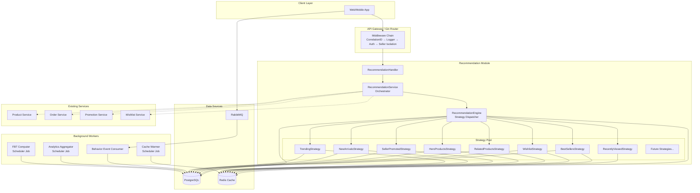
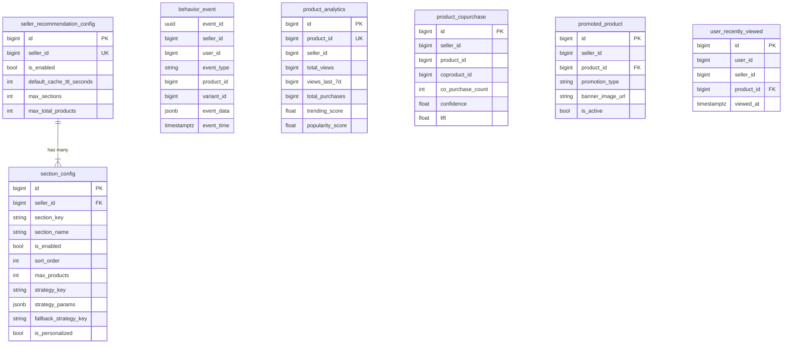
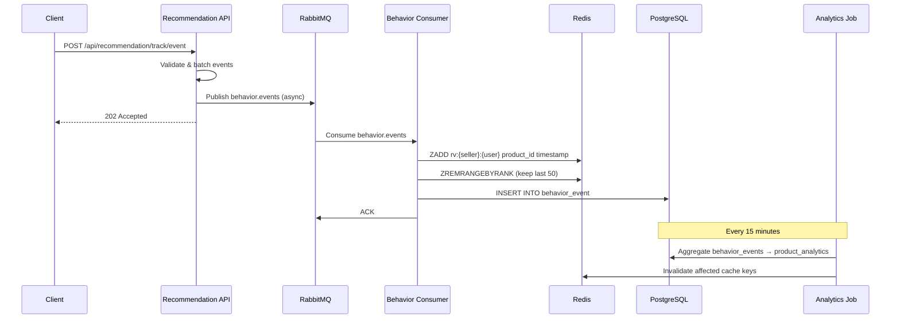
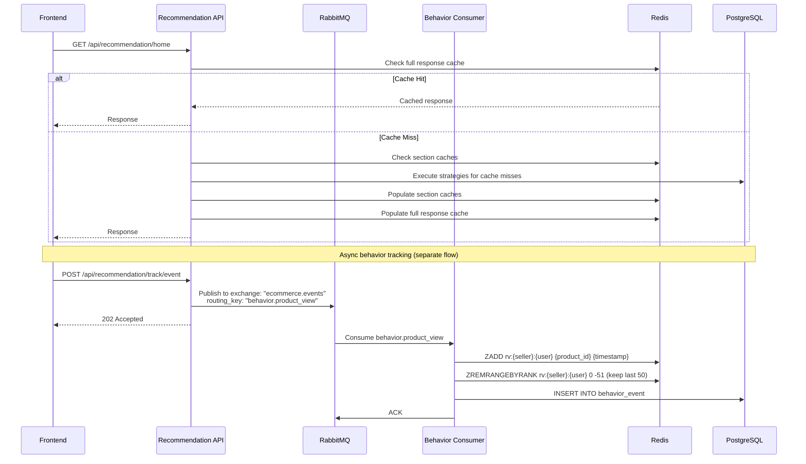
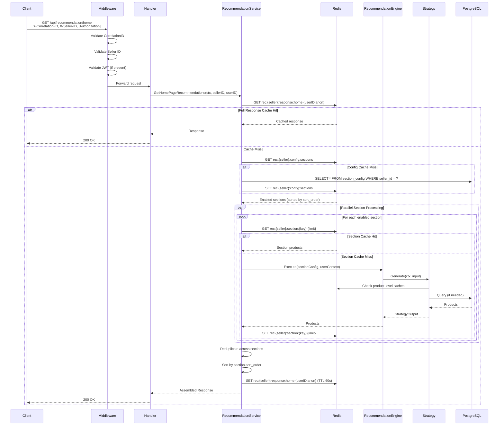
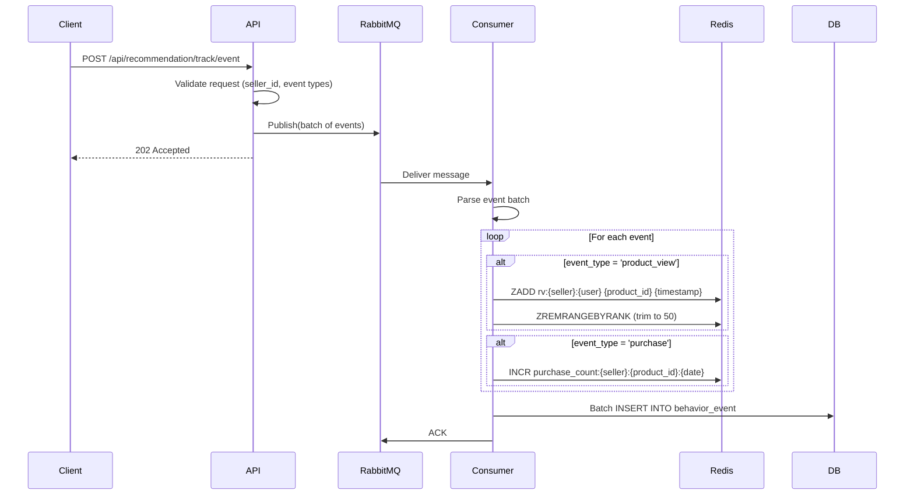
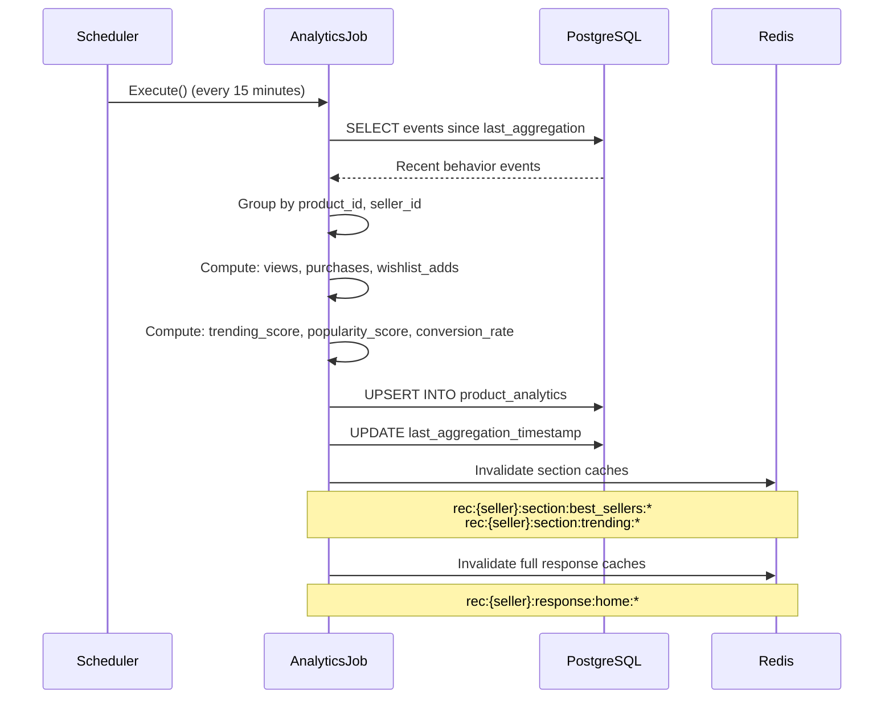

# Home Page Recommendation API — Architecture & Design

> **Status**: Draft  
> **Last Updated**: 2026-07-13  
> **Module**: `recommendation/` (new)

---

## Table of Contents

1. [Executive Summary](#1-executive-summary)
2. [Existing System Context](#2-existing-system-context)
3. [High-Level Architecture](#3-high-level-architecture)
4. [Module Structure](#4-module-structure)
5. [Database Design](#5-database-design)
6. [API Contract](#6-api-contract)
7. [Section Configuration Model](#7-section-configuration-model)
8. [Recommendation Strategy Engine](#8-recommendation-strategy-engine)
9. [User Behavior Tracking](#9-user-behavior-tracking)
10. [Caching Strategy](#10-caching-strategy)
11. [Event-Driven Architecture](#11-event-driven-architecture)
12. [Seller Configuration Management](#12-seller-configuration-management)
13. [Sequence Diagrams](#13-sequence-diagrams)
14. [Scalability & Performance](#14-scalability--performance)
15. [Security & Tenant Isolation](#15-security--tenant-isolation)
16. [Future Extensibility](#16-future-extensibility)
17. [Pros and Cons of Approach](#17-pros-and-cons-of-approach)
18. [Implementation Phases](#18-implementation-phases)

---

## 1. Executive Summary

### Problem Statement

We need a **Home Page Recommendation API** that returns personalized product sections for a **multi-tenant SaaS e-commerce platform**. Unlike large-scale platforms (Amazon, Flipkart), each tenant has a relatively small product catalog and limited user interaction data. A configurable, rule-based recommendation engine with personalization is required — with the architecture flexible enough to support AI/ML-based recommendations in the future.

### Key Design Decisions

| Decision                                        | Rationale                                                                                                                                    |
| ----------------------------------------------- | -------------------------------------------------------------------------------------------------------------------------------------------- |
| **Strategy Pattern** for recommendation sources | Each section type (Recently Viewed, Best Sellers, etc.) is a pluggable strategy. New sections can be added without changing the core engine. |
| **Separate `recommendation/` module**           | Follows the existing modular-monolith pattern. Can be extracted into a microservice later.                                                   |
| **Redis-first caching with multi-level TTLs**   | The home page is the most-read endpoint. Cache at section, product, and full-response levels.                                                |
| **Event-driven behavior tracking**              | User actions (view, purchase, wishlist add) are published as lightweight events via RabbitMQ for async processing.                           |
| **Per-seller configuration via database**       | Each seller independently controls which sections appear, their order, strategy, and limits.                                                 |
| **Fallback-first design**                       | Every recommendation section has a deterministic fallback (e.g., "Best Sellers" falls back to "New Arrivals" if no purchase data).           |

---

## 2. Existing System Context

### What Already Exists

| System               | Relevant Tables/Features                                                                                                                                                                                                                                                                                           | Relationship to Recommendations                                         |
| -------------------- | ------------------------------------------------------------------------------------------------------------------------------------------------------------------------------------------------------------------------------------------------------------------------------------------------------------------ | ----------------------------------------------------------------------- |
| **Product Service**  | [`product`](migrations/002_create_product_tables.sql:58), [`product_variant`](migrations/002_create_product_tables.sql:106), [`category`](migrations/002_create_product_tables.sql:7), [`wishlist`](migrations/010_create_wishlist_tables.sql:10), [`wishlist_item`](migrations/010_create_wishlist_tables.sql:28) | Source of product data, wishlist items                                  |
| **Order Service**    | [`order`](migrations/013_create_order_tables.sql:5), [`order_item`](migrations/013_create_order_tables.sql:28)                                                                                                                                                                                                     | Source of purchase history for "Related Products", "Best Sellers"       |
| **Promotion System** | [`promotion`](migrations/005_create_promotion_tables.sql:27), [`sale`](migrations/022_create_sale_table_and_promotion_sale_id.sql:8)                                                                                                                                                                               | Source for "Hero/Banner Products", "Seller Promoted Products"           |
| **Related Products** | Stored procedure [`get_related_products_scored`](product/query/related_products_queries.go:4), `product_category`, `product.brand`                                                                                                                                                                                 | Existing related-products engine to reuse for "Related Products"        |
| **Redis Cache**      | [`common/cache/redis.go`](common/cache/redis.go:1)                                                                                                                                                                                                                                                                 | Already initialized; add new cache key patterns                         |
| **RabbitMQ**         | [`common/messaging/rabbitmq/`](common/messaging/rabbitmq/publisher.go:1)                                                                                                                                                                                                                                           | Event publishing infrastructure already in place                        |
| **Scheduler**        | [`common/scheduler/`](common/scheduler/worker.go:56)                                                                                                                                                                                                                                                               | Background job processing for async tasks                               |
| **Auth/Middleware**  | [`customer_middleware.go`](common/middleware/customer_middleware.go:1), [`public_api_middleware.go`](common/middleware/public_api_middleware.go:1)                                                                                                                                                                 | Multi-tenant isolation via `X-Seller-ID` header, JWT-based user context |

### What Does NOT Exist (Must Be Built)

| Gap                                                               | Impact                                                                           |
| ----------------------------------------------------------------- | -------------------------------------------------------------------------------- |
| **No user behavior tracking** (product views, clicks, time-spent) | Cannot generate "Recently Viewed" or "Related Products"                          |
| **No product-level analytics** (view count, purchase count)       | Cannot compute "Best Sellers", "Trending Products"                               |
| **No recommendation configuration per seller**                    | Cannot control which sections appear per tenant                                  |
| **No seller promotion mapping to home page**                      | "Hero Products" and "Seller Promoted Products" need explicit home-page targeting |
| **No product-level analytics** (view count, purchase count)       | Cannot compute "Best Sellers", "Trending Products"                               |
| **No recommendation-specific cache layer**                        | Every home page call would hit the database directly                             |

---

## 3. High-Level Architecture



### Architecture Principles

1. **Strategy Pattern**: Each recommendation section is an independent, pluggable strategy implementing a common interface.
2. **Read-Optimized**: The home page is read-heavy. All strategies first check Redis, then fall back to the database.
3. **Async Writes**: Behavior tracking is async (fire-and-forget events via RabbitMQ). The home page API never blocks on analytics writes.
4. **Tenant Isolation**: Every query is scoped by `seller_id`. Cache keys are namespaced by tenant.
5. **Fallback Chains**: Every strategy has a configurable fallback. If "Related Products" has no data, it can fall back to "Trending" → "New Arrivals".
6. **Configurable Everything**: Section enable/disable, ordering, max items, strategy parameters — all per-seller in the database.

---

## 4. Module Structure

Following the existing project pattern (see [`ARCHITECTURE.md`](ARCHITECTURE.md:289)), the new `recommendation/` module mirrors the structure of `product/`, `order/`, etc.

```
recommendation/
├── container.go                          # Module registration & wiring
│
├── entity/
│   ├── recommendation_config.go          # GORM entity for seller_config table
│   ├── section_config.go                 # GORM entity for section_config table
│   ├── behavior_event.go                 # GORM entity for behavior_events table
│   ├── product_analytics.go              # GORM entity for product_analytics table
│   ├── product_copurchase.go             # GORM entity for product_copurchase table
│   └── promoted_product.go               # GORM entity for promoted_products table
│
├── model/
│   ├── recommendation_model.go           # Request/Response DTOs
│   ├── section_response_model.go         # Section-level response structures
│   ├── config_model.go                   # Seller/section config CRUD DTOs
│   └── strategy_model.go                 # Strategy input/output models
│
├── repository/
│   ├── recommendation_config_repository.go
│   ├── behavior_repository.go
│   ├── analytics_repository.go
│   ├── copurchase_repository.go
│   └── promoted_product_repository.go
│
├── service/
│   ├── recommendation_service.go         # Main orchestrator
│   ├── config_service.go                 # Seller/section configuration CRUD
│   ├── analytics_service.go              # Analytics aggregation
│   └── cache_service.go                  # Recommendation-specific cache logic
│
├── strategy/
│   ├── strategy.go                        # Strategy interface definition
│   ├── recently_viewed.go
│   ├── best_sellers.go
│   ├── wishlist.go
│   ├── related_products.go                # Includes "bought together" as sub-strategy
│   ├── hero_products.go
│   ├── seller_promoted.go
│   ├── new_arrivals.go
│   ├── trending.go
│   └── registry.go                       # Strategy registry (auto-discovery)
│
├── handler/
│   ├── recommendation_handler.go         # GET /api/recommendation/home
│   └── config_handler.go                 # Seller config management CRUD
│
├── route/
│   └── recommendation_route.go           # Route registration
│
├── consumer/
│   └── behavior_event_consumer.go        # RabbitMQ consumer for behavior events
│
├── job/
│   ├── analytics_aggregate_job.go        # Scheduled job: aggregate product analytics
│   └── cache_warm_job.go                 # Scheduled job: warm caches
│
├── factory/
│   └── singleton/
│       ├── singleton_factory.go
│       ├── repository_factory.go
│       ├── service_factory.go
│       └── handler_factory.go
│
├── constants/
│   ├── cache_keys.go                     # Cache key patterns
│   ├── strategy_names.go                 # Strategy name constants
│   ├── event_types.go                    # Behavior event type constants
│   └── config_defaults.go                # Default section configurations
│
├── error/
│   └── recommendation_error.go           # Domain-specific errors
│
└── utils/
    └── recommendation_helpers.go         # Scoring, ranking, dedup utilities
```

### Integration with Existing Modules

The recommendation module does **not** duplicate existing repositories. Instead, it injects existing service interfaces:

```go
// recommendation/service/recommendation_service.go
type RecommendationServiceImpl struct {
    // Own repositories
    configRepo    repository.RecommendationConfigRepository
    behaviorRepo  repository.BehaviorRepository
    analyticsRepo repository.AnalyticsRepository
    copurchaseRepo repository.CopurchaseRepository

    // Injected existing services
    productQuerySvc   productService.ProductQueryService   // from product module
    variantQuerySvc   productService.VariantQueryService    // from product module
    wishlistSvc       productService.WishlistService        // from product module
    orderRepo         orderRepo.OrderRepository             // from order module

    // Infrastructure
    cache         cacheService.CacheService
    publisher     messaging.Publisher                       // RabbitMQ
}
```

---

## 5. Database Design

### 5.1 Migration File: `023_create_recommendation_tables.sql`

#### 5.1.1 `seller_recommendation_config`

Holds the top-level recommendation configuration for each seller.

```sql
CREATE TABLE IF NOT EXISTS seller_recommendation_config (
    id BIGSERIAL PRIMARY KEY,
    seller_id BIGINT NOT NULL UNIQUE,

    -- Global enable/disable for the entire recommendation engine
    is_enabled BOOLEAN NOT NULL DEFAULT TRUE,

    -- Default cache TTL for recommendations (seconds)
    default_cache_ttl_seconds INTEGER NOT NULL DEFAULT 300,

    -- Maximum total sections to return
    max_sections INTEGER NOT NULL DEFAULT 10,

    -- Maximum total products across all sections
    max_total_products INTEGER NOT NULL DEFAULT 50,

    -- Feature flags for future A/B testing and ML
    enable_personalization BOOLEAN NOT NULL DEFAULT TRUE,
    enable_ml_recommendations BOOLEAN NOT NULL DEFAULT FALSE,
    ml_model_version VARCHAR(50),

    created_at TIMESTAMPTZ NOT NULL DEFAULT CURRENT_TIMESTAMP,
    updated_at TIMESTAMPTZ NOT NULL DEFAULT CURRENT_TIMESTAMP
);

CREATE INDEX IF NOT EXISTS idx_src_seller_id ON seller_recommendation_config(seller_id);
```

#### 5.1.2 `section_config`

Per-section configuration for each seller. Each row defines one recommendation section.

```sql
CREATE TABLE IF NOT EXISTS section_config (
    id BIGSERIAL PRIMARY KEY,
    seller_id BIGINT NOT NULL,

    -- Section identity
    section_key VARCHAR(100) NOT NULL,           -- e.g., 'recently_viewed', 'best_sellers'
    section_name VARCHAR(255) NOT NULL,           -- Display name, e.g., 'Best Sellers'
    section_description VARCHAR(500),             -- Optional description for admin UI

    -- Enable/disable
    is_enabled BOOLEAN NOT NULL DEFAULT TRUE,

    -- Display ordering (lower = shown first)
    sort_order INTEGER NOT NULL DEFAULT 0,

    -- Product limits
    max_products INTEGER NOT NULL DEFAULT 10,

    -- Strategy configuration
    strategy_key VARCHAR(100) NOT NULL,           -- Which strategy to use
    strategy_params JSONB NOT NULL DEFAULT '{}',  -- Strategy-specific params

    -- Fallback chain
    fallback_strategy_key VARCHAR(100),           -- Fallback strategy if primary returns empty
    fallback_strategy_params JSONB DEFAULT '{}',

    -- Cache TTL override for this section (NULL = use seller default)
    cache_ttl_seconds INTEGER,

    -- Personalization
    is_personalized BOOLEAN NOT NULL DEFAULT FALSE,  -- Whether section varies per user
    personalization_weight FLOAT NOT NULL DEFAULT 0.5, -- 0=generic, 1=fully personalized

    -- Visibility rules
    requires_auth BOOLEAN NOT NULL DEFAULT FALSE,     -- Only for logged-in users
    min_products_to_show INTEGER NOT NULL DEFAULT 1,  -- Hide section if fewer than N products

    created_at TIMESTAMPTZ NOT NULL DEFAULT CURRENT_TIMESTAMP,
    updated_at TIMESTAMPTZ NOT NULL DEFAULT CURRENT_TIMESTAMP,

    UNIQUE(seller_id, section_key)
);

CREATE INDEX IF NOT EXISTS idx_sc_seller_id ON section_config(seller_id);
CREATE INDEX IF NOT EXISTS idx_sc_seller_sort ON section_config(seller_id, sort_order);
CREATE INDEX IF NOT EXISTS idx_sc_section_key ON section_config(section_key);
```

#### 5.1.3 `behavior_event`

Stores user behavior events for analytics and personalization. This is an append-only, time-partitioned candidate table.

```sql
CREATE TABLE IF NOT EXISTS behavior_event (
    id BIGSERIAL,
    event_id UUID NOT NULL,

    -- Tenant and user
    seller_id BIGINT NOT NULL,
    user_id BIGINT,                               -- NULL for anonymous users

    -- Event details
    event_type VARCHAR(50) NOT NULL,               -- 'product_view', 'product_click', 'search',
                                                    -- 'add_to_cart', 'purchase', 'wishlist_add'
    event_source VARCHAR(50) NOT NULL DEFAULT 'web', -- 'web', 'mobile_app', 'admin'

    -- Target
    product_id BIGINT,
    variant_id BIGINT,

    -- Event metadata
    event_data JSONB NOT NULL DEFAULT '{}',        -- Flexible payload
    -- Examples:
    -- product_view: {"duration_ms": 4500, "scroll_depth_pct": 75}
    -- search: {"query": "blue shoes", "results_count": 12}
    -- purchase: {"order_id": 123, "quantity": 2}

    -- Session info
    session_id VARCHAR(255),
    device_id VARCHAR(255),

    -- Timestamps
    event_time TIMESTAMPTZ NOT NULL DEFAULT CURRENT_TIMESTAMP,
    created_at TIMESTAMPTZ NOT NULL DEFAULT CURRENT_TIMESTAMP,

    PRIMARY KEY (event_time, id)
) PARTITION BY RANGE (event_time);

-- Monthly partitions (example)
CREATE TABLE behavior_event_2026_07 PARTITION OF behavior_event
    FOR VALUES FROM ('2026-07-01') TO ('2026-08-01');
CREATE TABLE behavior_event_2026_08 PARTITION OF behavior_event
    FOR VALUES FROM ('2026-08-01') TO ('2026-09-01');

-- Indexes on the partitioned table
CREATE INDEX IF NOT EXISTS idx_be_seller_user ON behavior_event(seller_id, user_id, event_time);
CREATE INDEX IF NOT EXISTS idx_be_product ON behavior_event(product_id, event_time);
CREATE INDEX IF NOT EXISTS idx_be_event_type ON behavior_event(event_type, event_time);
CREATE INDEX IF NOT EXISTS idx_be_session ON behavior_event(session_id);
```

**Design Rationale**: Time-based partitioning is critical here. Behavior events grow rapidly (potentially millions per day). Partitioning by month allows efficient data archival (drop old partitions) and keeps query performance stable.

#### 5.1.4 `product_analytics`

Pre-aggregated analytics for each product, refreshed periodically by a background job.

```sql
CREATE TABLE IF NOT EXISTS product_analytics (
    id BIGSERIAL PRIMARY KEY,
    product_id BIGINT NOT NULL,
    seller_id BIGINT NOT NULL,

    -- View metrics
    total_views BIGINT NOT NULL DEFAULT 0,
    unique_viewers BIGINT NOT NULL DEFAULT 0,
    views_last_7d BIGINT NOT NULL DEFAULT 0,
    views_last_24h BIGINT NOT NULL DEFAULT 0,

    -- Purchase metrics
    total_purchases BIGINT NOT NULL DEFAULT 0,
    purchases_last_7d BIGINT NOT NULL DEFAULT 0,
    purchases_last_24h BIGINT NOT NULL DEFAULT 0,

    -- Wishlist metrics
    total_wishlist_adds BIGINT NOT NULL DEFAULT 0,
    wishlist_adds_last_7d BIGINT NOT NULL DEFAULT 0,

    -- Cart metrics
    total_cart_adds BIGINT NOT NULL DEFAULT 0,
    cart_adds_last_7d BIGINT NOT NULL DEFAULT 0,

    -- Computed scores
    trending_score FLOAT NOT NULL DEFAULT 0,
    popularity_score FLOAT NOT NULL DEFAULT 0,
    conversion_rate FLOAT NOT NULL DEFAULT 0,

    -- Metadata
    last_purchased_at TIMESTAMPTZ,
    computed_at TIMESTAMPTZ NOT NULL DEFAULT CURRENT_TIMESTAMP,
    updated_at TIMESTAMPTZ NOT NULL DEFAULT CURRENT_TIMESTAMP,

    UNIQUE(product_id)
);

CREATE INDEX IF NOT EXISTS idx_pa_seller_id ON product_analytics(seller_id);
CREATE INDEX IF NOT EXISTS idx_pa_trending ON product_analytics(seller_id, trending_score DESC);
CREATE INDEX IF NOT EXISTS idx_pa_popularity ON product_analytics(seller_id, popularity_score DESC);
CREATE INDEX IF NOT EXISTS idx_pa_views_7d ON product_analytics(seller_id, views_last_7d DESC);
CREATE INDEX IF NOT EXISTS idx_pa_purchases_7d ON product_analytics(seller_id, purchases_last_7d DESC);
```

#### 5.1.5 `product_copurchase`

Pre-computed "frequently bought together" pairs, refreshed by a background job.

```sql
CREATE TABLE IF NOT EXISTS product_copurchase (
    id BIGSERIAL PRIMARY KEY,
    seller_id BIGINT NOT NULL,
    product_id BIGINT NOT NULL,
    coproduct_id BIGINT NOT NULL,

    -- Co-occurrence metrics
    co_purchase_count INTEGER NOT NULL DEFAULT 0,
    confidence FLOAT NOT NULL DEFAULT 0,     -- P(coproduct | product)
    lift FLOAT NOT NULL DEFAULT 0,           -- confidence / P(coproduct)
    support FLOAT NOT NULL DEFAULT 0,        -- P(product AND coproduct)

    -- Ranking within the product's co-purchases
    rank INTEGER NOT NULL DEFAULT 0,

    computed_at TIMESTAMPTZ NOT NULL DEFAULT CURRENT_TIMESTAMP,
    updated_at TIMESTAMPTZ NOT NULL DEFAULT CURRENT_TIMESTAMP,

    UNIQUE(product_id, coproduct_id)
);

CREATE INDEX IF NOT EXISTS idx_cp_product ON product_copurchase(product_id, rank);
CREATE INDEX IF NOT EXISTS idx_cp_seller ON product_copurchase(seller_id);
```

#### 5.1.6 `promoted_product`

Seller-configured products explicitly marked for home page promotion.

```sql
CREATE TABLE IF NOT EXISTS promoted_product (
    id BIGSERIAL PRIMARY KEY,
    seller_id BIGINT NOT NULL,
    product_id BIGINT NOT NULL REFERENCES product(id) ON DELETE CASCADE,

    -- Promotion type
    promotion_type VARCHAR(50) NOT NULL DEFAULT 'hero',  -- 'hero', 'featured', 'banner', 'deal'

    -- Display metadata
    banner_image_url VARCHAR(500),
    banner_text VARCHAR(255),
    call_to_action VARCHAR(100),
    redirect_url VARCHAR(500),

    -- Scheduling
    start_at TIMESTAMPTZ,
    end_at TIMESTAMPTZ,

    -- Controls
    is_active BOOLEAN NOT NULL DEFAULT TRUE,
    sort_order INTEGER NOT NULL DEFAULT 0,

    -- Optional link to a sale event
    sale_id BIGINT REFERENCES sale(id) ON DELETE SET NULL,

    created_at TIMESTAMPTZ NOT NULL DEFAULT CURRENT_TIMESTAMP,
    updated_at TIMESTAMPTZ NOT NULL DEFAULT CURRENT_TIMESTAMP,

    UNIQUE(seller_id, product_id, promotion_type)
);

CREATE INDEX IF NOT EXISTS idx_pp_seller_type ON promoted_product(seller_id, promotion_type, is_active);
CREATE INDEX IF NOT EXISTS idx_pp_sale_id ON promoted_product(sale_id);
CREATE INDEX IF NOT EXISTS idx_pp_active_dates ON promoted_product(is_active, start_at, end_at);
```

#### 5.1.7 `user_recently_viewed` (Redis-backed with PostgreSQL fallback)

For recently viewed products, Redis is the primary store. PostgreSQL provides durability:

```sql
CREATE TABLE IF NOT EXISTS user_recently_viewed (
    id BIGSERIAL PRIMARY KEY,
    user_id BIGINT NOT NULL,
    seller_id BIGINT NOT NULL,
    product_id BIGINT NOT NULL REFERENCES product(id) ON DELETE CASCADE,
    variant_id BIGINT,

    viewed_at TIMESTAMPTZ NOT NULL DEFAULT CURRENT_TIMESTAMP,

    -- Each user-product pair appears once, with latest viewed_at
    UNIQUE(user_id, product_id)
);

CREATE INDEX IF NOT EXISTS idx_urv_user_seller ON user_recently_viewed(user_id, seller_id, viewed_at DESC);
```

**Note**: This table is primarily a durability backup. The hot path reads from Redis sorted sets (`ZSET`) keyed by `user_id:seller_id`. A periodic job syncs Redis → PostgreSQL. The table also serves as the data source for cold-start (Redis miss) scenarios.

### 5.2 Entity Relationship Diagram



---

## 6. API Contract

### 6.1 Home Page Recommendation API

**Endpoint**: `GET /api/recommendation/home`

**Headers**:

```
X-Correlation-ID: <uuid>
X-Seller-ID: <seller_id>           # Required for multi-tenant isolation
Authorization: Bearer <jwt>        # Optional: enables personalized sections
```

**Query Parameters**:

| Parameter         | Type   | Default       | Description                                               |
| ----------------- | ------ | ------------- | --------------------------------------------------------- |
| `sections`        | string | (all enabled) | Comma-separated section keys to include. Filter sections. |
| `max_per_section` | int    | (from config) | Override max products per section                         |
| `skip_cache`      | bool   | false         | Bypass cache for fresh results admin/debug                |
| `device_type`     | string | "web"         | "web", "mobile", "tablet" — may affect layout hints       |

**Response Structure**:

```json
{
  "success": true,
  "data": {
    "sections": [
      {
        "sectionKey": "hero_products",
        "sectionName": "Featured Deals",
        "sectionType": "hero",
        "sortOrder": 1,
        "displayHint": "carousel",
        "products": [
          {
            "id": 123,
            "name": "Wireless Headphones",
            "categoryId": 5,
            "category": { "id": 5, "name": "Electronics" },
            "brand": "Sony",
            "sku": "WH-1000XM5",
            "shortDescription": "Premium noise-cancelling headphones",
            "tags": ["wireless", "premium"],
            "sellerId": 2,
            "minPrice": 299.99,
            "maxPrice": 349.99,
            "inStockVariants": 3,
            "totalVariants": 3,
            "bannerImageUrl": "https://cdn.example.com/banners/hero-sony.jpg",
            "promotionBadge": "SALE",
            "createdAt": "2026-01-15T10:00:00Z",
            "updatedAt": "2026-06-01T08:00:00Z"
          }
        ],
        "totalProducts": 1,
        "meta": {
          "strategyUsed": "hero_products",
          "personalized": false,
          "cachedAt": "2026-07-13T11:20:00Z"
        }
      },
      {
        "sectionKey": "recently_viewed",
        "sectionName": "Recently Viewed",
        "sectionType": "grid",
        "sortOrder": 2,
        "displayHint": "horizontal_scroll",
        "products": [
          {
            "id": 456,
            "name": "Running Shoes",
            "categoryId": 3,
            "category": { "id": 3, "name": "Sports" },
            "brand": "Nike",
            "sku": "AIR-ZOOM-001",
            "minPrice": 129.99,
            "maxPrice": 129.99,
            "inStockVariants": 5,
            "totalVariants": 5,
            "sellerId": 2,
            "createdAt": "2026-03-10T00:00:00Z",
            "updatedAt": "2026-07-01T00:00:00Z"
          }
        ],
        "totalProducts": 1,
        "meta": {
          "strategyUsed": "recently_viewed",
          "personalized": true,
          "cachedAt": null
        }
      },
      {
        "sectionKey": "best_sellers",
        "sectionName": "Best Sellers",
        "sectionType": "grid",
        "sortOrder": 3,
        "displayHint": "grid",
        "products": [
          /* ... up to max_products ... */
        ],
        "totalProducts": 10,
        "meta": {
          "strategyUsed": "best_sellers",
          "personalized": false,
          "cachedAt": "2026-07-13T11:15:00Z"
        }
      },
      {
        "sectionKey": "related_products",
        "sectionName": "Related Products",
        "sectionType": "grid",
        "sortOrder": 4,
        "displayHint": "grid",
        "products": [
          /* ... */
        ],
        "totalProducts": 8,
        "meta": {
          "strategyUsed": "related_products",
          "personalized": true,
          "cachedAt": null
        }
      }
    ],
    "totalSections": 8,
    "totalProducts": 71,
    "meta": {
      "sellerId": 2,
      "personalized": true,
      "cached": false,
      "responseTimeMs": 45
    }
  },
  "message": "Recommendations retrieved successfully"
}
```

**Response Contract Details**:

- `sectionType`: One of `hero`, `carousel`, `grid`, `horizontal_scroll`, `list` — hints for the frontend renderer.
- `displayHint`: Additional rendering hint.
- `meta.strategyUsed`: Which strategy produced the results.
- `meta.fallbackUsed`: If the primary strategy returned empty and a fallback was used.
- `meta.personalized`: Whether this section varies by user.
- `meta.cachedAt`: If served from cache, when the cache was populated (null if fresh).
- `products[]` contains the standard [`ProductResponse`](product/model/product_model.go:96) fields with optional promotion metadata.

### 6.2 Seller Configuration API (Admin/Seller)

```
GET    /api/recommendation/config                    # Get seller's config
PUT    /api/recommendation/config                    # Update seller-level config
GET    /api/recommendation/config/sections           # List all sections
PUT    /api/recommendation/config/sections/:key      # Update a section
PATCH  /api/recommendation/config/sections/reorder   # Reorder sections
DELETE /api/recommendation/config/cache              # Invalidate seller's cache
```

### 6.3 Behavior Tracking API

```
POST /api/recommendation/track/event                 # Track a user behavior event
```

Request body:

```json
{
  "events": [
    {
      "eventType": "product_view",
      "productId": 456,
      "variantId": null,
      "eventSource": "web",
      "sessionId": "sess_abc123",
      "eventData": {
        "durationMs": 4500,
        "scrollDepthPct": 75,
        "sourceSection": "best_sellers"
      }
    }
  ]
}
```

This endpoint publishes events to RabbitMQ and returns `202 Accepted` immediately. The client batches events (up to 20 per request) to reduce HTTP overhead.

### 6.4 Promoted Products Management API (Seller)

```
GET    /api/recommendation/promoted                  # List promoted products
POST   /api/recommendation/promoted                  # Add promoted product
PUT    /api/recommendation/promoted/:id              # Update promoted product
DELETE /api/recommendation/promoted/:id              # Remove promoted product
```

---

## 7. Section Configuration Model

### 7.1 Standard Section Keys

| Section Key        | Display Name      | Default Enabled | Personalized | Strategy           |
| ------------------ | ----------------- | --------------- | ------------ | ------------------ |
| `hero_products`    | Hero Products     | true            | false        | `hero_products`    |
| `seller_promoted`  | Featured Products | true            | false        | `seller_promoted`  |
| `recently_viewed`  | Recently Viewed   | true            | true         | `recently_viewed`  |
| `best_sellers`     | Best Sellers      | true            | false        | `best_sellers`     |
| `new_arrivals`     | New Arrivals      | true            | false        | `new_arrivals`     |
| `trending`         | Trending Now      | true            | false        | `trending`         |
| `wishlist`         | Your Wishlist     | true            | true         | `wishlist`         |
| `related_products` | Related Products  | true            | true         | `related_products` |

### 7.2 Default Configuration (Seeded per Seller)

When a new seller is onboarded, a default section configuration is seeded:

```json
{
  "sections": [
    {
      "sectionKey": "hero_products",
      "sortOrder": 1,
      "maxProducts": 5,
      "isEnabled": true
    },
    {
      "sectionKey": "recently_viewed",
      "sortOrder": 2,
      "maxProducts": 10,
      "isEnabled": true
    },
    {
      "sectionKey": "seller_promoted",
      "sortOrder": 3,
      "maxProducts": 8,
      "isEnabled": true
    },
    {
      "sectionKey": "best_sellers",
      "sortOrder": 4,
      "maxProducts": 10,
      "isEnabled": true
    },
    {
      "sectionKey": "new_arrivals",
      "sortOrder": 5,
      "maxProducts": 10,
      "isEnabled": true
    },
    {
      "sectionKey": "trending",
      "sortOrder": 6,
      "maxProducts": 10,
      "isEnabled": true
    },
    {
      "sectionKey": "wishlist",
      "sortOrder": 7,
      "maxProducts": 10,
      "isEnabled": true
    },
    {
      "sectionKey": "related_products",
      "sortOrder": 8,
      "maxProducts": 10,
      "isEnabled": true
    }
  ]
}
```

### 7.3 Section Deduplication

Products are deduplicated **across sections** within a single API response. The deduplication strategy:

1. Sections with higher `sortOrder` (displayed first) get priority.
2. If a product appears in "Hero Products" (sortOrder=1), it is excluded from "Trending" (sortOrder=6).
3. Exception: "Recently Viewed" and "Wishlist" are never deduplicated (they are explicitly user-chosen).

---

## 8. Recommendation Strategy Engine

### 8.1 Strategy Interface

```go
// recommendation/strategy/strategy.go
type RecommendationStrategy interface {
    // Name returns the unique strategy key (e.g., "best_sellers")
    Name() string

    // Generate produces product recommendations for a given context
    Generate(ctx context.Context, input StrategyInput) (*StrategyOutput, error)

    // CacheKey returns a deterministic cache key for the given input
    CacheKey(input StrategyInput) string

    // IsPersonalized returns true if this strategy produces user-specific results
    IsPersonalized() bool
}

type StrategyInput struct {
    SellerID   uint
    UserID     *uint                    // nil for anonymous users
    Config     *entity.SectionConfig    // Section configuration
    Limit      int
    ExcludeIDs []uint                  // Product IDs to exclude (dedup)
    UserContext *UserContext            // Additional user context
}

type UserContext struct {
    RecentViews     []uint             // Recently viewed product IDs
    RecentPurchases []uint             // Recently purchased product IDs
    WishlistItems   []uint             // Product IDs in user's wishlist
    PreferredCategories []uint         // Categories the user frequently browses
    PreferredBrands    []string        // Brands the user frequently browses
}

type StrategyOutput struct {
    Products        []ProductRecommendation
    StrategyUsed    string
    FallbackUsed    string             // Empty if no fallback was needed
}

type ProductRecommendation struct {
    ProductID       uint
    VariantID       *uint
    Score           float64            // Relevance score for ranking
    Reason          string             // Why this was recommended (e.g., "Based on your purchase")
    PromotionBadge  string             // Optional badge: "SALE", "NEW", "TRENDING"
    BannerImageURL  string             // Optional banner for hero sections
}
```

### 8.2 Strategy Implementations

#### 8.2.1 Recently Viewed Strategy

```
Data Source: Redis ZSET "rv:{seller_id}:{user_id}" (product_id → viewed_at timestamp)
Fallback: PostgreSQL user_recently_viewed table
Scoring: Recency (more recent = higher score)
Cold Start: Empty section (no fallback — showing nothing is correct behavior)
```

#### 8.2.2 Best Sellers Strategy

```
Data Source: product_analytics table (total_purchases DESC)
Fallback: New Arrivals (products ORDER BY created_at DESC)
Scoring: Weighted combination:
  - total_purchases (weight: 0.5)
  - conversion_rate (weight: 0.3)
  - views_last_7d (weight: 0.2)
Cold Start: New Arrivals
```

#### 8.2.3 Wishlist Strategy

```
Data Source: wishlist_item + wishlist tables (existing)
Scoring: Most recently added first
Personalized: Yes (user-specific)
```

#### 8.2.4 Related Products Strategy

```
Data Source: Reuses existing get_related_products_scored stored procedure
Input: Recent purchases + recent views of the user
Scoring: Existing related-products scoring algorithm
Sub-strategies:
  - Category-matching: Products in same category as user's recent views
  - Brand-matching: Products of same brand as user's purchases
  - Bought-together: If co-purchase data exists for user's products, include those
Cold Start: Best Sellers
Personalized: Yes
```

#### 8.2.5 Hero Products Strategy

```
Data Source: promoted_product table WHERE promotion_type = 'hero' AND is_active = true
Scheduling: Only products where start_at <= NOW() <= end_at (or NULL for no end)
Scoring: sort_order (seller-configured)
```

#### 8.2.6 Seller Promoted Strategy

```
Data Source: promoted_product table WHERE promotion_type IN ('featured', 'deal')
Same scheduling logic as Hero Products
Scoring: sort_order (seller-configured)
```

#### 8.2.7 New Arrivals Strategy

```
Data Source: product table, ORDER BY created_at DESC
Simple, cacheable, no personalization
```

#### 8.2.8 Trending Strategy

```
Data Source: product_analytics table, ORDER BY trending_score DESC
Trending Score Formula:
  trending_score = (views_last_24h * 0.4) + (purchases_last_24h * 0.4) + (wishlist_adds_last_7d * 0.1) + (cart_adds_last_7d * 0.1)
Fallback: New Arrivals
```

### 8.3 Strategy Registry

Strategies are auto-registered via a registry pattern:

```go
// recommendation/strategy/registry.go
var strategyRegistry = map[string]RecommendationStrategy{}

func RegisterStrategy(s RecommendationStrategy) {
    strategyRegistry[s.Name()] = s
}

func GetStrategy(name string) (RecommendationStrategy, bool) {
    s, ok := strategyRegistry[name]
    return s, ok
}

// Each strategy file has an init():
// recently_viewed.go
func init() {
    RegisterStrategy(&RecentlyViewedStrategy{})
}
```

New strategies can be added by creating a new file and implementing the interface — no changes to the engine core.

---

## 9. User Behavior Tracking

### 9.1 Architecture



### 9.2 Event Types

| Event Type        | Trigger Point                  | Data Captured                                       |
| ----------------- | ------------------------------ | --------------------------------------------------- |
| `product_view`    | Product detail page viewed     | `duration_ms`, `scroll_depth_pct`, `source_section` |
| `product_click`   | Product clicked from a section | `source_section`, `position_in_section`             |
| `search`          | Search performed               | `query`, `results_count`, `clicked_product_id`      |
| `add_to_cart`     | Product added to cart          | `quantity`, `variant_id`                            |
| `purchase`        | Order placed                   | `order_id`, `quantity`, `unit_price`                |
| `wishlist_add`    | Product added to wishlist      | `wishlist_id`                                       |
| `wishlist_remove` | Product removed from wishlist  | `wishlist_id`                                       |

### 9.3 Client-Side Integration

The frontend should track events and batch-send them. A JavaScript snippet is provided for web:

```javascript
// Client-side tracking (conceptual)
const tracker = {
  buffer: [],
  flush() {
    if (this.buffer.length === 0) return;
    fetch("/api/recommendation/track/event", {
      method: "POST",
      body: JSON.stringify({ events: this.buffer }),
      headers: { "Content-Type": "application/json", "X-Seller-ID": sellerId },
    });
    this.buffer = [];
  },
  track(type, productId, data = {}) {
    this.buffer.push({
      eventType: type,
      productId,
      eventSource: "web",
      eventData: data,
    });
    if (this.buffer.length >= 20) this.flush();
  },
};
// Auto-flush every 5 seconds
setInterval(() => tracker.flush(), 5000);
// Flush on page unload
window.addEventListener("beforeunload", () => tracker.flush());
```

### 9.4 Analytics Aggregation Job

Scheduled every 15 minutes via [`common/scheduler/`](common/scheduler/worker.go:56):

1. Query `behavior_event` for events since last aggregation
2. Compute: total_views, views_last_7d, views_last_24h, total_purchases, etc.
3. UPSERT into `product_analytics`
4. Compute `trending_score`, `popularity_score`, `conversion_rate`
5. Invalidate affected Redis cache keys

---

## 10. Caching Strategy

### 10.1 Cache Key Design

```
Key Pattern: rec:{tenant}:{scope}:{identifier}[:{variant}]

Examples:
rec:2:section:best_sellers:10         # Seller 2, best sellers section, 10 products
rec:2:section:new_arrivals:10
rec:2:section:hero_products:5
rec:2:product:456:analytics           # Product-level analytics cache
rec:2:user:789:recently_viewed:10     # User-specific (personalized)
rec:2:user:789:recommended:10         # User-specific recommendations
rec:2:response:home:anon              # Full cached response for anonymous users
rec:2:config:sections                 # Section configuration cache
```

### 10.2 Cache TTL Strategy

| Cache Level                             | TTL              | Rationale                                  |
| --------------------------------------- | ---------------- | ------------------------------------------ |
| Full home page response (anonymous)     | 60s              | Fast-changing; acceptable staleness        |
| Full home page response (authenticated) | 30s              | Personalization means shorter TTL          |
| Section-level cache (non-personalized)  | 120s             | Sections like "Best Sellers" change slowly |
| Product analytics cache                 | 300s             | Analytics change slowly                    |
| Configuration cache                     | 600s             | Config rarely changes                      |
| User recently viewed (Redis ZSET)       | 7 days (sliding) | Keep last 7 days of views per user         |
| Co-purchase cache                       | 3600s            | Co-purchase relationships change slowly    |

### 10.3 Cache Hierarchy

```
Request comes in
    │
    ▼
┌─────────────────────────────┐
│ 1. Full Response Cache      │  ← Check first (fastest)
│    Key: rec:{seller}:       │
│         response:home:{user}│
└─────────┬───────────────────┘
          │ MISS
          ▼
┌─────────────────────────────┐
│ 2. Parallel Section Fetch   │  ← Check per-section caches
│    ┌───────┐ ┌───────┐     │
│    │ Sect1 │ │ Sect2 │ ... │
│    │ Cache │ │ Cache │     │
│    └───┬───┘ └───┬───┘     │
│        │         │          │
│    HIT │    MISS │          │
│        │         ▼          │
│        │  ┌───────────┐     │
│        │  │ 3. Execute│     │  ← Run strategy, query DB
│        │  │  Strategy │     │
│        │  └─────┬─────┘     │
│        │        │            │
│        │        ▼            │
│        │  ┌───────────┐     │
│        │  │ 4. Populate│    │  ← Write back to cache
│        │  │  Section   │    │
│        │  │  Cache     │    │
│        │  └───────────┘     │
└─────────┴───────────────────┘
          │
          ▼
┌─────────────────────────────┐
│ 5. Assemble Response        │
│    • Deduplicate products   │
│    • Apply section ordering │
│    • Populate full response │
│      cache (if all cached)  │
└─────────────────────────────┘
```

### 10.4 Cache Invalidation Strategy

| Trigger                      | Action                                                                                                      | Scope         |
| ---------------------------- | ----------------------------------------------------------------------------------------------------------- | ------------- |
| Product created/updated      | Invalidate `rec:{seller}:section:new_arrivals`, `rec:{seller}:section:related_products`                     | Seller-level  |
| Product deleted              | Invalidate all section caches for the seller                                                                | Seller-level  |
| Order placed                 | Invalidate `rec:{seller}:section:best_sellers`, `rec:{seller}:section:trending`, user's personalized caches | Seller + User |
| Seller updates config        | Invalidate `rec:{seller}:config:*` and `rec:{seller}:response:*`                                            | Seller-level  |
| Seller adds promoted product | Invalidate `rec:{seller}:section:hero_products`, `rec:{seller}:section:seller_promoted`                     | Seller-level  |
| Analytics job completes      | Invalidate section caches affected by updated analytics                                                     | Seller-level  |

### 10.5 Cache Warming

At application startup and on a schedule:

1. **Pre-warm anonymous caches**: For active sellers with recent purchases, pre-compute the anonymous home page response.
2. **Pre-warm section caches**: For non-personalized sections (Best Sellers, New Arrivals, Hero Products, Trending), pre-compute and cache.
3. **On cache miss**: The first user to experience a cache miss pays the compute cost; subsequent users get the cached result.

---

## 11. Event-Driven Architecture

### 11.1 Event Flow



### 11.2 RabbitMQ Exchange and Queue Design

```
Exchange: ecommerce.events (topic exchange)

Routing Keys:
  behavior.product_view       → Queue: recommendation.behavior.product_view
  behavior.product_click      → Queue: recommendation.behavior.product_click
  behavior.add_to_cart        → Queue: recommendation.behavior.add_to_cart
  behavior.purchase           → Queue: recommendation.behavior.purchase
  behavior.wishlist_add       → Queue: recommendation.behavior.wishlist_add
  product.created             → Queue: recommendation.cache.invalidation
  product.updated             → Queue: recommendation.cache.invalidation
  product.deleted             → Queue: recommendation.cache.invalidation
  order.placed                → Queue: recommendation.cache.invalidation
  config.updated              → Queue: recommendation.config.sync
```

### 11.3 Cache Invalidation via Events

Instead of the recommendation module directly calling cache invalidation in other modules, the other modules publish events and the recommendation module listens:

```
Product Service: product.updated event
    → Recommendation Consumer receives event
    → Invalidates affected cache keys for the seller
```

This keeps the recommendation module decoupled from other modules' internals.

---

## 12. Seller Configuration Management

### 12.1 Configuration Flow

```
Seller Onboarding
    │
    ▼
Seed Default Config
    │ (INSERT INTO seller_recommendation_config)
    │ (INSERT INTO section_config × 11 default sections)
    │
    ▼
Seller Customizes via Admin Dashboard
    │ (PUT /api/recommendation/config/sections/:key)
    │
    ▼
Config Updated in PostgreSQL
    │
    ▼
Publish config.updated Event
    │
    ▼
Invalidate Seller's Recommendation Caches
```

### 12.2 Configuration Validation Rules

1. At least one section must be enabled.
2. `sort_order` values must be unique per seller.
3. `max_products` must be between 1 and 50.
4. `strategy_key` must be a registered strategy.
5. `fallback_strategy_key` must be a registered strategy and must not create circular dependencies.
6. When disabling a section, re-compute sort orders of remaining sections.

### 12.3 Multi-Tenant Isolation

Every configuration query is scoped by `seller_id`:

```go
func (r *ConfigRepositoryImpl) GetSectionsBySeller(ctx context.Context, sellerID uint) ([]entity.SectionConfig, error) {
    var sections []entity.SectionConfig
    err := db.DB(ctx).
        Where("seller_id = ? AND is_enabled = ?", sellerID, true).
        Order("sort_order ASC").
        Find(&sections).Error
    return sections, err
}
```

The seller ID comes from the JWT token (authenticated routes) or the `X-Seller-ID` header (public routes), as enforced by existing middleware.

---

## 13. Sequence Diagrams

### 13.1 Home Page API Request (Full Flow)



### 13.2 Behavior Event Processing



### 13.3 Analytics Aggregation Job



---

## 14. Scalability & Performance

### 14.1 Performance Budget

| Metric                    | Target            |
| ------------------------- | ----------------- |
| P50 latency (cached)      | < 10ms            |
| P50 latency (cache miss)  | < 100ms           |
| P99 latency               | < 250ms           |
| Cache hit rate target     | > 90%             |
| Max products per response | 50 (configurable) |
| Max sections per response | 10 (configurable) |

### 14.2 Optimization Techniques

1. **Parallel Section Execution**: All section strategies run concurrently via goroutines. The response assembles once all complete (or timeout).

2. **Connection Pooling**: Database connections are pooled. Redis connections are pooled. No new connections per request.

3. **Database Query Optimization**:
   - All `seller_id` columns have indexes (tenant isolation doubles as query performance).
   - Analytics queries use covering indexes.
   - Behavior events use time-partitioned tables with partition pruning.

4. **Lazy Loading**: Product detail enrichment (variants, prices, stock status) uses the existing batch-loading pattern from [`VariantQueryService`](product/service/variant_query_service.go:62).

5. **Response Compression**: gzip/brotli for JSON responses via Gin middleware.

6. **Rate Limiting**: Per-seller rate limiting on the home page API (e.g., 100 req/s per seller) to prevent abuse.

7. **Circuit Breakers**: If Redis is down, fall back to database-only mode. If RabbitMQ is down, buffer events locally and retry.

### 14.3 Horizontal Scaling

The recommendation module is stateless (all state in Redis/PostgreSQL). It scales horizontally behind a load balancer:

```
                ┌──────────────┐
                │   LB / GW    │
                └──┬──┬──┬──┬──┘
                   │  │  │  │
             ┌─────┘  │  │  └─────┐
             ▼        ▼  ▼        ▼
          ┌─────┐ ┌─────┐ ┌─────┐ ┌─────┐
          │App 1│ │App 2│ │App 3│ │App N│
          └──┬──┘ └──┬──┘ └──┬──┘ └──┬──┘
             │       │       │       │
             └───────┴───┬───┴───────┘
                         │
              ┌──────────┼──────────┐
              ▼          ▼          ▼
         ┌────────┐ ┌────────┐ ┌────────┐
         │ Redis  │ │  PG    │ │  MQ    │
         │ Cluster│ │ Primary│ │ Cluster│
         └────────┘ └────────┘ └────────┘
```

---

## 15. Security & Tenant Isolation

### 15.1 Tenant Isolation Guarantees

| Layer                | Mechanism                                                                                                     |
| -------------------- | ------------------------------------------------------------------------------------------------------------- |
| **HTTP Middleware**  | [`PublicAPIAuth()`](common/middleware/public_api_middleware.go:1) extracts and validates `X-Seller-ID` header |
| **JWT Claims**       | Authenticated users have `seller_id` in their JWT                                                             |
| **Repository Layer** | Every query is scoped by `WHERE seller_id = ?`                                                                |
| **Cache Keys**       | All cache keys include `{seller_id}` prefix                                                                   |
| **Events**           | Events carry `tenant_id` in message headers                                                                   |
| **Background Jobs**  | Analytics/copurchase jobs process per-seller, never cross-tenant                                              |

### 15.2 Data Privacy

1. **Behavior events**: User-level behavior data is stored with `user_id`. This data is never exposed cross-seller.
2. **Recently viewed**: Keyed by both `user_id` AND `seller_id`. A user's view history on Seller A's store is not visible on Seller B's store.
3. **Recommendations**: Personalization signals (preferred categories, brands) are computed per-seller. A user's preferences on one seller's store do not leak to another.

### 15.3 API Security

1. **Rate Limiting**: The home page API is rate-limited per seller (prevents one seller from degrading service for others).
2. **Input Validation**: All strategy parameters and configuration values are validated server-side.
3. **No SQL Injection**: All queries use parameterized GORM or `$1, $2` placeholders.

---

## 16. Future Extensibility

### 16.1 Adding a New Recommendation Section

1. Create a new file in [`recommendation/strategy/`](recommendation/strategy/):
   ```go
   // recommendation/strategy/seasonal_picks.go
   func init() { RegisterStrategy(&SeasonalPicksStrategy{}) }
   ```
2. Implement the [`RecommendationStrategy`](#81-strategy-interface) interface.
3. Add a migration to insert the new section into existing sellers' configurations.
4. Deploy. No changes to the engine, handler, or service layers.

### 16.2 A/B Testing Support

The [`seller_recommendation_config`](#511-seller_recommendation_config) table includes feature flags. For A/B testing:

```sql
-- Example: A/B test strategy variants for the related_products section
UPDATE section_config
SET strategy_params = '{"variant": "A", "weight_category": 0.7}'
WHERE seller_id = 2 AND section_key = 'related_products';

-- The handler reads the variant and includes it in response meta
```

The strategy can use the variant to adjust its scoring algorithm. The frontend or analytics can track conversion rates per variant.

### 16.3 AI/ML-Based Recommendations

The architecture is designed to accommodate ML-based recommendation:

1. **ML Model Service**: A separate service (Python/ML) that exposes a gRPC endpoint.
2. **ML Strategy**: A new strategy implementation that calls the ML service:

   ```go
   type MLRecommendedStrategy struct {
       mlClient MLServiceClient  // gRPC client
   }

   func (s *MLRecommendedStrategy) Generate(ctx context.Context, input StrategyInput) (*StrategyOutput, error) {
       resp, err := s.mlClient.GetRecommendations(ctx, &pb.RecRequest{
           UserId:   input.UserID,
           SellerId: input.SellerID,
           Limit:    input.Limit,
       })
       // Map ML response to StrategyOutput
   }
   ```

3. **Fallback**: The existing rule-based strategy serves as fallback when the ML service is unavailable.
4. **Training Data**: `behavior_event` and `product_analytics` tables serve as the ML training data source.
5. **Feature Store**: The `product_analytics` table + user behavior history can be exported to a feature store.

### 16.4 Feature Flags

Use the `seller_recommendation_config` feature flags:

```go
if config.EnableMLRecommendations && config.MLModelVersion != "" {
    strategy = &MLRecommendedStrategy{ModelVersion: config.MLModelVersion}
} else {
    strategy = &RuleBasedRecommendedStrategy{}
}
```

---

## 17. Pros and Cons of Approach

### Pros

| Aspect                              | Benefit                                                                                                            |
| ----------------------------------- | ------------------------------------------------------------------------------------------------------------------ |
| **Strategy Pattern**                | New recommendation types require zero changes to core engine. Each strategy is independently testable.             |
| **Redis-First Caching**             | Sub-10ms response times for cached requests. Multi-level caching reduces database load.                            |
| **Async Behavior Tracking**         | Home page API response time is never impacted by analytics writes.                                                 |
| **Per-Seller Configuration**        | Each tenant independently controls their storefront. No cross-tenant leakage.                                      |
| **Event-Driven Cache Invalidation** | Cache stays fresh without tight coupling between modules.                                                          |
| **Fallback Chains**                 | Even with missing data, every section produces a result. Graceful degradation.                                     |
| **Existing Code Reuse**             | Leverages existing product/order/wishlist services, related-products stored procedure, Redis, RabbitMQ, scheduler. |
| **Modular Monolith Pattern**        | Follows the exact same patterns as `product/`, `order/`, etc. New developers can onboard quickly.                  |
| **ML-Ready**                        | Behavior events and analytics tables serve as training data. Strategy interface accommodates ML service calls.     |
| **Scales Horizontally**             | Stateless services, shared Redis/PostgreSQL/RabbitMQ. No sticky sessions needed.                                   |

### Cons

| Aspect                            | Concern                                                                 | Mitigation                                                                                                          |
| --------------------------------- | ----------------------------------------------------------------------- | ------------------------------------------------------------------------------------------------------------------- |
| **Cold Start**                    | New sellers have no analytics data for personalized recommendations.    | All personalized strategies have fallback chains to non-personalized ones (Trending → Best Sellers → New Arrivals). |
| **Cache Invalidation Complexity** | Multiple cache levels require careful invalidation to avoid stale data. | Event-driven invalidation with explicit key patterns. Cache TTLs act as safety net.                                 |
| **Behavior Event Volume**         | Can grow to billions of rows quickly.                                   | Time-based partitioning + periodic archival of old partitions. Redis sorted sets handle hot "recent" data.          |
| **Personalization Accuracy**      | Rule-based personalization is less accurate than ML-based.              | Architecture supports ML strategy swap-in. Rule-based serves as MVP + permanent fallback.                           |
| **Redis Dependency**              | If Redis is down, every request hits the database.                      | Circuit breaker pattern: detect Redis outage, serve from database with degraded performance.                        |
| **Configuration Complexity**      | 11+ section types with many parameters per seller.                      | Sensible defaults seeded at seller creation. Admin UI simplifies configuration.                                     |

---

## 18. Implementation Phases

### Phase 1: Foundation (Database + Configuration)

**Goal**: Create the data model and configuration infrastructure.

- [ ] Migration `023_create_recommendation_tables.sql`: Create `seller_recommendation_config`, `section_config`, `behavior_event`, `product_analytics`, `product_copurchase`, `promoted_product`, `user_recently_viewed`
- [ ] Seed migration: Insert default configurations for existing sellers
- [ ] Entity definitions in [`recommendation/entity/`](recommendation/entity/)
- [ ] Repository interfaces and implementations
- [ ] Configuration service (CRUD for seller config and sections)
- [ ] Configuration handler and routes (seller-facing)
- [ ] Integration tests for configuration CRUD

### Phase 2: Behavior Tracking

**Goal**: Capture user behavior events.

- [ ] [`recommendation/consumer/behavior_event_consumer.go`](recommendation/consumer/): RabbitMQ consumer
- [ ] `POST /api/recommendation/track/event` endpoint
- [ ] Redis sorted set management for recently viewed
- [ ] Batch insert logic for behavior events
- [ ] Integration tests for event tracking

### Phase 3: Non-Personalized Strategies

**Goal**: Deliver sections that work without user context.

- [ ] Strategy interface and registry
- [ ] `BestSellersStrategy` (uses `product_analytics`)
- [ ] `NewArrivalsStrategy` (uses `product.created_at`)
- [ ] `HeroProductsStrategy` (uses `promoted_product`)
- [ ] `SellerPromotedStrategy` (uses `promoted_product`)
- [ ] `TrendingStrategy` (uses `product_analytics`)
- [ ] Integration tests for each strategy

### Phase 4: Personalized Strategies

**Goal**: Deliver user-specific sections.

- [ ] `RecentlyViewedStrategy` (uses Redis ZSET)
- [ ] `WishlistStrategy` (uses existing wishlist service)
- [ ] `RecommendedForYouStrategy` (category/brand-based)
- [ ] `SimilarProductsStrategy` (tag/category matching)
- [ ] Integration tests with mock user data

### Phase 5: Home Page Orchestration + Caching

**Goal**: Assemble the full API response with caching.

- [ ] [`RecommendationService`](recommendation/service/) orchestrator with parallel strategy execution
- [ ] Multi-level caching (full response, section, product)
- [ ] Deduplication logic
- [ ] `GET /api/recommendation/home` endpoint
- [ ] Cache invalidation on relevant events
- [ ] Performance tests (load testing with k6/vegeta)

### Phase 6: Advanced Features

**Goal**: Co-purchase and analytics aggregation.

- [ ] `FrequentlyBoughtTogetherStrategy`
- [ ] Co-purchase computation job (scheduled)
- [ ] Analytics aggregation job (scheduled)
- [ ] Cache warming job (scheduled)
- [ ] `RelatedProductsStrategy` (reuses existing stored procedure)

### Phase 7: Production Hardening

**Goal**: Ensure production readiness.

- [ ] Rate limiting on home page API
- [ ] Circuit breaker for Redis
- [ ] Graceful degradation (no Redis → DB-only mode)
- [ ] Monitoring and metrics (prometheus counters for cache hit/miss, strategy latency)
- [ ] Alerting (cache hit rate below threshold, high P99 latency)
- [ ] Documentation (API docs, seller admin guide)
- [ ] Load testing with production-like data volumes

---

## Appendix A: Redis Data Structures Summary

| Key Pattern                           | Data Structure | Purpose                                  | TTL            |
| ------------------------------------- | -------------- | ---------------------------------------- | -------------- |
| `rv:{seller}:{user}`                  | ZSET           | Recently viewed (product_id → timestamp) | 7 days sliding |
| `rec:{seller}:section:{key}:{n}`      | STRING (JSON)  | Section-level cached products            | 120s           |
| `rec:{seller}:response:home:{user}`   | STRING (JSON)  | Full home page response                  | 60s            |
| `rec:{seller}:config:sections`        | STRING (JSON)  | Section configuration                    | 600s           |
| `rec:{seller}:product:{id}:analytics` | STRING (JSON)  | Product analytics snapshot               | 300s           |

## Appendix B: Key Directory References

| Reference                           | Path                                                                                                                       |
| ----------------------------------- | -------------------------------------------------------------------------------------------------------------------------- |
| Existing architecture docs          | [`ARCHITECTURE.md`](ARCHITECTURE.md)                                                                                       |
| Redis cache implementation          | [`common/cache/redis.go`](common/cache/redis.go)                                                                           |
| RabbitMQ publisher                  | [`common/messaging/rabbitmq/publisher.go`](common/messaging/rabbitmq/publisher.go)                                         |
| Scheduler/worker pool               | [`common/scheduler/worker.go`](common/scheduler/worker.go)                                                                 |
| Product service (reference pattern) | [`product/`](product/)                                                                                                     |
| Related products query              | [`product/query/related_products_queries.go`](product/query/related_products_queries.go)                                   |
| Product entity                      | [`product/entity/product.go`](product/entity/product.go)                                                                   |
| Wishlist service                    | [`product/service/wishlist_service.go`](product/service/wishlist_service.go)                                               |
| Order service                       | [`order/`](order/)                                                                                                         |
| Sale/promotion tables               | [`migrations/022_create_sale_table_and_promotion_sale_id.sql`](migrations/022_create_sale_table_and_promotion_sale_id.sql) |
