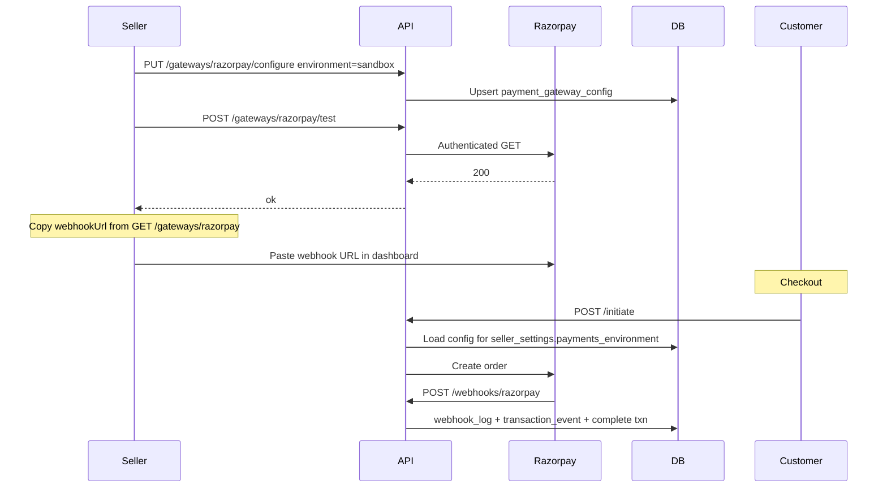

# Payment Seller Dashboard Gaps — Implementation Plan

> **Consistency (2026-09-06):** This file is a **phase checklist**. Binding design is [`spec.md`](./spec.md) + [`pre-spec.md`](./pre-spec.md) + speckit [`plan.md`](./plan.md) / [`research.md`](./research.md).  
> **Do not implement** these older bullets if they conflict: dedicated `GET …/events` (events are on GET-by-id only); `config.country` / `country_id` on config (drop country on config); Razorpay-named webhook handler; `VerifyWebhook`+`ParseWebhook` instead of `NormalizeWebhook`. See research.md **R-01**.

**Feature folder:** `plans/010-payment-seller-dashboard-gaps/` (original) / copy in `specs/010-payment-gateway-platform/`  
**Architecture source of truth:** [`pre-spec.md`](./pre-spec.md). This file is the phased todo list.  
**Source of gaps:** [`plans/payment-backend-handoff.md`](../../plans/payment-backend-handoff.md) plus additional gaps identified during FE/BE review.  
**Module:** `ecommerce-be/payment`  
**Depends on:** Razorpay integration already shipped (`specs/009-razorpay-payment-gateway`).

---

## 1. Objective

Close every seller-dashboard gap that blocks a production-ready Payments UI:

1. Handoff items (status filter, masked config, dual sandbox/production, partial secret update, refundable amount, logo).
2. Missing read APIs for `payment_transaction_event` and `payment_webhook_log`.
3. Return **both** sandbox and production configs (masked) on gateway detail.
4. Decide and implement **gateway test API**.
5. Fix **webhook URL vs hardcoded route** (one source of truth).
6. Stop hardcoding country/currency as string arrays; use existing `country` / `currency` tables.

---

## 2. Current vs target

### 2.1 What exists today

| Area | Today |
|------|--------|
| Gateway catalog | `GET /api/payment/gateways`, `GET /:code` — schema only, no saved hints |
| Configure | `PUT /:code/configure` — full secrets required; `FindBySellerAndGateway` ignores `environment` |
| DB unique | `payment_gateway_config` already `UNIQUE(seller_id, gateway_id, environment)` — unused by API |
| Countries / currencies | `payment_gateway.supported_countries VARCHAR(2)[]`, `supported_currencies VARCHAR(3)[]`; config has `country VARCHAR(2)` with no FK |
| Webhook route | Hardcoded `POST /api/payment/webhooks/razorpay` in [`payment/route/webhook_route.go`](../../payment/route/webhook_route.go) |
| `payment_gateway.webhook_url` | Seeded `NULL`, never read, never returned |
| Events | Append-only `payment_transaction_event` — **Create only**, no GET |
| Webhook logs | `payment_webhook_log` — **internal only**, no GET |
| Test credentials | None (file module has `POST /storage-config/test`) |
| Store test/live mode | Not on `seller_settings` |

### 2.2 Target API surface (seller unless noted)

| Method | Path | Purpose |
|--------|------|---------|
| `GET` | `/api/payment/gateways` | Catalog + dual-env badges + resolved countries/currencies + logo + composed `webhookUrl` |
| `GET` | `/api/payment/gateways/:code` | Detail + fields + **sandbox + production** masked configs + `webhookUrl` |
| `PUT` | `/api/payment/gateways/:code/configure` | Upsert **per environment**; partial secret merge |
| `DELETE` | `/api/payment/gateways/:code/configure?environment=` | Deactivate one env (default: current store mode) |
| `POST` | `/api/payment/gateways/:code/test` | Verify credentials against provider (does not persist) |
| `GET` | `/api/payment/transactions?status=&page=&pageSize=` | Seller list with enum filter |
| `GET` | `/api/payment/transactions/:transactionId` | Detail + `refundableAmountCents` + optional `events` |
| `GET` | `/api/payment/transactions/:transactionId/events` | Event ledger for that payment |
| `GET` | `/api/payment/webhook-logs` | Paginated seller-scoped webhook audit |
| `POST` | `/api/payment/webhooks/:code` | Generic inbound webhook (replaces `/razorpay`) |
| `GET/PATCH` | existing seller settings | Add `paymentsEnvironment` (`sandbox` \| `production`) |

Customer checkout still uses `POST /api/payment/initiate` — routing uses store mode + matching env config.

---

## 3. Architecture decisions (finalize these)

### ADR-1 — Webhook URL field vs hardcoded route

**Problem:** Catalog stores `webhook_url` but the HTTP route is hardcoded to `/razorpay`. That is redundant and does not scale to Stripe/Cashfree.

**Decision:**

- **Routing lives in code**, not in the DB. Gin must bind a handler; a VARCHAR cannot register a route.
- **Replace** `POST /api/payment/webhooks/razorpay` with **generic** `POST /api/payment/webhooks/:code`.
  - Lookup `payment_gateway` by `code`, resolve adapter via existing factory, verify signature, process.
  - Adding Stripe later = seed row + adapter; **no new route**.
- **Drop `payment_gateway.webhook_url`** (migration). It is unused (`NULL`) and duplicates the path.
- **Compose display URL at read time** for the dashboard:

  `{PUBLIC_API_BASE_URL}/api/payment/webhooks/{code}`

  e.g. `https://api.example.com/api/payment/webhooks/razorpay`

- Keep Correlation-ID skip rule as prefix `/api/payment/webhooks/` (already matches).

**Not a DB route table.** `webhook_url` was meant as a copy-paste hint for Razorpay Dashboard, not as routing config. Composition from public base URL + code is the single source of truth.

**Backward compatibility:** Keep an alias `POST /api/payment/webhooks/razorpay` that forwards to the generic handler for one release if Razorpay dashboard was already pointed at the old path (same path as `/:code` with `code=razorpay`, so no alias needed if we only change the Go registration).

### ADR-2 — Gateway test API after configure

**Question:** After configure, do we need a test API?

**Decision: Yes.** Mirror file storage `POST /storage-config/test`.

**Why:** Saving encrypted JSON does not prove Key ID / Key Secret work. Sellers currently only find out at checkout.

**Contract:**

```
POST /api/payment/gateways/:code/test
{
  "environment": "sandbox",
  "credentials": { "key_id": "...", "key_secret": "...", "webhook_secret": "..." }
}
```

- `credentials` optional: if omitted, decrypt **saved** config for that environment and test those.
- If provided, **test unsaved form values** (do not persist). Empty sensitive fields merge from stored config (same as partial PUT).
- Adapter method `TestConnection(ctx, credentials) error` — Razorpay: authenticated GET that must succeed with those keys (e.g. list orders with `count=1`, or create+discard is too heavy — prefer a cheap authenticated GET).
- Do **not** require a live webhook round-trip (Razorpay cannot call localhost). Webhook secret is format-validated only.
- Response: `{ "ok": true, "environment": "sandbox", "message": "Credentials accepted by Razorpay" }` or 400 with provider error (mask secrets).

**When to call:** Dashboard “Test connection” before or after save. Configure can stay independent; test is optional but recommended in UX after save.

### ADR-3 — Country / currency: use geo tables, no hardcoded arrays

**Problem:** `ARRAY['IN']` / `ARRAY['INR']` on `payment_gateway` and `country VARCHAR(2)` on config bypass `country` / `currency` / `country_currency`.

**Decision:**

New join tables (same pattern as `country_currency`):

```
payment_gateway_country (gateway_id FK, country_id FK → country.id) UNIQUE(gateway_id, country_id)
payment_gateway_currency (gateway_id FK, currency_id FK → currency.id) UNIQUE(gateway_id, currency_id)
```

- Drop `supported_countries` and `supported_currencies` columns.
- Change `payment_gateway_config.country` → `country_id BIGINT NOT NULL REFERENCES country(id)` (seller business country at configure time; default from `seller_settings.business_country_id`).
- Seed Razorpay: join India (`country.code = 'IN'`) and INR (`currency.code = 'INR'`).
- API responses return objects (or at least codes resolved from FKs), not ad-hoc strings:

```json
"supportedCountries": [{ "id": 21, "code": "IN", "name": "India" }],
"supportedCurrencies": [{ "id": 4, "code": "INR", "symbol": "₹", "decimalDigits": 2 }]
```

- Initiate payment already uses `UserService.GetSellerDefaultCurrency` + business country. Replace string `IN`/`INR` checks with: seller `business_country_id` / `base_currency_id` must exist in the gateway join tables.

### ADR-4 — Dual sandbox + production configs

**DB already allows it** (`UNIQUE(seller_id, gateway_id, environment)`). The gap is application:

- `FindBySellerAndGateway` loads **one** row (non-deterministic if two exist).
- List/detail expose a single `configured` + `environment`.
- Configure overwrites conceptually “the” config.

**Target:**

- Upsert keyed by `(seller_id, gateway_id, environment)`.
- Detail returns:

```json
"configs": {
  "sandbox": { "configured": true, "isActive": true, "priority": 1, "configHints": { "keyId": "rzp_test_xxxx…yyyy", "accountId": "acc_…" } },
  "production": { "configured": false, "isActive": false, "priority": 0, "configHints": null }
}
```

- Secrets never returned.
- List badges: `configuredSandbox`, `configuredProduction`.
- `seller_settings.payments_environment` (`sandbox` | `production`, default `sandbox`) selects which config checkout uses. Never mix envs.
- `DELETE .../configure?environment=sandbox` deactivates that row only.

### ADR-5 — Event and webhook-log APIs (seller scoped)

**Events** (`payment_transaction_event`): append-only ledger. Sellers need them on payment detail for disputes/debug.

- `GET /api/payment/transactions/:transactionId/events` — ordered by `created_at`.
- Optionally embed last N on transaction detail (`events` array) to save a round trip; dedicated list still required for full history.
- Scope: transaction must belong to `seller_id`.
- Do **not** strip `gateway_request` / `gateway_response` for sellers (ops need them); never expose other sellers’ data.

**Webhook logs** (`payment_webhook_log`): raw inbound audit.

- `GET /api/payment/webhook-logs?page=&pageSize=&status=&eventType=`
- Scope: logs whose `transaction_id` is in the seller’s transactions, **or** unmatched logs cannot be seller-scoped reliably (webhook secret is tried across sellers). **Rule:** only return logs with `transaction_id` pointing at this seller’s payments. Unmatched/global logs stay admin-only (out of scope unless we add admin later).
- Payload may contain PII/card fingerprints — return as stored JSON to seller of that payment only.

---

## 4. Phases and todos

### Phase 0 — Schema (edit existing migrations; payment is not in prod)

**Goal:** Correct CREATE scripts. No `032`, no backfill, no API aliases.

- [ ] **T0.1** Rewrite [`migrations/009_create_payment_tables.sql`](../../migrations/009_create_payment_tables.sql): join tables for country/currency; no arrays, no `webhook_url`, no `config.country`, no `payment_method` table; txn has `environment` + session/payment ids; webhook `event_id NOT NULL` + unique `(gateway_id, event_id)`; index `(status, created_at)`.
- [ ] **T0.2** Fold leftover 031 ALTERs into 009 or slim 031 to **only** `payment_transaction_event` if not merged. Update seed `004` for IN/INR joins.
- [ ] **T0.3** Add `payments_environment` on `seller_settings` in 008.
- [ ] **T0.4** GORM entities match 009. Recreate local DB / testcontainers (RunAllMigrations).

**Depends:** none. **Pre-spec:** [`pre-spec.md`](pre-spec.md) §8.

---

### Phase 1 — Webhook routing (generic `:code`)

**Goal:** One public route; factory resolves adapter.

- [ ] **T1.1** Change [`webhook_route.go`](../../payment/route/webhook_route.go) to `POST /:code` → `HandleWebhook`.
- [ ] **T1.2** Handler reads `code`, loads gateway, adapter `VerifyWebhook` + `ParseWebhook` (today Razorpay-only function becomes generic).
- [ ] **T1.3** Compose `webhookUrl` helper: `config.PublicAPIBaseURL` (new env `PUBLIC_API_BASE_URL`, fallback request host in local) + `/api/payment/webhooks/` + code.
- [ ] **T1.4** Confirm skip rule `PathPrefix: /api/payment/webhooks/` still applies.
- [ ] **T1.5** Integration tests: capture/fail/unauthorized against `/api/payment/webhooks/razorpay`; unknown code → 404; missing correlation ID still 200.

**Depends:** none (can ship before Phase 0 if `webhook_url` drop is in same PR as T1.3).

---

### Phase 2 — Handoff: list/detail/configure/deactivate (dual env + masking)

**Goal:** Dashboard can show both configs and save without re-entering secrets.

- [ ] **T2.1** Repository: `FindBySellerGatewayAndEnvironment`; `FindAllBySellerAndGateway` (both envs); stop using environment-less `First`.
- [ ] **T2.2** `GET /gateways` — `configuredSandbox`, `configuredProduction`, `paymentsEnvironment` (from settings), `webhookUrl`, resolved country/currency objects, logo via `FileDisplayGateway`.
- [ ] **T2.3** `GET /gateways/:code` — `configs.sandbox` / `configs.production` with backend-only `configHints` (mask `key_id`, never secrets).
- [ ] **T2.4** `PUT /configure` — require `environment`; upsert that row; **partial merge** of sensitive fields from existing encrypted JSON (file-module pattern).
- [ ] **T2.5** `DELETE /configure?environment=` — deactivate that env row.
- [ ] **T2.6** Seller settings GET/PATCH include `paymentsEnvironment`.
- [ ] **T2.7** Initiate payment: load config for **store mode env** only; reject if that env not active (`GATEWAY_NOT_CONFIGURED`).
- [ ] **T2.8** Integration: dual-row configure, list badges, partial update, initiate uses sandbox vs production.

**Depends:** Phase 0 (country_id, settings column). Phase 1 for `webhookUrl` composition.

---

### Phase 3 — Gateway test API

- [ ] **T3.1** `PaymentGateway` interface: `TestConnection(ctx, credentials map[string]any) error`.
- [ ] **T3.2** Razorpay implementation: authenticated cheap GET; map 401 → invalid credentials.
- [ ] **T3.3** `POST /api/payment/gateways/:code/test` seller auth.
- [ ] **T3.4** Integration: fake Razorpay 200 → ok; 401 → 400; omitted credentials uses saved sandbox row.

**Depends:** Phase 2 (saved dual-env configs).

---

### Phase 4 — Transactions: status filter + refundable amount

- [ ] **T4.1** `GET /transactions?status=` — validate enum; 400 unknown; pass to `FindBySellerID`.
- [ ] **T4.2** Compute `refundableAmountCents` = `amountCents - sum(completed+processing refunds)` on detail (and list if cheap).
- [ ] **T4.3** Integration: filter each status; refundable after partial refund.

**Depends:** none (can parallel Phase 0–2). **Ship this first if FE is blocked on Failed/Refunded chips.**

---

### Phase 5 — Transaction events API

- [ ] **T5.1** Repo: `ListByTransactionID(ctx, transactionPK uint) ([]PaymentTransactionEvent, error)` ordered `created_at ASC`.
- [ ] **T5.2** `GET /api/payment/transactions/:transactionId/events` — seller (and customer owner) after ownership check.
- [ ] **T5.3** Optionally include `events` on `GET /transactions/:id`.
- [ ] **T5.4** Integration: initiate + webhook produces `initiated`, `gateway_session_created`, `captured`; foreign seller 404.

**Depends:** existing event writes.

---

### Phase 6 — Webhook logs API

- [ ] **T6.1** Repo: paginated `FindBySellerID` via join `payment_webhook_log.transaction_id → payment_transaction.seller_id`.
- [ ] **T6.2** `GET /api/payment/webhook-logs` — query `page`, `pageSize`, optional `status`, `eventType`.
- [ ] **T6.3** Integration: captured webhook appears; other seller empty; unmatched log not leaked.

**Depends:** Phase 1 (same webhook pipeline).

---

### Phase 7 — Initiate routing vs geo support

- [ ] **T7.1** Replace string country/currency checks with join-table membership (`business_country_id`, `base_currency_id`).
- [ ] **T7.2** Error if seller country/currency not in gateway support (`ErrorGatewayUnsupportedCurrency` / new unsupported country).
- [ ] **T7.3** Integration: John/IN/INR still succeeds; seller with unsupported currency 400.

**Depends:** Phase 0 + Phase 2.

---

### Phase 8 — Tests, docs, FE contract

- [ ] **T8.1** Unit tests in `test/` (not beside production packages): gateway masking, refundable amount, skip rules unchanged.
- [ ] **T8.2** Integration in `test/integration/payment/`.
- [ ] **T8.3** Update [`plans/payment-backend-handoff.md`](../payment-backend-handoff.md) “current API surface” to match.
- [ ] **T8.4** Update [`specs/009-razorpay-payment-gateway/contracts/payment-api.md`](../../specs/009-razorpay-payment-gateway/contracts/payment-api.md) and quickstart webhook path + test endpoint + dual env.
- [ ] **T8.5** FE note: webhook URL from API only; Test connection button; sandbox/production tabs.

---

## 5. Suggested ship order (PRs)

| PR | Phases | Why |
|----|--------|-----|
| **PR-A** | Phase 4 | Unblocks dashboard status chips immediately; no schema |
| **PR-B** | Phase 1 | Generic webhook; unblocks Razorpay Dashboard URL story with composed URL even before dropping column |
| **PR-C** | Phase 0 + 2 + 7 | Schema + dual env + geo FKs + initiate routing (one migration) |
| **PR-D** | Phase 3 | Test connection |
| **PR-E** | Phase 5 + 6 | Events + webhook logs |
| **PR-F** | Phase 8 leftovers | Docs only if not included above |

---

## 6. Sequence (configure → test → checkout → webhook)



---

## 7. Files likely touched

| Layer | Paths |
|-------|--------|
| Migrations / seeds | **Edit in place:** `009`, `031` (or merge), `008` seller_settings, `004_seed_payment_gateways.sql`. No `032`. |
| Entities | `payment/entity/payment_gateway.go`, `_config.go`, new join entities, `user/entity/seller_settings.go` |
| Repos | `payment_gateway_config_repository.go`, transaction, event, webhook_log, new country/currency joins |
| Services | `payment_gateway_service.go`, `payment_service.go`, `webhook_service.go`, Razorpay adapter `TestConnection` |
| Routes / handlers | `gateway_route.go`, `webhook_route.go`, `payment_route.go`, seller settings handler |
| Config | public API base URL |
| Tests | `test/integration/payment/*`, `test/common/` or `test/payment/` unit tests |
| Specs | `specs/009-razorpay-payment-gateway/contracts/payment-api.md` |

---

## 8. Out of scope

- Dedicated `GET /api/payment/refunds` ledger (handoff §4.6 — still optional).
- Admin-global unmatched webhook log browser.
- Stripe/Cashfree adapters (generic webhook + join tables unblock them).
- Mixing sandbox and production on one checkout.
- Smart multi-gateway routing beyond `priority` + store mode.

---

## 9. Answers (short)

**Do we need a test API after configure?**  
Yes. Saving credentials ≠ valid keys. Add `POST /gateways/:code/test` like storage-config test. Optional for UX but required for this plan.

**Why `webhook_url` in DB and hardcoded `/razorpay`?**  
The DB field is leftover display config and is unused. Routes cannot come from the DB. **Drop the column; use `POST /webhooks/:code`; compose the URL for the seller.** That is the finalized design.

**Hardcoded IN/INR on `payment_gateway`?**  
Wrong for this codebase. Use `payment_gateway_country` / `payment_gateway_currency` FKs to `country` / `currency`, same as `seller_settings`.
