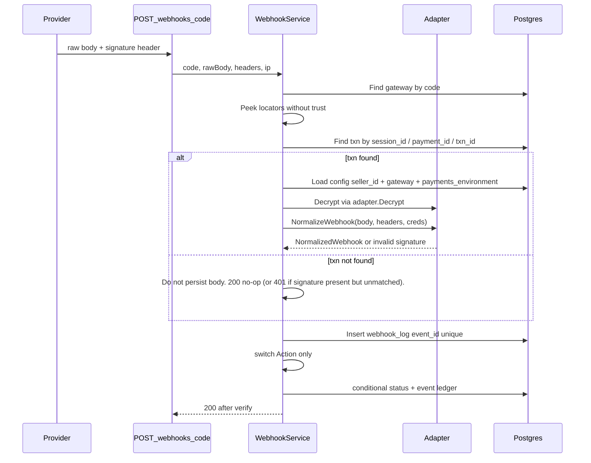

# Payment Gateway Platform — Full Pre-Spec

**Status:** Final for this iteration (architecture + product gaps).  
**Folder:** `plans/010-payment-seller-dashboard-gaps/`  
**Companion:** [`plan.md`](plan.md) (phased todos). This file is the **source of truth** for *what* and *why*; `plan.md` is the *how/when*.  
**Audience:** Backend engineers implementing `ecommerce-be/payment`.  
**Constraint:** Adding Stripe / Cashfree / PayU later must **not** edit `payment_service.go`, `webhook_service.go`, `payment_gateway_service.go`, handlers, or routes except a **one-line factory register**.

**Development (not production):** the payment module is **not deployed to prod**.  
- **Edit existing SQL in place** (`migrations/009_create_payment_tables.sql`, `migrations/031_create_razorpay_payment_integration.sql`, `migrations/008_create_geo_tables.sql` / seller_settings, `migrations/seeds/core/004_seed_payment_gateways.sql`).  
- **Do not** add a follow-up `032` “ALTER drop leftover” migration for this work.  
- **Do not** keep API aliases, deprecated JSON fields, or dual routes “for old FE.” Checkout response is the new contract (`checkout`), not `keyId`.  
- Local/dev DBs: recreate via migrate+seed (or drop payment tables and re-run 009/031). No data-backfill story.

---

## 0. Executive summary

The Razorpay slice works for a **single** provider. It is **not** a platform.

Today, “add a gateway” still requires editing:

| Layer | Razorpay leak |
|-------|----------------|
| Initiate / refund | `FindByCode(GATEWAY_CODE_RAZORPAY)` |
| Credentials | Package-level `EncryptSensitive` / `DecryptSensitive` / `ParseRazorpayCredentials` used by **base** services |
| Configure | Always parses Razorpay fields; hardcodes `country = "IN"` |
| Webhook route | `POST /razorpay` + `HandleRazorpay` |
| Webhook apply | `switch` on `payment.captured`, `refund.processed`, … |
| Checkout response | Base service copies `creds.KeyID` (Razorpay Checkout) |
| Webhook secret | **First active seller’s config** for the gateway — multi-tenant security defect |
| Catalog | `VARCHAR[]` countries/currencies; unused `webhook_url` |
| Stuck payments | No reconciliation; `pending` can sit forever |
| Seller dashboard | No dual sandbox/production read, no masked hints, no status filter, no events/logs APIs, no test connection |

**Target:** every provider lives under `payment/service/payment_gateway/{provider}/`. Base services speak **only** gateway-agnostic interfaces and **normalized actions**. Encryption, HTTP, signature headers, event name mapping, and checkout payload shape stay **inside the provider folder**.

---

## 1. Non-negotiable principles (15-year bar)

1. **Open/Closed.** Base payment/webhook/gateway-dashboard services are closed for modification, open for extension via adapters.
2. **One tenant’s secret never verifies another tenant’s webhook.** Resolve seller **then** verify HMAC.
3. **Never trust webhook JSON before signature verification** except for **non-authoritative locator hints** used only to find which secret to try; the hint is discarded if HMAC fails.
4. **Idempotency everywhere.** Conditional status updates (`WHERE status = expected`). Unique `(gateway_id, event_id)` on webhook logs. Duplicate webhooks = `200` no-op.
5. **Secrets:** AES-256-GCM field-level encrypt; never log; never return; mask `key_id` in APIs; constant-time HMAC compare.
6. **Performance:** no N-seller HMAC brute force on the hot path if we can locate the transaction first; bounded batches + `SKIP LOCKED` for cron; timeouts on all outbound HTTP.
7. **Payments stay order-independent.** `reference_type` + `reference_id`; order module only via service interface.
8. **Geo is first-class FKs.** Catalog support is `payment_gateway_country` / `payment_gateway_currency` → `country.id` / `currency.id`. Seller settings already store those IDs. Initiate is an indexed join/exists, not string-array scan. No denormalized `config.country`.
9. **Sandbox and production are two config rows.** Store mode (`seller_settings.payments_environment`) picks which row checkout uses. Never mix.
10. **One apply path.** Webhook + cron share `applyNormalized`. Do not duplicate status machines.
11. **Hot path stays small.** Checkout/webhook do not load event lists or webhook-log pages. Those are separate, paginated reads.

---

## 1.1 What we still cut vs what we restore for scale

Cuts that **help** performance/security (keep them):

| Cut | Why it does **not** hurt scale |
|-----|-------------------------------|
| Separate `CredentialCodec` | Same methods on one interface; zero extra runtime. |
| `WebhookSignatureHeader()` | Header parse is inside `NormalizeWebhook`. |
| `FetchPayment` + `FetchSession` + `SessionStatusOutput` | One `FetchRemoteStatus` → same `NormalizedWebhook`. Fewer types, **same** cron/webhook apply (less CPU, one code path). |
| `RefundType` enum | Amount already on the request. |
| Dual `configured` + sandbox/production flags | One pair of flags. |
| `keyId` on initiate | FE reads `checkout.fields`. No second contract. |
| Persist **unverified** webhook bodies | Unauthenticated writes would **hurt** DB and storage at scale. Cron heals pending txns. |
| Events on **list** transactions | N+1. Events only on **GET by id**. |
| Extra files (`map_events.go`) | Same binary; just folder hygiene. |
| Per-seller webhook URL tokens | Locate-by-session is O(index). Tokens are a later escape hatch. |
| Separate webhook **replay** cron | Pending/refund TTL cron already polls the provider. Two crons double provider QPS. |

Restored / required for **performance and scale** (do not treat as overengineering):

| Keep | Why |
|------|-----|
| Geo **join tables** + FKs | `EXISTS (gateway_id, country_id)` uses unique indexes. Arrays (`VARCHAR[]` + GIN) do not join to `seller_settings.business_country_id` without a code lookup every initiate. As gateways/countries grow, FKs stay O(log n). We can put this in **009** now (no prod). |
| `FetchRemoteStatus` GET **retry** (2×, jitter, 429/5xx only) | Reconciliation will call Razorpay in batches. Without retry, one 429 fails the whole row until the next 5 min tick. POST initiate/refund still **no retry** (receipt idempotency). |
| Cron: `LIMIT 100` + `FOR UPDATE SKIP LOCKED` + overlap skip | Multi-instance safe; no stampedes. |
| Unique `(gateway_id, event_id)` **NOT NULL** `event_id` | Cheap idempotency. Composite `{event}:{id}` always set. |
| HTTP timeout 10–15s + pooled `http.Client` | Avoids hung initiate under provider lag. |
| `pageSize` cap 100 on all list APIs | Protects DB. |
| `GET /webhook-logs` **paginated**, seller-scoped, **not** on checkout | Hot path unchanged. At scale, ops cannot grep Postgres. Index `(transaction_id, created_at DESC)` / join via `payment_transaction.seller_id`. |
| Shared `applyNormalized` | One lock/update pattern; webhook vs cron cannot diverge. |

**Still drop:** `payment_gateway.webhook_url`, `payment_gateway_config.country`, unused **`payment_method` table** (saved cards — not built; delete from 009). `supported_*` **arrays** on `payment_gateway` — replaced by join tables in 009.

---

## 1.2 Missing from the first pre-spec (payment module)

| Gap | Decision |
|-----|----------|
| Dead DTOs in [`payment/model/gateway_response.go`](../../payment/model/gateway_response.go) (`CreatePaymentResponse`, `CancelPayment`, unused `PaymentStatusResponse`) | **Delete the file.** Live types are `gateway_models.go` + `payment_response.go`. |
| Unused [`payment_method`](../../payment/entity/payment_method.go) table (saved cards) | **Remove from 009** + delete entity. No APIs. |
| `payment_method_details` on **transaction** | Keep column; fill on capture from webhook. |
| Refund rejected unless status is exactly `completed` | Allow `completed` **and** `partially_refunded`. Current code blocks a second partial refund. |
| Webhook does not check amount/currency vs our txn | Reject apply (log failed, do not complete) if `AmountCents`/`Currency` present and mismatch. Prevents wrong-order capture. |
| Empty `event_id` skips unique index (`WHERE event_id IS NOT NULL`) | Adapter **must** always set `EventID` (`{providerEvent}:{entityId}` fallback). |
| Initiate: gateway HTTP after insert; crash leaves `pending` | Already handled by TTL cron. Also **mark failed** if `InitiatePayment` returns error (already decided). |
| `AttachTransactionID` failure after session created | Compensating: leave txn pending; cron + webhook still work; order may lack `transaction_id` — **retry Attach** once; if fail, log and still return checkout (order attach is best-effort second call). Prefer: attach inside same request; if attach fails return 500 and cron will expire unpaid. **Decision: fail the HTTP initiate if attach fails** (txn stays pending until TTL). |
| `priority` on config never used | Use it in gateway **select** (highest priority active config for store env + geo). |
| `supported_payment_methods` unused at initiate | Optional filter if client sends `paymentMethodType`; if set and not in list → 400. If omitted, skip. |
| `reference_type=subscription` | Keep column; no subscription flow in this iteration. |
| No cancel-payment API | Out of scope. Abandoned Checkout → TTL fail. |
| Idempotency-Key on initiate | Out of scope; duplicate pending/completed per order already 409. |
| `ENCRYPTION_KEY` empty | Configure must 500 with clear error, not store plaintext. |
| Page size unbounded | Cap `pageSize` at 100 (same as other list APIs). |
| Webhook `headers` JSONB never stored | Store signature header name + event id only (not full header dump). Optional. Skip to avoid PII. **Skip.** |
| Design V2 leftover comments on dropped `metadata` | Ignore; already dropped in 031. |

---

## 2. Code review — defects that this pre-spec fixes

### 2.1 Open/Closed violations (must fix)

**[`payment/service/payment_service.go`](../../payment/service/payment_service.go)**

- Lines ~118 and ~301: `FindByCode(ctx, constant.GATEWAY_CODE_RAZORPAY)` — initiate and refund cannot select another configured gateway.
- Decrypt via `gateway.DecryptSensitive` which returns `*RazorpayCredentials`.
- Checkout returns `KeyID: creds.KeyID` — Stripe needs `clientSecret`, Cashfree needs `paymentSessionId`. That belongs on **adapter output**, not the orchestrator.

**[`payment/service/payment_gateway_service.go`](../../payment/service/payment_gateway_service.go)**

- Configure always `ParseRazorpayCredentials` + `EncryptSensitive`.
- `country := "IN"` hardcoded.

**[`payment/service/webhook_service.go`](../../payment/service/webhook_service.go)**

- `switch event.EventType` on Razorpay dotted names (`constant.RAZORPAY_EVENT_*`).
- `findGatewayConfigForWebhook` returns `configs[0]` — **wrong seller’s webhook_secret** as soon as two sellers exist.
- Error strings contain `"razorpay:"`.

**[`payment/handler/webhook_handler.go`](../../payment/handler/webhook_handler.go)** + **[`webhook_route.go`](../../payment/route/webhook_route.go)**

- Route and handler named Razorpay; signature header assumed `X-Razorpay-Signature` at the HTTP layer (`WEBHOOK_SIGNATURE_HEADER` constant is Razorpay-specific).

**[`payment/service/payment_gateway/`](../../payment/service/payment_gateway/)**

- Flat package: `razorpay_gateway.go`, `razorpay_credentials.go` sit beside the interface.
- `EncryptSensitive` / `DecryptSensitive` / `ResolveEncryptionKey` are **package-level** and Razorpay-shaped; Stripe would collide or force `if code == razorpay` in the dashboard service.

**[`payment/model/gateway_models.go`](../../payment/model/gateway_models.go)**

- `RazorpayCredentials` in the shared model package. Provider credential structs must live in the provider folder.

**[`payment/utils/constant/payment_gateway_constant.go`](../../payment/utils/constant/payment_gateway_constant.go)**

- `RAZORPAY_EVENT_*` and `RAZORPAY_BASE_URL` imported by **webhook_service**. Event names must not leave the Razorpay folder.

### 2.2 Security defects

| ID | Issue | Risk | Fix |
|----|--------|------|-----|
| S1 | Webhook HMAC uses first seller config | Cross-tenant payment confirmation / secret oracle | Locate txn → seller config → verify |
| S2 | Payload parsed fully before verify in practice (parse after verify today, but secret is wrong seller) | Attacker who knows seller A secret cannot hit seller B if we fix S1; still parse-after-verify | Verify then parse, or parse locators only |
| S3 | Razorpay `event_id` taken from body `payload.id` / entity id — **not** `X-Razorpay-Event-Id` | Weak idempotency (payment id reused across event types) | Adapter extracts canonical event id (header + body rules) |
| S4 | Configure requires all secrets every time | Sellers paste secrets in chat; rotation pain | Partial merge |
| S5 | No credential test | Bad keys discovered at checkout | `TestConnection` |
| S6 | Initiate uses any active config regardless of sandbox vs live store mode | Live orders charged on test keys | Store `payments_environment` |
| S7 | Logs may include Razorpay body on API error (`body=` in warn) | Secret/PII in logs | Truncate + redaction in adapter HTTP client |

### 2.3 Scalability / ops defects

| ID | Issue | Fix |
|----|--------|-----|
| P1 | `pending` forever if webhook missed (user closed Checkout) | Reconciliation cron + `FetchRemoteStatus` |
| P2 | Refund `processing` forever if refund webhook missed | Same cron for refunds |
| P3 | Provider 429/5xx on cron GET | 2 retries + jitter on `FetchRemoteStatus` / `TestConnection` only |
| P4 | Webhook handler returns 200 on processing errors | Keep 200 after **verified** events (provider retry storms); persist `webhook_log.status=failed` + cron replay optional later |
| P5 | No listing filter → FE paginates wrong | `?status=` |
| P6 | Dual env unique key exists in SQL; app loads one row | Query by environment |

### 2.4 Product gaps (dashboard + ledger)

Already listed in [`plans/payment-backend-handoff.md`](../payment-backend-handoff.md) and [`plan.md`](plan.md): status filter, masked config, webhook URL composition, dual env, partial update, refundable amount, logo, events API, webhook-logs API, geo FKs, generic webhook path, test API.

This pre-spec **includes all of them**. They are not optional if this is “full and final.”

---

## 3. Target package layout

```
payment/service/payment_gateway/
  contract.go              # PaymentGateway interface, WebhookAction, NormalizedWebhook, I/O DTOs
  crypto.go                # ResolveEncryptionKey() only (move from razorpay_credentials.go)
  razorpay/
    adapter.go             # implements PaymentGateway
    credentials.go         # validate / encrypt / decrypt / mask / merge
    http.go                # client, timeout, redacted error log
    webhook.go             # HMAC, peek locators, parse → NormalizedWebhook, event map
  stripe/                  # FUTURE
```

**Factory register (only base-ish file allowed to grow by one line):**

[`payment/factory/singleton/service_factory.go`](../../payment/factory/singleton/service_factory.go)

```go
razorpay := razorpay.New(os.Getenv("RAZORPAY_BASE_URL"))
stripe := stripe.New(...) // future
factory.NewPaymentGatewayFactory(repo, razorpay, stripe)
```

**Rules**

- No `razorpay` import in `payment/service/*.go` except the factory singleton.
- No `RAZORPAY_*` constants outside `payment_gateway/razorpay/`.
- Shared `payment/model` keeps **orchestrator DTOs** (`InitiatePaymentInput`, `NormalizedWebhook`). Provider credential structs stay in the provider folder.
- Delete flat `razorpay_gateway.go` / `razorpay_credentials.go` after move.

---

## 4. Interfaces (the only contract base services may call)

**One interface.** Factory: `map[code]PaymentGateway`.

```go
type PaymentGateway interface {
    Code() string

    // Credentials (seller dashboard + decrypt for outbound)
    Validate(raw map[string]any, partial bool) error
    Encrypt(raw map[string]any) (map[string]any, error)
    Decrypt(stored map[string]any) (map[string]any, error)
    MaskHints(stored map[string]any) map[string]any
    MergePartial(existingStored, incoming map[string]any) (map[string]any, error)

    InitiatePayment(ctx context.Context, in InitiatePaymentInput) (*InitiatePaymentOutput, error)
    Refund(ctx context.Context, in RefundInput) (*RefundOutput, error)
    TestConnection(ctx context.Context, creds map[string]any) error

    // PeekLocators is untrusted JSON scrape (no HMAC). Used only to find our txn.
    PeekLocators(rawBody []byte) Locators

    // NormalizeWebhook verifies signature from headers + creds, then maps to Action.
    NormalizeWebhook(rawBody []byte, headers http.Header, creds map[string]any) (*NormalizedWebhook, error)

    // FetchRemoteStatus for cron. Pass session and/or payment id (either may be empty).
    // Returns Action=ignore if still open; payment_completed / payment_failed / refund_* when terminal.
    FetchRemoteStatus(ctx context.Context, sessionID, paymentID string, creds map[string]any) (*NormalizedWebhook, error)
}

type Locators struct {
    TransactionID string
    SessionID     string
    PaymentID     string
    RefundID      string
}
```

Drop today's `Refund(..., refundType RefundType, ...)`. Drop `PaymentStatusOutput` if unused after this (cron uses `NormalizedWebhook`). Keep `InitiatePaymentOutput` / `RefundOutput`.

**`NormalizeWebhook`:** verify then parse. Return actions, not `payment.captured`.

### 4.3 Normalized webhook (base service switch — frozen)

```go
type WebhookAction string

const (
    WebhookActionIgnore           WebhookAction = "ignore"
    WebhookActionAuthorized       WebhookAction = "authorized"        // observation; status unchanged
    WebhookActionPaymentCompleted WebhookAction = "payment_completed" // pending → completed + confirm order
    WebhookActionPaymentFailed    WebhookAction = "payment_failed"    // pending → failed + fail order
    WebhookActionRefundPending    WebhookAction = "refund_pending"
    WebhookActionRefundCompleted  WebhookAction = "refund_completed"
    WebhookActionRefundFailed     WebhookAction = "refund_failed"
)

type NormalizedWebhook struct {
    Action          WebhookAction
    EventID         string         // idempotency key (provider unique)
    ProviderEvent   string         // raw name stored on webhook_log.event_type for audit only
    TransactionID   string         // our TXN_* if present in notes
    SessionID       string         // gateway_session_id
    PaymentID       string         // gateway_payment_id
    RefundID        string         // gateway_refund_id
    AmountCents     int64
    Currency        string
    FeeCents        *int64
    FailureCode     string
    FailureMessage  string
    Payload         map[string]any // sanitized for storage
}
```

**Base `webhook_service` switch (never grows with new gateways):**

```
ignore → mark log ignored
authorized → append event, no status change
payment_completed → complete txn + ConfirmPaymentByTransactionID
payment_failed → fail txn + FailPaymentByTransactionID
refund_* → refund row + recompute txn refunded/partial
```

Razorpay mapping (lives in `razorpay/map_events.go` only):

| Razorpay event | Action |
|----------------|--------|
| `payment.authorized` | `authorized` |
| `payment.captured` | `payment_completed` |
| `payment.failed` | `payment_failed` |
| `refund.created` | `refund_pending` |
| `refund.processed` | `refund_completed` |
| `refund.failed` | `refund_failed` |
| anything else | `ignore` |

Stripe would map `payment_intent.succeeded` → `payment_completed` in **its** folder. Base service unchanged.

### 4.4 Initiate output — checkout payload (no Razorpay in orchestrator)

```go
type InitiatePaymentOutput struct {
    GatewaySessionID   string
    Status             string
    AmountCents        int64
    Currency           string
    GatewayResponse    map[string]any
    Checkout           CheckoutPayload // FE-facing, adapter-defined
}

type CheckoutPayload struct {
    GatewayCode string         `json:"gatewayCode"`
    Fields      map[string]any `json:"fields"`
}
```

Razorpay `Fields`: `{ "keyId", "orderId" }` (`orderId` = session id).  
Stripe later: `{ "clientSecret", "publishableKey" }`.

HTTP `InitiatePaymentResponse`: `transactionId`, `gatewaySessionID`, `amountCents`, `currency`, `status`, `checkout` (`gatewayCode` + `fields`). **No `keyId` field.** Razorpay puts `keyId` and `orderId` inside `checkout.fields`.

Razorpay `FetchRemoteStatus`: `GET /orders/{sessionID}`. `paid` → `payment_completed`; still open → `ignore`; expired → `payment_failed`. If only `paymentID` is set (stuck refund), `GET /payments/{id}` as needed. **GET:** up to 2 retries on 429/5xx with jitter. **POST:** no retry.

---

## 5. Webhook pipeline (secure, scalable)



### 5.1 Two-phase locate (required for multi-seller)

**Phase A — untrusted peek (adapter method `PeekLocators(rawBody) Locators`, no creds):** extract session/payment/txn ids from JSON **without** treating the event as authentic.

**Phase B — load seller config** from `payment_transaction.seller_id` + `gateway_id`. Prefer config `environment` matching `seller_settings.payments_environment`. If webhook arrives for sandbox payment, use the txn’s gateway + the config environment **that created the session** (store `environment` on `payment_transaction` — see §8). **Do not guess.**

**Phase C — `NormalizeWebhook` with that seller’s decrypted `webhook_secret`.** Fail → 401, no state change.

**If no transaction yet:** do not HMAC-guess across sellers; do not store the payload. Return **200** so the provider stops hammering (initiate may still be in flight). Cron reconciles if we later have a pending txn. If this is too lossy in production, add per-seller webhook path later — not v1.

### 5.2 Signature header

Razorpay adapter reads `X-Razorpay-Signature` and `X-Razorpay-Event-Id` from `headers`. `EventID` fallback: `{event}:{entity.id}` so authorized vs captured are distinct unique-index keys.

### 5.3 HTTP route

```
POST /api/payment/webhooks/:code
```

Handler: read raw body (`io.ReadAll`), pass `c.Request.Header`, `code` from path. **No Razorpay-named handler.** Correlation-ID skip prefix stays `/api/payment/webhooks/`.

Unknown `code` → 404. Invalid signature (txn found, HMAC fail) → 401. Verified → **always 200**. Apply errors → `webhook_log.status=failed`; pending cron is the backstop (no separate replay job in v1).

### 5.4 Drop `payment_gateway.webhook_url`

Compose: `{PUBLIC_API_BASE_URL}/api/payment/webhooks/{code}`.  
Env: `PUBLIC_API_BASE_URL` (required in prod). Local default `http://localhost:8080`.

---

## 6. Seller configuration (full product)

### 6.1 Data grain

`UNIQUE (seller_id, gateway_id, environment)` — already in `migrations/009`. **Use it.**

Store mode: `seller_settings.payments_environment` = `sandbox` | `production` (default `sandbox`).

Checkout / refund / webhook apply use:

`payment_transaction.environment` copied from store mode **at initiate time** so a later toggle does not reinterpret old payments.

### 6.2 APIs

| Method | Path | Behavior |
|--------|------|----------|
| GET | `/api/payment/gateways` | Catalog + dual-env flags + `paymentsEnvironment` + countries/currencies as `{id,code,name}` from joins + logo + `webhookUrl` |
| GET | `/api/payment/gateways/:code` | Fields schema + `configs.sandbox` + `configs.production` + `configHints` (masked) |
| PUT | `/api/payment/gateways/:code/configure` | Body includes `environment`. Partial secrets. Codec `Validate`/`MergePartial`/`Encrypt` |
| DELETE | `/api/payment/gateways/:code/configure?environment=` | Deactivate that env |
| POST | `/api/payment/gateways/:code/test` | Codec decrypt or unsaved merge → `TestConnection` |
| PATCH | existing seller settings | `paymentsEnvironment` toggle |

**Toggle rules**

- Switching store to `production` without an **active** production config → checkout returns `GATEWAY_NOT_CONFIGURED` (do not silently use sandbox).
- Banner/FE: test mode vs live is store setting, not inferred from last configure.

**Hints masking (backend only)**

- `key_id`: show first 8 + last 4 (`rzp_test_xxxx…Cgd`) or full if product prefers full public key — **never** `key_secret` / `webhook_secret`.
- `account_id`: full if present.

### 6.3 Test API

Same as file `storage-config/test`. Razorpay: authenticated GET with `count=1` on orders. 401 → 400 invalid credentials. Webhook secret: length/format only (cannot call Razorpay to verify webhook secret without them posting).

---

## 7. Stuck / in-flight transactions — reconciliation (best practice)

Webhooks are **best-effort**. Users close Checkout, mobile loses network, Razorpay retries fail, our process crashes after `200`. Industry practice: **webhook + poll**.

### 7.1 When a payment is “stuck”

`payment_transaction.status = pending` AND `now - created_at > PendingGrace` (default **45 minutes**; Razorpay order typically 15–45 min; make configurable `PAYMENT_PENDING_TTL_MINUTES`).

Also: `payment_refund.status IN (pending, processing)` older than `REFUND_STUCK_TTL_MINUTES` (default 30).

### 7.2 Job

- Register `common/cron` job, e.g. every **5 minutes**, name `payment.reconcile_pending`.
- Query: `WHERE status = pending AND created_at < now()-ttl ORDER BY id LIMIT 100 FOR UPDATE SKIP LOCKED`.
- For each row: load adapter by `gateway_id`, decrypt **that txn’s** env config, call `FetchRemoteStatus(sessionID, paymentID, creds)`.
- Apply the **same** `applyNormalized` as webhooks (`source=system`).
- If Action is `ignore` and age > TTL → treat as `payment_failed` with `failure_code=EXPIRED_UNPAID` and fail the order.
- If `gateway_session_id` empty (initiate crashed before session) → fail immediately after shorter TTL (5 min).
- Metrics/logs: processed, completed, failed, errors. No secrets.

### 7.3 Why not only cron

Webhooks remain primary (low latency for Checkout UX). Cron is safety net. Do not poll every pending txn every second.

### 7.4 Customer UX

`GET /transactions/:id` remains source of truth. FE polls after Checkout. Reconciliation catches abandoned sessions without FE.

### 7.5 Concurrency

Webhook and cron must both use `UpdateStatusIfCurrent(pending → completed|failed)`. Loser is no-op. Unique webhook event_id still applies for webhooks.

---

## 8. Schema — edit 009 / 031 / 008 / seed in place

No `032`. Target shape of **009** (rewrite the CREATE):

`payment_gateway`: `id`, `code`, `name`, `description`, `logo_file_id`, `is_active`, `supported_payment_methods`, timestamps. **No** `supported_countries`, `supported_currencies`, `webhook_url`, `logo_url`.

`payment_gateway_country`: `(gateway_id, country_id)` UNIQUE, FKs, indexes on both ids.  
`payment_gateway_currency`: `(gateway_id, currency_id)` UNIQUE, FKs, indexes on both ids.

`payment_gateway_field`: unchanged idea.  
`payment_gateway_config`: `seller_id`, `gateway_id`, `environment`, `credentials`, `is_active`, `priority`, timestamps. `UNIQUE(seller_id, gateway_id, environment)`. **No `country`.**

`payment_transaction`: include `reference_*`, `gateway_session_id`, `gateway_payment_id`, `payment_method_details`, `environment`, nullable `gateway_fee_cents`. Index `(status, created_at)` for cron. **No** `metadata`, `initiated_at`, `gateway_transaction_id`.

`payment_transaction_event`: as today (031 can stay as CREATE or fold into 009 — prefer **one** payment schema file if you merge 031 into 009; otherwise keep 031 but only the event table + webhook unique index, not leftover ALTERs that 009 already has).

`payment_webhook_log`: `event_id VARCHAR NOT NULL`; unique `(gateway_id, event_id)` without `WHERE event_id IS NOT NULL`. Index `(created_at DESC)`.

**Drop from 009:** entire `payment_method` table (saved cards unused).

**008 / seller_settings:** add `payments_environment VARCHAR(20) NOT NULL DEFAULT 'sandbox'`.

**Seed 004:** Razorpay row + fields; insert join rows for India + INR via `country.code='IN'` / `currency.code='INR'` subselects. No `webhook_url`.

---

## 9. Base service algorithms (gateway-agnostic)

### 9.1 Initiate

1. Load payable order (existing).
2. Reject duplicate pending/completed payment for reference.
3. Resolve seller currency + business country from user service.
4. **Select gateway:** active configs for `(seller_id, payments_environment)`, gateway `is_active`, `EXISTS` seller `business_country_id` / `base_currency_id` on gateway join tables, order by `priority DESC`. Factory `GetByCode`. Not hardcoded Razorpay.
4b. If request `paymentMethodType` set and not in `supported_payment_methods` → 400. If none match geo/env → `GATEWAY_NOT_CONFIGURED` / unsupported geo.
5. `adapter.Decrypt(config.Credentials)`.
6. Insert txn `pending` + `environment` + event `initiated`.
7. `adapter.InitiatePayment` with decrypted map.
8. Persist `gateway_session_id` + event `gateway_session_created`.
9. Attach txn id to order.
10. Return txn + `checkout` from adapter.

If step 7 fails: mark txn `failed` (or leave pending and let cron expire — **prefer fail initiate** so user can retry; delete-or-fail pending row). Decision: **mark failed** with `failure_message` from adapter, allow new initiate (duplicate check only pending+completed — failed does not block).

### 9.2 Refund

1. Seller owns txn; status `completed` **or** `partially_refunded`.
2. Cap `refundableAmountCents`.
3. Load config by **txn.environment** (not current store toggle).
4. `adapter.Refund` with decrypted creds.
5. Persist refund `processing` + event.

### 9.3 Webhook apply

Shared `applyNormalized(ctx, txn, n NormalizedWebhook, source webhook|system)` used by webhook + cron.

Before money movement: if `n.AmountCents > 0` and ≠ `txn.AmountCents`, or currency set and ≠ `txn.Currency`, mark log failed and **do not** complete. On `payment_completed`, persist `gateway_payment_id`, fee, and `payment_method_details` from payload when present.

### 9.4 Configure

1. Factory `GetByCode(code)` → codec methods.
2. `MergePartial` if row exists for that environment.
3. `Validate` + `Encrypt` + upsert unique (seller, gateway, env).
4. Do not write `country` on config.

---

## 10. Remaining dashboard / ledger APIs

All seller-scoped unless noted.

| API | Notes |
|-----|--------|
| `GET /transactions?status=&page=&pageSize=` | SQL filter; `pageSize` cap 100; **no events** in list payload |
| `GET /transactions/:id` | + `refundableAmountCents` + `environment` + **`events`** (small, ordered `created_at`) |
| `GET /webhook-logs` | Seller-scoped via txn join; `page`/`pageSize`/optional `status`; not on checkout path |
| Logo | `FileDisplayGateway` when `logo_file_id` set |

---

## 11. Performance checklist

- HTTP client: 10–15s timeout, connection pooling.
- **GET** `FetchRemoteStatus` / `TestConnection`: 2 retries, jitter, 429/5xx only. **POST** initiate/refund: no retry (`receipt` idempotency).
- Cron batch 100, `SKIP LOCKED`, skip if previous run still active.
- Webhook: one apply per event; no provider HTTP inside apply.
- List APIs: filter in SQL; never attach events to list.
- Geo check: `EXISTS` on join tables, not loading full catalogs into memory.
- Decrypt once per request.

## 12. Security checklist

- AES-256-GCM via existing `helper.Encrypt`; key from config/`ENCRYPTION_KEY`.
- HMAC compare `hmac.Equal`.
- Raw body for signatures (never re-serialized JSON).
- Tenant isolation on every GET.
- Masking only in backend.
- Webhook skip correlation ID **only** for `/api/payment/webhooks/`.
- Redact Authorization and secrets in adapter logs.
- TestConnection must not persist body with secrets.
- Empty `ENCRYPTION_KEY` → configure/decrypt fails closed (no plaintext secrets in DB).
- Webhook amount/currency must match txn before complete.

## 13. Adding a new gateway (definition of done)

Checklist — **only** these files:

1. `payment/service/payment_gateway/{code}/` implementing `PaymentGateway`.
2. Seed `payment_gateway` + fields + IN/INR join rows.
3. One line in `service_factory.go` `NewPaymentGatewayFactory(..., newAdapter)`.
4. Integration tests under `test/integration/payment/` with fake HTTP server.

**Forbidden:** switches on `code` in payment/webhook/gateway dashboard services; new HTTP routes per provider; new encrypt functions in `payment_gateway_service.go`.

---

## 14. Testing requirements

- Unit: `test/payment/payment_gateway/razorpay/` (webhook map, mask, merge, HMAC).
- Unit: `test/payment/` for `applyNormalized` with fake adapter.
- Integration: existing suite + dual env + webhook without correlation id + unknown code 404 + wrong seller secret 401 + two sellers isolation + reconciliation marks expired pending failed + `?status=` + events on GET detail + test endpoint + second partial refund + amount mismatch does not complete.
- Never hit real Razorpay in CI (httptest).

---

## 15. API contract (no aliases)

- Initiate: `checkout` only (no `keyId`).
- Webhook: `POST /api/payment/webhooks/:code` only (Razorpay is `code=razorpay`).
- `PUBLIC_API_BASE_URL` for composed webhook URL.

---

## 16. Out of scope

- Stripe/Cashfree adapter code (folder contract only).
- Per-seller webhook URL tokens.
- `GET /refunds` ledger; extra `GET .../events` route (events are on detail).
- Saved cards (`payment_method`).
- Cancel-payment API; subscription payments.
- Admin unmatched webhook browser.
- Smart routing beyond priority + geo + store mode.

---

## 17. Implementation order (aligned with `plan.md`)

1. Rewrite **009 / 031 / 008 / seed** to the schema above; delete `payment_method`; delete dead `gateway_response.go`.
2. Extract Razorpay folder + **one** `PaymentGateway` interface. Purge Razorpay from base services.
3. Generic `POST /webhooks/:code` + locate-then-verify + amount/currency check.
4. Dual-env configure/detail/partial update/store toggle; `priority` + geo `EXISTS` on initiate.
5. Test connection API.
6. `?status=` + `refundableAmountCents` + refund on `partially_refunded`.
7. Embed `events` on GET txn detail; paginated `GET /webhook-logs`.
8. Reconciliation cron (`FetchRemoteStatus` + GET retries + `applyNormalized`).
9. Docs + FE: `checkout.fields`.

If FE is blocked on `?status=` only, that query param can land in parallel **without** Razorpay switches — but **do not** ship more Razorpay branches in `webhook_service`.

---

## 18. Success criteria

- New gateway = new folder + seed + factory line.
- Two sellers on Razorpay: seller B webhook cannot complete seller A payment.
- Abandoned Checkout: txn leaves `pending` via cron within TTL.
- Seller can save sandbox and production, toggle store mode, update `key_id` without re-entering secrets, copy webhook URL, test keys, see events.
- `rg "RAZORPAY_EVENT|ParseRazorpay|DecryptSensitive|GATEWAY_CODE_RAZORPAY" payment/service/*.go payment/handler payment/route` → **zero matches** (factory singleton excluded).
