# Caching Infrastructure — Pre-Spec

**Status:** Draft for review (architecture + strategy + backend decision).
**Folder:** `specs/011-caching-infrastructure/`
**Companion:** `plan.md` (phased build order) + `tasks.md` (generated later). This file is the **source of truth** for *what* and *why*; `plan.md` is the *how/when*.
**Audience:** Backend engineers implementing `ecommerce-be/common/cachekit` + per-module cache strategies.
**Constraint:** Adding a cached resource later must **not** touch the cache client, codec, key builder, or other modules — only the owning module's `cache/*.go` strategy + service wiring.

**Development (not production):** the platform is **not deployed to prod**.
- Backend choice is unconstrained: full move to DragonflyDB allowed, no backward-compat shims for old keys.
- Client: `go-redis/v8 → github.com/redis/go-redis/v9` in Phase 0. **rueidis is out of scope** unless the conformance suite shows pipeline saturation on Dragonfly.
- Existing Redis keys (`seller_complete:*`, `seller_subscription:*`, dead constants) may be renamed/removed without migration.
- Compose runs **two** KV services (volatile cache vs durable queue/locks). Redis profiles stay one release as rollback after Dragonfly cutover.
- Logical Redis DB stays **`0`**. Do not use `SELECT` / `REDIS_DB>0` — Dragonfly multi-DB is not Redis-identical; isolation is by key prefix.

**How to read the diagrams:** all diagrams are Mermaid (rendered by GitHub/VS Code). Start with §0.1 (request flow), §0.3 (two stores), §3.1 (layer map), **§4.5 (module registry — cache / never / later per route)**, §5.1 (invalidation), §6.1 (inventory), §7.2 (backend decision), §8.3 (fail-open vs fail-closed).

**Consistency rule:** §4.5 is the complete cache/no-cache map. Keys (§5), allowlist (§5.5), packages (§3), flags (§8.5), phases (§10), and tests (§9) must not introduce a resource that §4.5 does not name.

---

## 0. Executive summary

Today Redis is a thin, inconsistent wrapper (`common/cache/redis.go:1-99`) around `go-redis/v8`. Domain caching is only ~4 concerns (seller validation, currency, JWT denylist, scheduler job-id pointers). Product/inventory/order — the actual read-heavy paths — have **zero** domain caching.

The same Redis instance is also a **durable work queue** (`delayed_jobs` ZSET, `scheduled_job:{id}`) and a **correctness store** (file `SETNX` idempotency, coupon rate-limit, JWT denylist). Compose already contradicts itself: `--maxmemory-policy allkeys-lru` **and** a `redis_data` volume. LRU can drop reservation-expiry jobs, upload idempotency, and logout entries.

Known defects: hot key never invalidated (`seller_complete:{id}`), invalidators target dead keys (`seller_subscription:`), denylist uses the **raw JWT** as the key with a **fixed 24h TTL from logout** while token lifetime is `JWT_EXPIRY_HOURS` (**72h** in `.env`/`.env.test`, env-dependent in prod via deploy secrets) — a ~48h window where a logged-out token becomes valid again, non-atomic rate-limit `INCR+EXPIRE`, no stampede protection, no timeouts/pool tuning, `DeletePattern` referenced in docs but unimplemented, `app.depends_on: redis healthy` blocks boot.

**Target:** `common/cachekit` (interface + hardened v9 client + key/codec/singleflight/metrics) → per-module strategies (`product/cache`, `user/cache`, `payment/cache`, `file/cache`, later `inventory/cache`) → services call strategies, never raw Redis. **Two backends:** volatile cache (fail-open, eviction OK) and durable KV (fail-closed where required, no LRU of jobs). Postgres stays source of truth for domain data. Safe incremental rollout: foundation + high-ROI safe caches first; list/search versioned cache and inventory micro-cache behind flags in a later phase.

### 0.1 Request flow (the whole design in one picture)

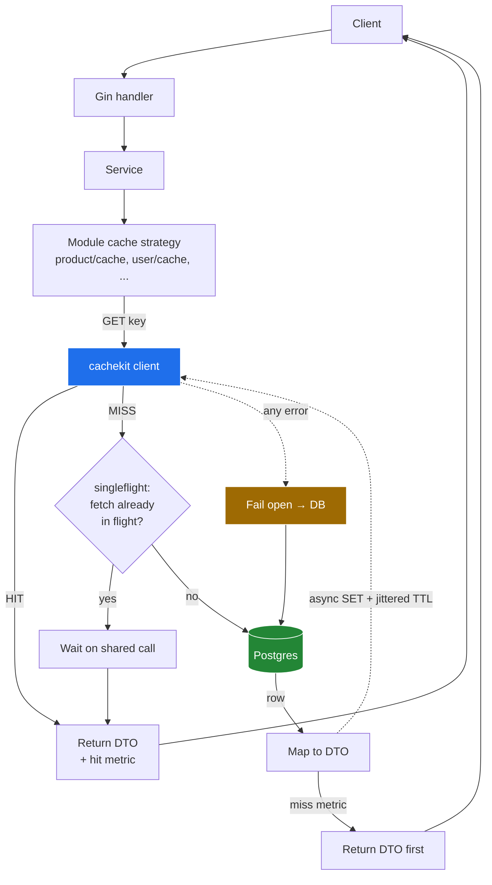

Read it left-to-right: **strategy → cachekit → (hit) return; (miss) singleflight → DB → return, populate async; (any cache error) DB.** The response never waits for the cache write (§8.6). This fail-open path is **domain cache-aside only**. Denylist, file `SETNX`, and the scheduler do **not** follow this diagram — see §8.3.

### 0.2 Write / invalidation flow

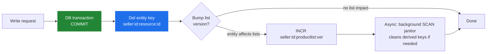

Key rule: **cache writes happen after DB commit, never inside the `db.WithTransaction` closure.** A transaction rollback must never leave a "new" value in cache.

If `Del` succeeds and `INCR` fails (or the opposite): log + `cache_error` metric; HTTP still 200. Stale bound is the list TTL (≤2m). Do not retry on the request path.

**Stale async-SET race (mandatory guard).** Timeline: request A misses → reads DB → request B commits a write and `Del`s the key → A’s detached SET puts the **pre-write** DTO back until TTL. Countermeasure (§8.6): every fill captures a per-key generation (or “key still missing / version unchanged” check) **immediately before SET**; if a write `Del`/version bump happened after the miss, **drop the SET**. Never populate blindly after returning to the caller.

### 0.3 Two stores (do not mix eviction classes)

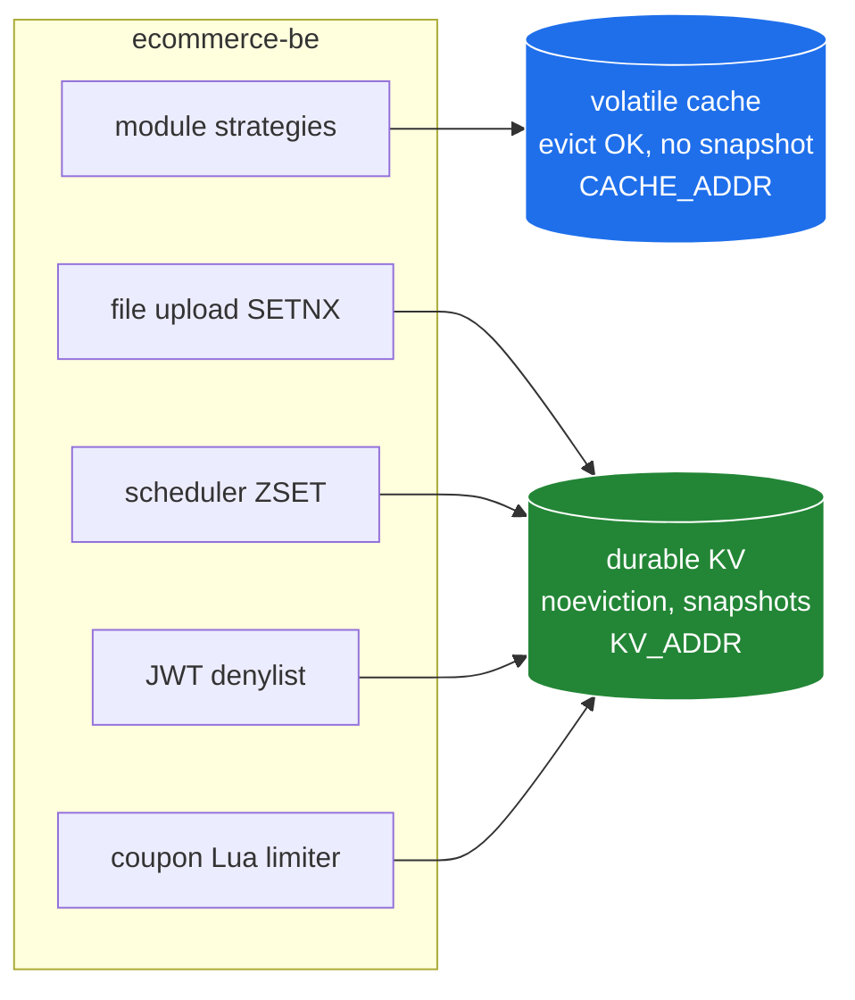

| Class | Addr env | What lives here | Eviction | Persistence | Boot |
|-------|----------|-----------------|----------|-------------|------|
| **Volatile cache** | `CACHE_ADDR` | seller/currency/catalog/list/inventory-avail | yes (`cache_mode` / LRU) | none — lose on restart OK | HTTP **must start** if this is down |
| **Durable KV** | `KV_ADDR` | `delayed_jobs`, `scheduled_job:`, `file:init:idem:`, `bl:`, `coupon:apply:rate:` | **no** (`noeviction`) | snapshots on; restart must recover jobs | Scheduler **must not** start without it; HTTP can start (file upload / logout degrade per §8.3) |

**Recommended:** two compose services (two Dragonfly or Redis processes). **Rejected as default:** one process with `allkeys-lru` (today's bug). A single process is allowed only if eviction is `noeviction` **and** cache keys all have TTLs **and** maxmemory is sized so catalog cannot OOM the box — that is a fallback, not the target.

### 0.4 Incident that shaped this design (pre-launch write storm)

High RPS with **random (non-repeating) product queries** → near-100% misses → every request did `GET (miss) + DB fetch + synchronous SET` → SETs queued behind a saturating backend → GETs slowed too (single-threaded command execution: big SETs head-of-line-block fast GETs) → upstream timeouts → client retries → retry wave → more load. Causal chain:

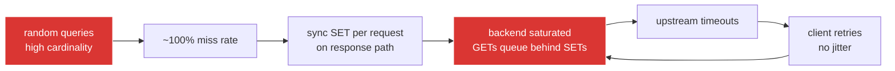

Every link in that chain has a named countermeasure in this spec, so we never re-fix it as a business-feature fire drill: admission control (§4.4) breaks link 1→2; async bounded SETs (§8.6) break link 2→3; jittered TTLs (§5.6) and no-retry-on-GET (§8.6) break links 3→6; the write-shed breaker (§8.6) is the automatic last resort. Standard stampede tools (singleflight, locks) do **not** help here — they only coalesce identical keys — which is why admission exists separately.

---

## 1. Non-negotiable principles (15-year bar)

1. **Cache never authoritative for domain reads.** Catalog/auth-seller/currency paths work with the volatile cache down (fail open to DB). Fail-closed is explicit and listed in §8.3 (checkout reserve, file idempotency, denylist read).
2. **No generic helper dumping ground.** `cachekit` holds infrastructure only (client, codec, keys, resilience, durable ZSET/`SETNX`). Business rules (what/TTL/invalidation) live in the owning module's `cache/` package.
3. **Tenant isolation enforced in code.** Key builder requires `seller:{id}` scope; `WHERE seller_id=?` stays in repos; cross-seller cache read is a tested failure case. Platform keys are an **allowlist** (§5.5), not a wildcard.
4. **No `KEYS` in request path.** Prefix invalidation via version counters (`INCR`) or background `SCAN` janitor only. Tests that currently call `Keys()` must move to `SCAN` or exact keys.
5. **Bounded blast radius.** Per-op timeouts, max-value guard (~256KB — **skip SET, serve from DB, log**; never truncate JSON), short TTLs on derived data, Lua for atomic counter ops.
6. **Observability from day one.** Hit/miss/error + latency per `(module, op)`; alert on miss-spike (invalidation bug) and error-spike (backend down).
7. **Backend portability via provider blindness.** No provider type, import, or error value (`go-redis`, `rueidis`, `redis.Nil`, …) may appear in any signature, struct, or import outside `common/cachekit/provider/` — the single adapter package. Services, strategies, the scheduler, and jobs depend only on `cachekit` interfaces (`Cache`, `Durable`, `DelayQueue`). Swapping Redis ↔ Dragonfly (or anything RESP-shaped later) = one new adapter + addr change, zero edits elsewhere. Enforced by grep in CI (§12).
8. **Never mix eviction classes.** Durable keys must not share an LRU/cache-mode instance with catalog cache.

---

## 2. Code review — defects this pre-spec fixes

| ID | Location | Issue | Fix |
|----|----------|-------|-----|
| C1 | `common/cache/redis.go:14-17` | Global `Background()` ctx, no timeouts | Per-op `WithTimeout` in `cachekit` client |
| C2 | `redis.go:20-28`, `main.go:54` | `ConnectRedis` never Pings, error ignored | Ping on connect; HTTP boot logs, **never blocks** on volatile cache; scheduler waits on durable KV |
| C3 | `common/config/redis.go` | No pool/dial/read/write/retry settings | Full pool + timeout + retry-with-jitter; `CACHE_ADDR` + `KV_ADDR` |
| C4 | `common/cache/cache_invalidation.go` | Invalidates dead keys; hot `seller_complete:{id}` never cleared | Invalidators target live keys (§5) |
| C5 | `user/handler/user_handler.go:332`, `auth_constants.go:73` | Raw JWT as key; denylist TTL is **fixed 24h from logout** but token `exp` is `JWT_EXPIRY_HOURS` (**72h** in `.env`; env-dependent in prod, so no fixed TTL can ever match) | Key `bl:{sha256(token)}`; TTL = `max(1s, exp - now)` — logout parses the token (`ParseToken` exists) to read `exp` |
| C6 | `order/utils/coupon_apply_rate_limit.go:37-41` | `INCR` + conditional `EXPIRE` non-atomic | Lua `INCR+EXPIRE` one round-trip on **durable** KV |
| C7 | `seller_validation.go:63-113`, `user_service.go:414-499` | No singleflight; herd on miss | Process-local `singleflight` on all cache-aside fills (multi-pod stampede accepted in P1 — §8.4) |
| C8 | `reservation_scheduler_service.go:59` vs file `5m` | Divergent buffer constants | Single shared buffer (5m) |
| C9 | `inventory/*` (no `FOR UPDATE`) | Reserve is read-modify-`Save`; no atomic guard | Conditional atomic decrement prerequisite (§6) |
| C10 | docs-only `DeletePattern` / `product/utils/cache_constants.go` | Referenced/defined, never implemented | Version-counter invalidation; delete dead constants |
| C11 | `docker-compose.yml` redis | `allkeys-lru` + volume; durable keys evictable | Two services; durable `noeviction` + snapshots (§0.3) |
| C12 | compose `app.depends_on: redis` | HTTP cannot start if Redis is down | App depends on Postgres only; scheduler depends on durable KV healthy |
| C13 | `file/service/upload_service.go` | Raw `*redis.Client` for SETNX/TTL | Durable `cachekit` API; fail-closed on KV down (keep current errors) |
| C14 | Incident: random-query write storm | No admission — every unique miss paid GET+DB+SET and evicted hot keys | Cache-on-second-hit + bypass for one-off queries (§4.4) |
| C15 | Incident: sync SET on response path | (No domain cache yet — but any naive cache-aside would repeat it) | Async bounded SETs; response never waits (§8.6) |
| C16 | Incident: synchronized expiries | Fixed TTLs everywhere (15m, 1h, 24h) | `JitteredTTL` on every SET incl. negative entries (§5.6) |

### 2.1 Current vs target dependency picture

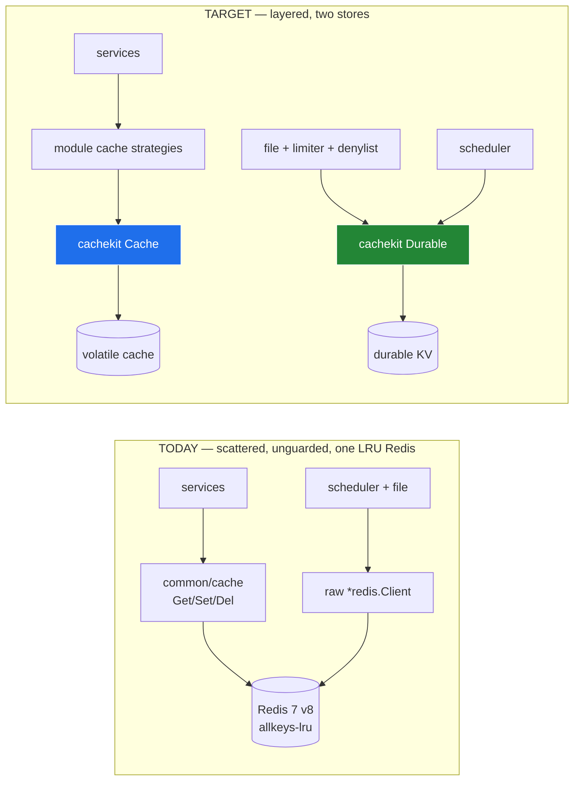

---

## 3. Target package layout

```text
common/cachekit/
  interface.go    # Cache, Durable, DelayQueue interfaces + ErrMiss/ErrUnavailable.
                  # These are the ONLY cache types the rest of the repo may name.
  provider/       # The ONLY package that may import the provider client (go-redis/v9).
                  # Adapts it to the interfaces above. Nothing outside imports this
                  # package except cachekit constructors + tests.
  client.go       # Two interfaced clients (cache + kv): pool, timeouts, retries, Ping, metrics,
                  # async bounded SET pool + generation check + write-shed breaker (§8.6). Holds interfaces, not *redis.Client.
  codec.go        # JSON encode/decode + max-value guard (skip SET if over)
  key.go          # Tenant-scoped builder + platform allowlist (§5.5)
  ttl.go          # JitteredTTL(base, ±15%) — used by EVERY Set incl. negative + markers (§5.6)
  singleflight.go # Process-local miss-collapse
  negative.go     # Short-TTL negative entries (60s default, jittered)
  version.go      # Per-resource version counter for list invalidation (durable-KV-backed, §5.4)
  metrics.go      # Hit/miss/error/latency/set-dropped/shed-state hooks (logrus now, Prometheus-ready labels)
product/cache/    # product/variant/category/attribute detail + nested invalidation; P2 lists/collections
user/cache/       # seller_validation (5m), currency (1h), geo refs, seller settings
payment/cache/    # gateway catalog slice only (no seller flags, no secrets)
file/cache/       # storage providers + adapter schemas only (no URLs/secrets)
inventory/cache/  # availability micro-cache (3–5s) — Phase 2, after §6 guard
file/             # Durable SETNX/TTL for upload idempotency — not a domain cache
```

**Rules:** no raw `*redis.Client` outside `cachekit`; no provider import outside `cachekit/provider/`; no provider type in any signature or struct field outside `cachekit` (the scheduler takes a `DelayQueue` interface, file/limiter/denylist take `Durable` — never a client). Services call module strategies for domain cache; durable ops go through `Durable`; cache writes happen **after** DB commit, never inside `db.WithTransaction` closures; DTO bytes cached, never GORM entities.

### 3.1 Layer map (who may call whom)

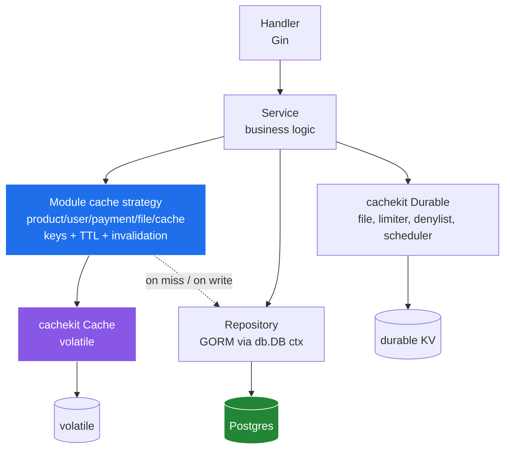

Forbidden directions: handler → cachekit, repository → cachekit, one module's strategy → another module's strategy. Cross-module data sharing happens at the service layer, and each module caches its own copy (§3.2).

### 3.2 Module cache boundaries (duplication policy)

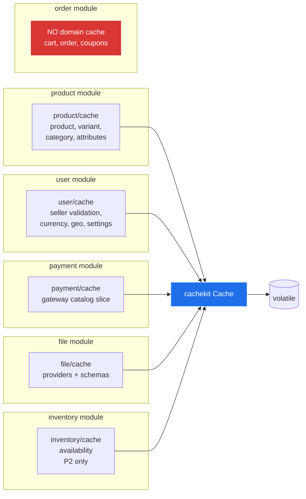

- **Across modules, duplicated cached data is acceptable** (e.g. product price snapshot cached by product; order stores its own immutable snapshot in DB, never from product's cache). Decoupling beats byte-saving.
- **Within a module, one canonical key per entity.** Variant write deletes both `variant:{vid}` and parent `product:{pid}` — never two competing product-detail keys.
- **Recommendation / home page** (`plans/001-home-page-recommendation-api`) is **out of this feature's implementation**. Binding contract when it lands: §11. Prefix `KEYS` deletes, warm-up jobs, and 7-day view ZSETs on the **volatile** cache are **not** compatible with this design.

### 3.3 Cachekit internals (what each file does on a GET)

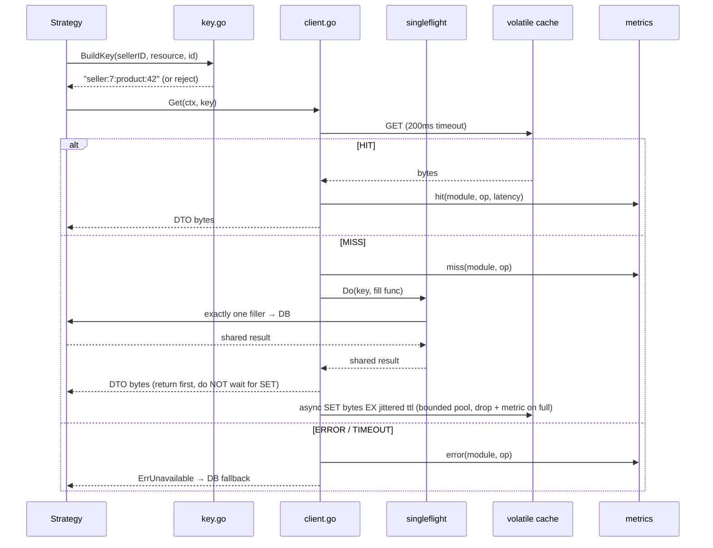

---

## 4. Cache / no-cache matrix

| Resource | Cache? | Store | TTL | Why |
|----------|--------|-------|-----|-----|
| Seller validation | Yes (highest ROI — every auth'd request) | volatile | 5m (down from 15m) + 60s negative; explicit `Del` | Static-ish; closes 15-min stale-access window. Today failed lookups use 2m — standardize on 60s. |
| Currency (seller default, user pref) | Yes | volatile | 1h + invalidate on settings write | Reference data. Values must not include PII beyond `userID` in the **key**. |
| Product/variant/category/attribute detail (+ nested options/package-options/media in the same DTO) | Yes (Phase 1) | volatile | detail 10m + 60s negative; category/attr 30–60m | Read-heavy, low-write. **Payload contract §4.3.** One canonical key per entity. |
| Product list/search/filters/related/`GET /variant` list | No in Phase 1; versioned list keys Phase 2 (flag) **with admission control (§4.4)** | volatile | 1–2m jittered + version bump | Key explosion; entity caches capture most P1 win. One-off random queries never earn a full SET |
| Collection metadata by id | Optional P1 | volatile | 10m + `Del` on collection CRUD | Bounded PK. Product membership lists are P2 (same class as product lists). |
| Collection product lists | No in Phase 1; P2 versioned + admission | volatile | 1–2m | Same combinatorial risk as `/search` |
| Geo (public active country/currency) | Yes (Phase 1) | volatile | 12h entity; versioned active lists | Near-static; id keys do not cover paginated lists — §4.5 |
| Seller settings | Yes (Phase 1) | volatile | 5m + `Del` on write | Money-critical; never cross-seller |
| Gateway catalog slice | Yes (Phase 1) | volatile | 12h + `Del` on admin/seed | No seller flags, no secrets |
| File providers + adapter schemas | Yes (Phase 1) | volatile | 24h jittered (not indefinite) + `Del` on seed/deploy | Reference only |
| Inventory availability (internal qty used by cart/PDP) | Micro-cache only (Phase 2) | volatile | 3–5s + singleflight | **Not** the seller `POST /summary/available` dashboard. Cart add may be ≤5s stale; reserve is truth (§6) |
| Cart, orders, reservations, txns, payment money paths | No | — | — | User-specific / write-heavy / strong consistency |
| Wishlist, recently viewed | No (011) | — | — | Per-user; explicit no so later tickets do not invent keys |
| Promotion / flash-sale **evaluation** | No | — | — | Same over-redemption risk as coupons |
| Coupon evaluation results | No; Lua rate limiter on durable KV | durable | 1m window | Atomic counter, not result cache |
| JWT denylist | Yes (fix) | durable | remaining JWT `exp` | Auth correctness; hashed key. **Behavior change:** logout SET failure and denylist-read-when-KV-down become fail-closed (§8.3); today both fail open. |
| File idempotency + scheduler ZSET | Keep pattern; move to Durable API | durable | existing delay+buffer | Restart + no eviction |
| Home-page recommendation | **Out of 011** | volatile when built | §11 contract | Do not prefix-delete; no warm-up in 011; 7-day ZSETs on durable KV |

### 4.1 Why each row (volatility × consistency × traffic)

```mermaid
quadrantChart
    title Cache-worthiness (x: write rate →, y: read traffic →)
    x-axis Low writes --> High writes
    y-axis Low reads --> High reads
    quadrant-1 Re-evaluate: cart, orders
    quadrant-2 Do NOT cache: reservations, txns
    quadrant-3 Cache long: category, currency, attributes
    quadrant-4 Cache short/guarded: product detail, inventory avail, lists
```

- **Top-right (hot + volatile) → shortest TTLs or no cache:** cart (per-keystroke, user-specific → no), inventory availability (every checkout reads, every order writes → 3–5s micro-cache only), coupon usage counters (atomicity required → Lua counter, not result cache).
- **Top-left (hot + static) → longest TTLs:** category tree, attribute definitions, currency, seller validation. Invalidation is rare and explicit.
- **Bottom half (cold)** → don't bother; DB handles it.
- **Strong-consistency data** (order state machine, payment status, reservation commit) → never cached, regardless of quadrant.

### 4.2 Per-API read/write profile (verified routes)

| API | R/W | Volatility | Consistency | Decision |
|-----|-----|-----------|-------------|----------|
| `GET /api/product`, `/search`, `/filters`, `/:id/related`, `GET /variant` (list) | R heavy | low | eventual OK | P1 **entity** cache only; P2 versioned lists (`/search` QPS is a **P2** success metric). `/filters` stock/price facets joined **live**, never frozen |
| `GET /:productId`, `GET …/variant/:id`, category/attribute reads, `GET …/option`, package-option GET | R heavy | low | eventual OK | P1 — nested reads served from parent product/variant DTO, not extra keys |
| `POST/PUT/DELETE /api/product…` including media, options, package-options, attributes, variant media | W rare | — | must invalidate | `Del` parent product + affected variants + version bump (§5.7) |
| `GET /api/product/collection`, `/:id`, `/:id/product` | R | low–med | eventual OK | Collection **by id** optional P1; membership lists P2 + admission |
| `POST /api/inventory/summary/available` (seller dashboard) | R | high | dashboard | **Not P2 target.** Never cache seller stock ledgers |
| Internal `GetTotalAvailableQuantities` (cart add, future PDP) | R heavy | **very high** | stale = wrong add-to-cart **gate**; checkout still atomic | P2 micro-cache 3–5s; document cart-gate staleness |
| `POST /manage`, `/manage/bulk`, `/reservation` | W | very high | strict | never cached; needs §6 guard |
| `GET /api/inventory`, by variant, by location, `/transaction` | R | high | dashboard + audit | never |
| `GET /api/inventory/location*` | R | low | dashboard | deferred (P2-or-later) with `Del` on CRUD; summaries that embed qty = never |
| `GET /api/order/cart` (+guest cart, merge, coupons) | R+W per session | very high | per-user strict | never cached |
| `POST /api/order`, status transitions | W | medium | strict (state machine) | never cached |
| Auth middleware seller check (every request) | R | low | 5-min stale OK (cap by subscription end — §4.5) | P1 `seller:complete` 5m |
| Currency resolution (money paths) | R | very low | 1-h stale OK | P1 1h + invalidate |
| `GET /api/user/country`, `/currency` (public active) | R | very low | hours stale OK | P1 geo entity + versioned active lists |
| `GET /api/user/seller/settings` | R | low | 5-min stale OK | P1 5m + `Del` on POST/PUT |
| `GET /api/payment/gateways` | R | very low | hours stale OK for **catalog** | P1 catalog slice; seller overlay live |
| Logout / denylist check | W/R | low | auth | durable KV; fail-closed on read **and** logout SET (§8.3) — behavior change vs today |
| Wishlist / recently viewed | R | medium | per-user | **no cache in 011** |

### 4.3 Product / variant cache payload contract

Cached catalog bytes are a **stable storefront DTO**, not the live handler JSON dump.

**Must include:** identity, title, slug, status, category ids, option/attribute defs as stored, package-option defs (price in cents), **price in cents**, currency code (not a live FX conversion), non-expiring public media identifiers (`fileId`, object key, display order, primary flag).

**Must not include:**
- Live stock, reserved qty, availability flags, `inStock` / `stockStatus` facets (inventory module only; join live on list/filter responses).
- Presigned / expiring URLs. Today's handler JSON embeds `url` and `thumbnailUrl` on `ProductMediaResponse` / `VariantMediaResponse` — **do not cache those fields**. Store `fileId` (+ public CDN path only if it does not expire). Re-resolve URLs after cache hit.
- Cart, coupon, or personalized fields: **`isWishlisted`, `wishlistItems`**, per-user prices. Re-join wishlist flags after hit when the caller is authenticated.

T11 asserts this contract (no stock, no expiring URLs, no wishlist personalization).

If encoded size > ~256KB: **do not SET**; serve the DB result; increment `cache_error`/`cache_value_too_large`. Never store truncated JSON.

List keys (P2): hash **canonical** query params (sorted keys, stable types, no raw URL string) so `?a=1&b=2` and `?b=2&a=1` share a key.

### 4.4 Admission control (anti write-storm)

Singleflight coalesces **identical** keys; it does nothing for random one-off queries. List/search caching therefore has a gate: a query response earns a full SET only on its **second sighting** inside a short window.

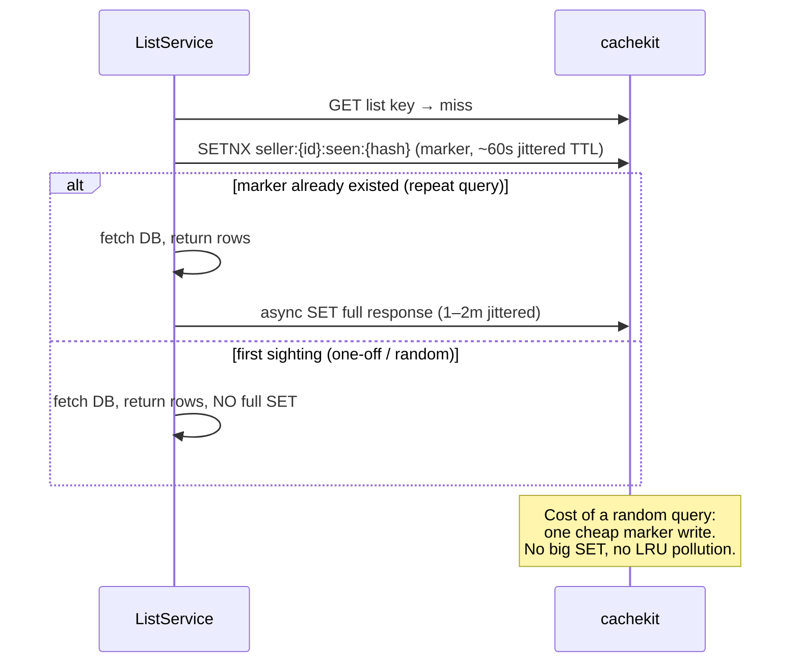

Rules:
- Marker keys are tiny (`seller:{id}:seen:{hash}` → `1`, seller-prefixed so the key builder accepts them with no allowlist change) and always carry a jittered TTL; they are never read on the hot path except via the `SETNX` result (one RTT, no extra GET).
- **Bypass, not cache, is the protection against unique-query floods.** If miss rate on the list namespace stays ≈100% while SET rate climbs (the §0.4 signature), the correct response is the write-shed lever (§8.6) and query/index capacity work — not longer TTLs or more cache memory. Caching cannot absorb traffic that never repeats.
- Entity caches (product/variant/category) are exempt from admission: primary-key lookups are bounded-cardinality and cheap to fill; the gate applies to combinatorial query shapes (list/search/filters/collection products) only.

### 4.5 Module-wise cache registry (the complete map)

This table is the **source of truth** for what 011 caches. Routes verified against current `RegisterRoutes`. Rule: **cache reference data and catalog reads; never cache money movement, identity, secrets, or audit trails.** A later ticket must add a row here (and matching §5 / §5.5 entries) before introducing a key.

**Product** (`product/cache`)

| Resource | Phase | Key / strategy | Invalidate |
|----------|-------|----------------|------------|
| `GET /:productId` | P1 | `seller:{id}:product:{pid}` — stable DTO §4.3 | Product CRUD **and** nested writes §5.7 |
| Variant by id; `GET …/variant/find` (option hash, bounded) | P1 | `seller:{id}:variant:{vid}` | Variant CRUD/media + parent product `Del` |
| Options / package-options / product-attributes / media | P1 | **No extra keys** — embed in product/variant DTO | Same as parent `Del` (§5.7) |
| Category by id; `GET /category` all; inherited attributes | P1 | `category:{cid}`, `categories:all:v{ver}` | Category/attr CRUD + link/unlink |
| `GET /category/by-parent` | P1 | `categories:parent:{pid}:v{ver}` (small list) | Same as category writes |
| Attribute by id; `GET /attribute` all | P1 | `attribute:{aid}`, `attributes:all:v{ver}` | Attribute CRUD |
| `GET ""` list, `/search`, `/filters`, `/:id/related`, `GET /variant` list | P2 | versioned list + admission §4.4 | `INCR productlist:ver` (filters: live stock/price facets) |
| Collection by id | optional P1 | `seller:{id}:collection:{cid}` | Collection CRUD |
| `GET /collection`, `/:id/product` | P2 | versioned + admission | Collection membership writes bump `collectionlist:ver` |
| Wishlist, wishlist items, recently-viewed | never | — | — |

**User** (`user/cache`; denylist is Durable, not this package)

| Resource | Phase | Key / strategy | Invalidate |
|----------|-------|----------------|------------|
| Seller validation (middleware) | P1 | `seller:{id}:seller:complete` 5m + 60s negative. TTL = `min(5m, time until SubscriptionEndDate)` when end date is set so a cached “active” cannot outlive the sub. | `user.is_active`, **any** `subscription` / plan write (no HTTP subscription module today — hook the writer; today’s `InvalidateSeller*` misses `seller_complete`) |
| Seller/user currency resolution | P1 | `seller:{id}:currency:default`, `seller:{id}:currency:user:{uid}` 1h | Settings/currency write → exact `Del` of known keys (no glob) |
| Public `GET /country/:id`, `/currency/:id` | P1 | `geo:country:{id}`, `geo:currency:{id}` 12h | Admin country/currency **and** country–currency mapping writes |
| Public `GET /country`, `GET /currency` (paginated/filterable) | P1 | `geo:countries:active:v{ver}`, `geo:currencies:active:v{ver}` — prefer caching the **full active set** (small) and paging in process; if query shapes explode, treat as P2 versioned lists | Same admin writes bump `ver` |
| `GET /seller/settings` | P1 | `seller:{id}:settings` **5m** + `Del` | POST/PUT settings |
| profile, address*, seller profile, user list, admin inactive geo, auth login/register/refresh/forgot | never | — | — |
| Logout / denylist | P0 fix | Durable `bl:{sha256}` | remaining `exp`. **Behavior change** vs today (raw JWT, 24h, fail-open) |

**Inventory** (`inventory/cache` — P2 after §6)

| Resource | Phase | Key / strategy | Invalidate |
|----------|-------|----------------|------------|
| Internal `GetTotalAvailableQuantities` (cart add-to-cart **gate**, future PDP) | P2 | `seller:{id}:inv:avail:{hash(sorted variant ids)}` 3–5s | TTL only; writes bypass. Cart may accept qty that reserve will reject ≤5s later — accepted |
| `POST /api/inventory/summary/available` (seller-auth dashboard) | never | — | Not the P2 target (spec previously mislabeled this as `GET` storefront) |
| `GET /inventory`, by variant, by location, `/transaction` | never | — | Ledger / audit |
| Location CRUD `GET /location`, `/:id` | deferred | optional later + `Del` on CRUD | — |
| Location summaries that embed quantities | never | — | — |
| Reserve / manage / bulk | never | — | Atomic DB guard |

**Order** — no domain cache. Cart, guest cart, merge, cart coupons, order CRUD/status: never. Coupon Lua limiter on durable KV.

**Payment** (`payment/cache`)

| Resource | Phase | Key / strategy | Invalidate |
|----------|-------|----------------|------------|
| Gateway catalog (`FindAllActive` / `FindByCode` + fields + geo) | P1 | `gateway:catalog:{code}`, `gateway:catalog:all:v{ver}` 12h. DTO = **public metadata only** (no secrets, no webhook HMAC material, no env keys) | Admin/seed → `Del` + version bump |
| Per-seller `Configured*` overlay | always live | never mixed into catalog key | — |
| initiate, transactions, refunds, webhook logs, webhook `FindByCode` processing | never | — | Stale `pending` / wrong HMAC |

**Promotion** — no `promotion/cache` in 011. Dashboard list/get (promotion/sale/discount-code): P-later 1–5m seller-scoped, never storefront price. Validate/apply/available-coupons/scope eligibility: never.

**File** (`file/cache` for refs; Durable for SETNX)

| Resource | Phase | Key / strategy | Invalidate |
|----------|-------|----------------|------------|
| `GET /storage/providers`, `GET /storage-config/schema` | P1 | `file:providers`, `file:schema:{adapter}` **24h jittered** (schema has no DB; still not indefinite) | Seed/deploy `Del` |
| file list/get, download-url, storage-config list/test/save, init/complete upload | never | — | URLs, secrets, SETNX |

**Report** — out of 011. When built: seller + exact resolved bounds + interval + TZ; verify repo seller scope first.

**Recommendation** — out of 011; binding contract §11.

**Stubs** (notification container only; no vendor/subscription HTTP). Revisit in this registry format. **Exception:** any writer of `subscription` / `plan` / `user.is_active` must `Del` seller-complete now, even with no module.

---

## 5. Keys, TTLs, invalidation

Convention: `seller:{sellerID}:{resource}:{id}`; lists `seller:{id}:productlist:v{ver}:{hash(canonical params)}`. **Every** TTL below is a base — the wire TTL is `JitteredTTL(base)` (§5.6). No fixed-TTL SET anywhere.

| Entry | Key | Store | TTL | Invalidate on |
|-------|-----|-------|-----|---------------|
| Seller validation | `seller:{id}:seller:complete` | volatile | `min(5m, until SubscriptionEndDate)` if set, else 5m; 60s negative | user active / subscription / plan write → exact `Del` |
| Currency | `seller:{id}:currency:default`, `seller:{id}:currency:user:{uid}` | volatile | 1h | settings/currency write → **exact** `Del` of those keys (never `currency:*` glob) |
| Geo entity (P1) | `geo:country:{id}`, `geo:currency:{id}` (public active-only) | volatile | 12h | admin country/currency/mapping write → `Del` |
| Geo active lists (P1) | `geo:countries:active:v{ver}`, `geo:currencies:active:v{ver}` | volatile | 12h | same writes → `INCR` version (durable counter, §5.4) |
| Seller settings (P1) | `seller:{id}:settings` | volatile | 5m | settings POST/PUT → `Del` |
| Gateway catalog (P1) | `gateway:catalog:{code}`, `gateway:catalog:all:v{ver}` (metadata only) | volatile | 12h | admin/seed → `Del` + version bump; seller configs never in this key |
| File reference (P1) | `file:providers`, `file:schema:{adapter}` | volatile | 24h jittered | seed/deploy → `Del` |
| Product detail | `seller:{id}:product:{pid}` | volatile | 10m + 60s neg | product **or nested** write (§5.7) → `Del` + bump `productlist:ver` |
| Variant | `seller:{id}:variant:{vid}` | volatile | 10m | variant/media write → `Del` + parent product `Del` |
| Category/attrs | `seller:{id}:category:{cid}`, `…:categories:all:v{ver}`, `…:categories:parent:{pid}:v{ver}`, `…:attribute:{aid}`, `…:attributes:all:v{ver}` | volatile | 60m / 30m | write / link / unlink → `Del` + version bump |
| Collection by id (optional P1) | `seller:{id}:collection:{cid}` | volatile | 10m | collection CRUD → `Del` |
| Lists (P2) | `seller:{id}:productlist:v{ver}:{hash}` | volatile | 1–2m, ≤256KB | product/nested write bumps `ver` (no enumeration) |
| Collection product lists (P2) | `seller:{id}:collectionlist:v{ver}:{cid}:{hash}` | volatile | 1–2m | membership write bumps `collectionlist:ver` |
| Inv. availability (P2) | `seller:{id}:inv:avail:{hash}` | volatile | 3–5s | TTL only; writes bypass cache |
| Admission marker (P2) | `seller:{id}:seen:{hash}` | volatile | ~60s jittered | `SETNX` on first sight; repeat earns the full list SET (§4.4) |
| User / seller hard delete | `seller:{id}:seller:complete`, `seller:{id}:currency:default`, `seller:{id}:currency:user:{uid}`, `seller:{id}:settings` | volatile | — | exact `Del` of known keys on delete (erasure; no tombstone — tombstones would retain the data). No prefix glob. |
| JWT denylist | `bl:{sha256(token)}` | durable | remaining `exp` | logout writes |
| Coupon apply limiter | `coupon:apply:rate:{user}` | durable | 1m window | TTL |
| File init idempotency | `file:init:idem:{ownerType}:{ownerId}:{sha256}` | durable | existing init TTL | claim/replay/delete on failure |
| Scheduler queue | `delayed_jobs` (ZSET) | durable | until claimed | ZRem on claim/cancel |
| Scheduler cancel index | `scheduled_job:{jobId}` | durable | until processed | Del after run/cancel |

Write flow: `DB commit → Del entity key → INCR list version → async derived-key cleanup`. Cache-aside everywhere for domain data; no write-through/behind; no SWR at these TTLs. Negative entries use the **same key** with a JSON tombstone sentinel (not a separate `neg:` key), so write-path `Del` stays a single key — no invalidation site must remember two keys. GET treats tombstone as a documented miss/404 (do not decode as a DTO). A subsequent **create** `Del`s the tombstone so the next read can fill. Nested product writes use the same `Del` set as product/variant update (§5.7).

### 5.1 Invalidation sequence (product update example)

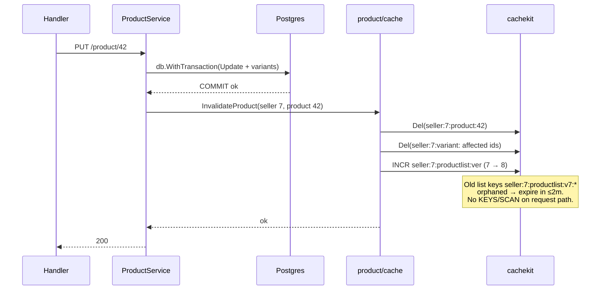

### 5.2 Key namespace tree (one seller's view)

```mermaid
flowchart TD
    ROOT["seller:7"] --> SV["seller:complete — 5m"]
    ROOT --> CUR["currency:default — 1h"]
    ROOT --> CURU["currency:user:UID — 1h"]
    ROOT --> SET["settings — 5m"]
    ROOT --> PROD["product:PID — 10m"]
    ROOT --> VAR["variant:VID — 10m"]
    ROOT --> CAT["category:CID — 60m"]
    ROOT --> ATTR["attributes — 30m"]
    ROOT --> COL["collection:CID — 10m"]
    ROOT --> PLV["productlist:ver — counter"]
    PLV --> PL1["productlist v8 + hash — 2m"]
    PLV --> PL2["productlist v8 + hash — 2m"]
    ROOT --> INV["inv:avail + hash — 5s"]
    GEO["geo:country / currency — 12h"]
    GW["gateway:catalog — 12h"]
    FR["file:providers / schema — 24h"]
    BL["bl:SHA — remaining JWT"]
    DJ["delayed_jobs ZSET"]
    SJ["scheduled_job:ID"]
    FI["file:init:idem:..."]
    CP["coupon:apply:rate:UID"]
    BL -.->|platform durable| DJ
```

### 5.3 TTL ladder (shortest → longest lived)


Reading rule: **the hotter and more volatile, the further left.** Anything left of `product` expires on its own faster than any plausible write burst can stale it; anything right of it is static enough to carry explicit invalidation. Durable keys are not on this ladder.

### 5.4 Why version counters instead of prefix delete

| Approach | How invalidation works | Request-path cost | Risk |
|----------|------------------------|-------------------|------|
| `KEYS` + `DEL` (forbidden) | Find all matching keys, delete | O(N) block on backend, latency spike | Blocks event loop; banned |
| `SCAN` + `DEL` on request path | Iterate cursor, delete | Extra round-trips per write | Slow writes; cursor storms under load |
| **Version counter (chosen)** | `INCR ver`; readers embed `ver` in key | One `INCR` per write (~1 RTT) | Old keys orphan until TTL (bounded ≤2m, ≤256KB each) |
| Pub/sub broadcast | Publish invalidate event | Needs subscriber infra | Overkill pre-prod; revisit for multi-region later |

**Invalidation storms.** A `productlist:ver` bump (or deploy restart) orphans many keys at once — that is intentional and safe here, not a stampede trigger: re-fill is gradual by construction because (a) admission (§4.4) lets one-off queries pass through without SETs, (b) jittered TTLs (§5.6) stagger re-expiry, (c) singleflight collapses repeats of the same key. Never "fix" a version bump with a warmer or a flush-all; both re-synchronize what the version counter deliberately de-synchronized.

**Version-counter durability.** Version keys (`seller:{id}:productlist:ver`, `collectionlist:ver`, category/attribute versions, `geo:*:active` versions, `gateway:catalog:all` version) live on **durable KV**, not volatile — they are a handful of tiny counter keys, not cache data. Rationale: if a version key were evicted by volatile LRU, the next `INCR` restarts at 1 and any orphaned `v1` list keys still inside TTL would be served as fresh, silently breaking the staleness bound. `noeviction` makes that impossible.

**Hot-seller version churn (accepted).** Sellers who write constantly bump `ver` constantly, so their list cache rarely hits. That is the correct tradeoff (correctness over hit rate); entity caches still absorb their detail reads. If measured, the escape hatch is per-category (or per-filter-dimension) versions — not longer TTLs.

### 5.5 Platform key allowlist (key.go)

Anything without `seller:{id}:` **must** match one of:

- `bl:{64 hex}` — JWT denylist
- `coupon:apply:rate:{uint}`
- `file:init:idem:{ownerType}:{ownerId}:{64 hex}`
- `file:providers` (exact)
- `file:schema:{adapter}`
- `geo:country:{id}`, `geo:currency:{id}`
- `geo:countries:active:v{ver}`, `geo:currencies:active:v{ver}`
- `gateway:catalog:{code}`, `gateway:catalog:all:v{ver}`
- `delayed_jobs` (exact)
- `scheduled_job:{uuid}`

Reject at build time otherwise. No `rec:` / recommendation keys until that feature adds them to this list **and** to §4.5.

### 5.6 TTL jitter (mandatory, not optional)

Every `SET` — entity, list, negative entry, admission marker — uses `JitteredTTL(base, ±15%)` from `cachekit/ttl.go`. Fixed TTLs are banned because any batch of keys written together (deploy fill, bulk import, warmer, version-bump re-fill) would otherwise expire together and re-create the §0.4 chain at the expiry boundary. Jitter spreads re-expiry over a window proportional to the base TTL (e.g. 10m → 8.5–11.5m); it costs one `rand` call per write and changes no read path. Negative entries and markers get jitter for the same reason — a synchronized negative-expiry would re-expose the DB all at once.

### 5.7 Nested product invalidation (P1)

A product/variant cache key is stale if **any** of these commits succeed. Each row is `Del` of `product:{pid}` plus listed extras, then `INCR productlist:ver` (and related-product list version if you split one later).

| Write | Extra `Del` |
|-------|-------------|
| Product create/update/delete | affected variants if the write touches them |
| Product media attach / metadata / remove | — |
| Variant create/update/delete / bulk | `variant:{vid}` for each affected id |
| Variant media attach / metadata / remove | `variant:{vid}` |
| Option / option-value create/update/delete / bulk | all variants for that product (option identity changed) |
| Package-option CRUD / bulk | — |
| Product-attribute set | — |
| Category attribute link/unlink | `category:{cid}` + inherited-attribute readers; bump category versions |

Missing a row here ships a stale PDP for up to 10m. Tests: one write per row → subsequent `GET /:productId` is a miss (T8 extended).

---

## 6. Inventory (correctness-first, prerequisite)

Micro-cache (3–5s, singleflight) applies **only** to internal availability reads (`GetTotalAvailableQuantities` used by cart add-to-cart and any future PDP stock join). It does **not** apply to seller dashboard `POST /api/inventory/summary/available` or location summaries. Reserve/fulfill/cancel/`POST /manage` bypass cache. **Prerequisite before any inventory caching:** atomic reserve guard — conditional decrement (or `SELECT FOR UPDATE` inside existing `WithTransaction`); reuse the defined-but-unused `IncrementReservedQuantity`. Cache must never mask oversell. Product detail cache **must not** embed stock (§4.3) so Phase 1 cannot recreate this bug.

**Cart-gate staleness (accepted).** Cart add-to-cart currently **rejects** qty above `GetTotalAvailableQuantities` (`ErrInsufficientStock`). A 3–5s micro-cache can let a shopper add a qty that reserve will refuse. That is display/gate lag, not oversell: §6.1 remains the single decider of what they can take. Do not cache cart itself.

### 6.1 Reserve path (cache stays out of the write lane)

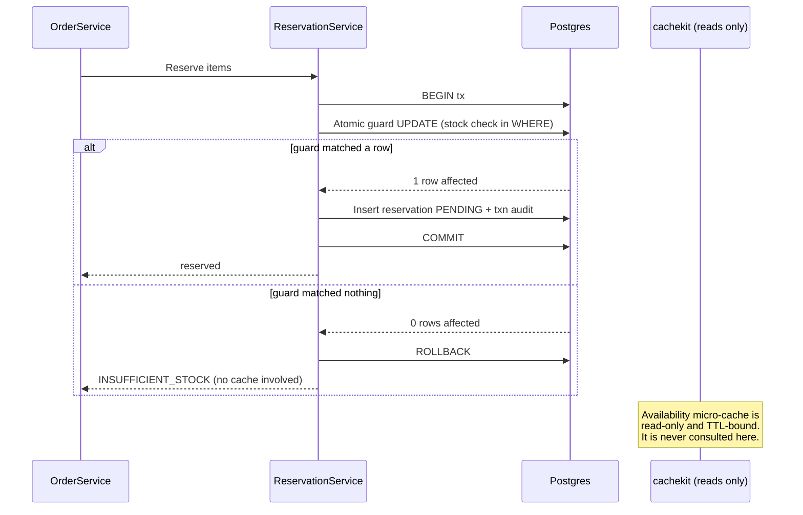

### 6.2 Why the micro-cache is safe anyway (defense in depth)

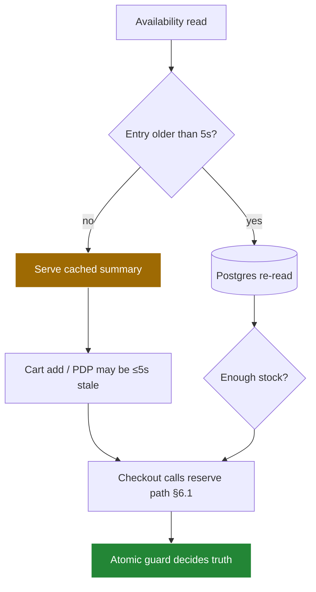

Even a maximally stale (5s) availability value can only affect cart-add gating and what the shopper *sees*; the reserve guard in §6.1 is the single decider of what they can *take*.

---

## 7. Backend decision: DragonflyDB vs Redis 7

### 7.1 Comparison (ephemeral cache **and** durable KV)

| Dimension | Redis 7 | DragonflyDB |
|-----------|---------|-------------|
| RESP / client compat | native | Compatible — v9 client; ZSET, SETNX, Lua (`KEYS`/`ARGV`) supported |
| Throughput / memory | good | Better (multi-threaded, denser encoding) — headroom for catalog read fan-out |
| Persistence / HA maturity | Proven (RDB/AOF, Sentinel/Cluster) | Younger; snapshots OK for **single-node pre-prod**; clustering out of scope |
| Multi-DB `SELECT` | yes | **Do not use** — `DB=0` + prefixes |
| Eviction | `allkeys-lru` etc. | `--cache_mode` on **volatile** instance only; durable uses `noeviction` |
| Keyspace notifications | optional | **Do not use** (old reservation PRD). Scheduler is ZSET poll. |
| K8s / monitoring | Rich | Thinner; scrape `INFO` + our metrics |
| Operational risk for volatile cache | low | low **iff** fail-open (§8.3) |
| Risk for durable scheduler | low if not LRU | Must pass T4 + T6 + **T10** (eviction must not drop jobs) |

**Decision:** DragonflyDB as **primary for both roles** is approved (pre-prod), as **two processes** (or two Redis processes if the suite fails). Conditions: (a) `cachekit` keeps backends swappable by addr; (b) Redis compose profile retained one release as rollback; (c) conformance suite (§9) green on Dragonfly — ZSET + Lua + SETNX + restart + **T10**; (d) two-store topology (§0.3) is in compose before cutover. If (c)/(d) show friction, stay on Redis 7 with the **same two-service split**. Architecture does not depend on Dragonfly-specific APIs.

**Order of work:** cachekit + two-client config first (current v8 client can't fairly evaluate either backend), Dragonfly verification second using the same suite. Reversed order tests throwaway code.

**Image pin:** plan.md pins `docker.dragonflydb.io/dragonflydb/dragonfly:<tag>` and the Redis `7-alpine` tag. Testcontainers uses the **same** tags. Do not float `latest` in CI.

**HA:** single node per role. No Sentinel, Cluster, or Dragonfly replication in 011.

### 7.2 Decision flowchart

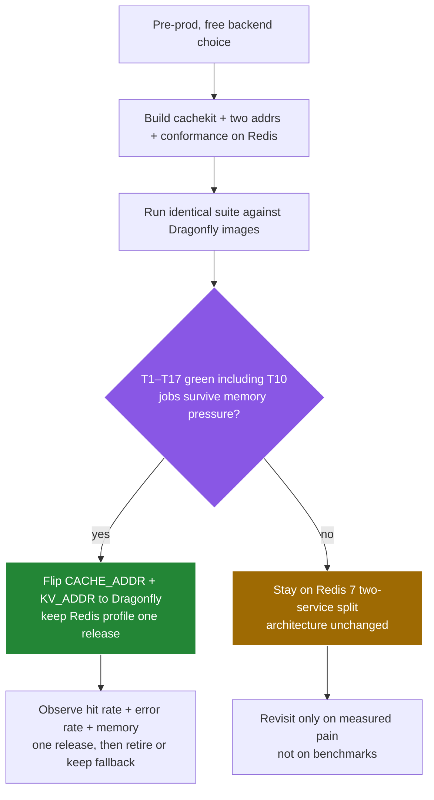

### 7.3 Compose / config sketch

Volatile Dragonfly (illustrative flags; exact flags in plan.md): password, `--cache_mode`, `--maxmemory`, **no** data dir (or empty dir), healthcheck `PING`.

Durable Dragonfly: password, `--dir` + snapshots, **no** cache_mode, memory ceiling with `noeviction` (process should fail loud rather than drop `delayed_jobs`).

App env: `CACHE_ADDR`, `KV_ADDR`, passwords, pool/timeouts. HTTP `depends_on`: Postgres healthy only. Scheduler process/goroutine: wait for durable `PING`. Volatile ping failure: log, continue.

**Volatile sizing (Phase 0 exit criterion).** `--maxmemory` is computed, not guessed: `(entity count × avg DTO bytes × headroom 2×) + (expected list keys × 256KB cap) + markers`. Entity DTO sizes come from the codec max-value observations in staging; list-key count from distinct canonical query shapes, not traffic. If the number doesn't fit the box, shrink TTLs or narrow P2 scope — never run volatile unbounded (Dragonfly `cache_mode` off by default evicts nothing) and never steal durable's memory.

---

## 8. Resilience & observability

Timeouts + fail-open-to-DB for **domain cache**; responses never wait for cache writes (§8.6); boot never blocked by **volatile** cache; `SCAN`-only janitor; process-local singleflight + negative cache + micro-TTLs vs stampede/hot-key/penetration; per-`(module,op)` hit/miss/error/latency; cold start = lazy fill (no warm-up). Cache-down integration suite mirrors `upload_outage_test.go` pattern.

### 8.1 Failure-mode matrix (volatile domain cache)

| Failure | Detection | Caller behavior | User impact |
|---------|-----------|-----------------|-------------|
| Volatile down / timeout | client error + metric | `ErrUnavailable` → DB fallback | Higher latency, correct data |
| Slow backend (p99 spike) | latency histogram | Per-op 200ms timeout → DB fallback | Bounded tail latency |
| Stampede on hot miss (one pod) | singleflight coalesce counter | One DB fill, rest wait shared | DB protected **per process** |
| Hot key (flash sale) | per-key hit counter | 3–5s micro-TTL absorbs burst | DB protected |
| Penetration (random IDs) | miss-rate spike | 60s negative entry | DB protected |
| Eviction under memory pressure | `evicted_keys` + miss spike | Re-fill from DB | Transient latency — **expected** on volatile |
| Cold start / deploy restart | hit-rate dip | Lazy fill, no warm-up job | Transient latency |
| Backend data loss (flush/crash) | hit-rate drops to ~0 | Full DB fallback, re-fill | Correct, slower until warm |
| SET path saturated (write storm) | `cache_set_async_dropped` rate + SET latency | Async pool drops SETs; GETs unaffected; breaker (§8.6) pauses writes if errors spike | Hit rate dips; responses stay fast |
| Upstream retry wave | gateway retry counters | No cache-side retry on GET; jittered backoff upstream (§8.6) | Bounded amplification, decays instead of growing |

### 8.2 Metrics & alerts (minimum viable)

- Counters: `cache_hit`, `cache_miss`, `cache_error`, `cache_negative_hit`, `cache_value_too_large`, `cache_set_async_dropped`, `cache_set_generation_dropped` — labels `(module, op)` and `store=cache|kv`.
- Histogram: `cache_op_latency_ms` — labels `(module, op, result, store)`.
- Gauges: `cache_fill_inflight`, `cache_write_shed_active` (0/1) — per process.
- Gauges (scraped from each backend `INFO`): memory used, evicted keys, connected clients — **per store**. Backend `INFO` is second priority: Dragonfly's fields differ from Redis, so dashboards and alerts key off **our own metrics first**; `INFO` is corroboration only.
- Alerts: error-rate spike (backend down); miss-rate spike on a stable key (invalidation bug); p99 latency breach; **evicted_keys > 0 on durable KV** (page immediately); **miss ≈100% + climbing SET rate on one namespace** (random-query flood / pollution signature — shed writes, see §8.6); `cache_write_shed_active == 1` (notify — someone or something pulled the lever).

**Phase SLOs (pre-prod, directional):** after a 10-minute warmup with flags on, catalog **detail** hit rate > 80% on `GET /:id`; volatile p99 GET < 20ms when up; cache-down `GET /:id` still 200 from DB.

### 8.3 Fail-open vs fail-closed (by concern)

| Concern | Store | Read when store down | Write when store down |
|---------|-------|----------------------|------------------------|
| Product/category/seller/currency/geo/settings/gateway-catalog/file-ref cache | volatile | **Open** → Postgres | Skip SET; continue |
| List cache (P2) | volatile | **Open** → Postgres | Skip |
| Inventory avail micro-cache | volatile | **Open** → Postgres | Skip |
| JWT denylist check | durable | **Closed** — `TOKEN_REVOKED` / 503 auth-unavailable (pick 503 in plan.md; do **not** treat as valid session) | Logout returns 503 if SET fails |
| File init SETNX / replay | durable | **Closed** — existing `ErrFileUploadStorageUnavailable` | same |
| Coupon apply limiter | durable | **Open** to in-process limiter (soft limit; current behavior) | n/a |
| Scheduler poll / claim | durable | **Do not run workers** | Schedule API fails closed |
| Checkout reserve | Postgres | n/a | Fail closed in DB; cache unused |

### 8.4 Multi-pod stampede (accepted in Phase 1)

`singleflight` is **in-process**. N replicas can each miss and hit Postgres once per key. Good enough for P1. Not in 011: distributed SETNX lock, probabilistic early expiry, or request coalescing across pods. Revisit if catalog miss storms show up in metrics.

### 8.5 Feature flags (default **off**)

| Flag | Phase | Effect |
|------|-------|--------|
| `CACHE_ENABLED` | 0 | Global kill switch; off → all domain Get/Set no-ops (fail-open to DB) |
| `CACHE_SELLER_VALIDATION` | 1 | seller complete |
| `CACHE_CURRENCY` | 1 | currency |
| `CACHE_PRODUCT_DETAIL` | 1 | product + variant DTO (nested invalidation §5.7); optional collection-by-id |
| `CACHE_CATEGORY` | 1 | category/attributes |
| `CACHE_GEO` | 1 | public country/currency entity + active lists (§4.5) |
| `CACHE_SELLER_SETTINGS` | 1 | seller settings private (§4.5) |
| `CACHE_GATEWAY_CATALOG` | 1 | gateway catalog slice, seller flags excluded (§4.5) |
| `CACHE_FILE_REF` | 1 | storage providers + adapter schemas (§4.5) |
| `CACHE_INVENTORY_AVAIL` | 2a | internal availability micro-cache (requires atomic guard) |
| `CACHE_PRODUCT_LIST` | 2b | versioned list/search/filters/related/collection products (**with admission**, §4.4) |
| `CACHE_SET_WRITES` | 0 | Manual write-shed lever (default **on**); off = serve GETs, skip all domain SETs. Use when §0.4 signature appears |

Flags do **not** disable durable KV (scheduler, SETNX, denylist, limiter).

### 8.6 Write-path protection (incident-driven, §0.4)

The response path and the cache-write path have separate budgets and separate failure modes:

1. **Async population.** After a DB fill, the strategy returns to the caller first; the `SET` runs on a detached context (50–100ms budget) through a process-local bounded pool (default 64 in-flight). Pool full → drop the SET, increment `cache_set_async_dropped`, continue. A dropped SET costs one future miss, never one slow response. Worst case of a dead backend is a cold cache, never a timeout cascade.
2. **Generation check before SET.** The fill records the key’s generation (or existence) at miss time. `Del` / version `INCR` on the write path bumps it. The async SET is skipped if the generation changed (`cache_set_generation_dropped`). This is what stops miss → concurrent write `Del` → stale SET resurrection (§0.2).
3. **No retry on cache GET or SET.** A sick cache gets exactly one fast attempt; then fail open (GET → DB) or drop (SET → metric). Retrying cache ops adds tail latency for zero benefit — the DB fallback *is* the retry. (Durable-KV ops — scheduler claim, SETNX, Lua limiter — keep their existing bounded retries; they have no DB fallback.)
4. **Upstream retries must be jittered.** Unjittered fixed-backoff retries re-synchronize into waves that grow instead of decay (link 5→6 in §0.4). Bounded attempts, exponential backoff with full jitter.
5. **Write-shed breaker (automatic).** If volatile-SET error/timeout rate crosses threshold over a window, `cachekit` pauses domain SETs for a cooldown while continuing to serve GETs (`cache_write_shed_active=1`), then probes back with a trickle of SETs. Manual override is `CACHE_SET_WRITES=off`. This is the automatic version of the manual intervention the §0.4 incident required.

---

## 9. Testing requirements

- Unit: key builder (cross-seller rejection + **full** allowlist including geo/gateway/file), codec + max-value skip, version bump, Lua limiter, remaining-JWT denylist TTL, canonical list hash, jitter bounds (min/max/TTL>0), admission marker logic, tombstone vs DTO decode, generation-dropped SET.
- Integration (Testcontainers, **both** Redis and Dragonfly images from Phase 0): §9.1. **PR CI** runs both profiles (Dragonfly nightly at minimum if PR runtime hurts); cutover flips the primary addr only — never a first-time Dragonfly run. Never float `latest`.
- Forbidden in CI: `KEYS`, real blob-provider calls, unbounded `pageSize`.

### 9.1 Conformance matrix (gates Dragonfly cutover)

| # | Case | Redis must | Dragonfly must | Why it matters |
|---|------|-----------|----------------|----------------|
| T1 | GET/SET/DEL round-trip + TTL expiry | pass | pass | Baseline RESP compat |
| T2 | `SETNX` idempotency claim + replay | pass | pass | File upload dedupe |
| T3 | Lua `INCR+EXPIRE` atomicity (concurrent goroutines **and** two clients) | pass | pass | Coupon limiter |
| T4 | ZSET schedule → poll → `ZRem==1` claim → cancel | pass | pass | Reservation/file expiry |
| T5 | `SCAN`-based prefix delete (large keyspace) | pass | pass | Janitor path |
| T6 | Durable restart → `delayed_jobs` + SETNX keys still present | pass | pass | Persistence mode |
| T7 | Volatile down → covered **domain** reads succeed via DB | pass | pass | Fail-open (§8.3) |
| T8 | Write → entity miss + list version bump visible; nested product writes in §5.7 each miss `GET /:productId` | pass | pass | Invalidation (§5.1, §5.7) |
| T9 | Cross-seller key isolation | reject | reject | Tenant safety |
| T10 | Fill volatile to maxmemory; durable `delayed_jobs` **must remain**; volatile keys may evict | pass | pass | §0.3 — today's LRU bug |
| T11 | Cached product DTO has no stock fields, no expiring `url`/`thumbnailUrl`, no `isWishlisted`/`wishlistItems` | pass | pass | §4.3 |
| T12 | Denylist: hashed key; TTL ≈ remaining exp; store down → not a valid session; logout SET failure → 503 | pass | pass | C5 + §8.3 (behavior change vs today’s fail-open) |
| T13 | Admission: one-off list query → marker only, no full SET; repeat within window → full SET | pass | pass | §4.4 — the §0.4 root cause |
| T14 | Slow/dead volatile backend: p99 domain-read latency unaffected; responses 200 from DB; SETs dropped + counted | pass | pass | §8.6 — the §0.4 outage mode |
| T15 | SET error storm → breaker pauses writes (`cache_write_shed_active`), GETs continue, recovers after cooldown | pass | pass | §8.6 |
| T16 | Wire TTLs across a batch fall inside base ±15% (sample keys) | pass | pass | §5.6 |
| T17 | Concurrent miss + write `Del`: async SET does not resurrect the pre-write DTO | pass | pass | §0.2 / §8.6 generation guard |

---

## 10. Implementation order (aligned with `plan.md`)

1. **Phase 0 — Foundation:** `cachekit` (two clients) + v9 + config + denylist/invalidator/Lua/buffer fixes + two compose services + conformance on Redis. No new cached reads. Flags exist, default off.
2. **Phase 1 — Safe caches:** enable **one flag at a time** in staging: seller validation → currency → geo → seller settings → product/variant detail (with §5.7 nested invalidation) → category/attributes → gateway catalog → file refs. Never flip multiple flags in one deploy.
3. **Phase 2 (flag-gated):** atomic reserve guard → internal availability micro-cache; versioned list/search/filters/related/collection-product cache with admission.
4. **Cutover:** T-suite already green on Dragonfly images (running since Phase 0) → flip `CACHE_ADDR`/`KV_ADDR` → one release with Redis rollback.

Cutover does **not** wait on P2. P1 + T1–T12, T14–T17 is enough to flip backends (T13 needs the P2 list path). P2 stays flag-gated on whichever primary is live.

### 10.1 Phase map

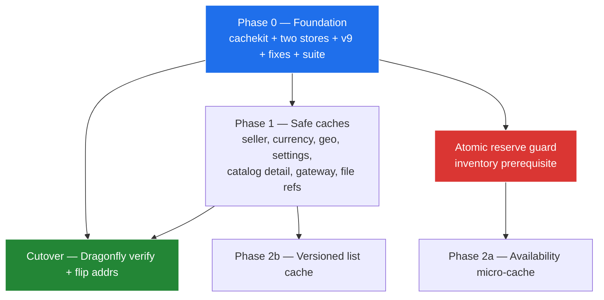

### 10.2 Per-phase file changes

| Phase | New files | Modified files | Behavior change |
|-------|-----------|----------------|-----------------|
| 0 | `common/cachekit/*` (incl. `ttl.go`, async SET pool, write-shed), `test/integration/cachekit/` | `go.mod` (v9), `common/config` (two addrs), `common/cache/*`, `order/utils/coupon_apply_rate_limit.go`, `file/service/upload_service.go` (Durable), scheduler wiring, `docker-compose.yml` (two KV services, app no longer depends on cache) | Bug fixes + split stores + async writes + jitter + breaker; flags off |
| 1 | `product/cache/*`, `user/cache/*`, `payment/cache/*` (catalog slice only), `file/cache/*` (refs only), flags | query services, `category_service.go`, `user_service.go`, `seller_validation.go`, nested product write paths (§5.7), gateway `ListForSeller`/`GetByCode` (split: catalog cached, seller overlay live), provider/schema handlers, country/currency/settings writes | Catalog/auth/currency/**reference-data** reads cached when flags on |
| 2a | `inventory/cache/*` | `inventory/repository` (atomic guard), cart/internal availability caller | Internal availability micro-cached (not seller dashboard POST) |
| 2b | list-key builder + version helpers + admission markers | `product_query_service.go` (list/search/filters/related), collection product lists, product write paths | List/search cached 1–2m **on second hit**; one-offs bypass |
| Cutover | Dragonfly compose + Testcontainers image | addr env only | Traffic moves backends |

---

## 11. Out of scope

- Cart/order/payment **result** caching, write-behind, SWR, search-index build, per-tenant quota.
- Cache **warm-up** jobs (recommendation plan wants them — not 011).
- Recommendation module implementation. **When it lands it must:**
  - depend only on `cachekit` (not `common/cache/redis.go`);
  - use `seller:{id}:rec:…` keys **or** add `rec:` patterns to §5.5 **and** a §4.5 row in the same change;
  - invalidate with version counters / exact `Del`, never `KEYS` / prefix delete of `rec:{seller}:*`;
  - put 7-day view ZSETs on **durable KV**, not the volatile LRU instance;
  - keep any warm-up job off the volatile maxmemory budget unless admission (§4.4) applies — warm-up is still not 011.
- Wishlist / recently-viewed caching. Collection **membership lists** are P2 under `CACHE_PRODUCT_LIST`, not a separate 011 deliverable beyond the registry.
- Promotion evaluation / dashboard cache (P-later, not 011).
- Report aggregates (open-window summaries/trends — §4.5; short private TTLs only, when built).
- Distributed singleflight / cross-pod locks.
- rueidis, Redis Cluster, Sentinel, Dragonfly replication, TLS (add later; password auth is in).
- Keyspace-notification expiry listeners.
- Changing JWT lifetime (stays `JWT_EXPIRY_HOURS`-driven unless auth spec says otherwise; denylist TTL follows remaining `exp` either way).

---

## 12. Success criteria

**Phase 0**
- Two compose services; T10 green (jobs not LRU-evicted).
- Volatile `--maxmemory` computed per §7.3 sizing; Dragonfly volatile runs with explicit `cache_mode=true` (its default is no eviction).
- DB QPS + latency baselines for auth/catalog paths recorded **before any flag turns on** (P1/P2 "QPS down" claims are measured against these).
- `rg "go-redis/redis/v8" --type go` → zero matches.
- Provider blindness enforced by grep in CI: no `go-redis` (or any provider) import, type, or error outside `common/cachekit/provider/` and test files — `rg "go-redis|redis\." --type go common product inventory order user file payment | grep -v cachekit/provider` → empty.
- No `*redis.Client` / `cache.GetRedisClient()` outside `cachekit`.
- HTTP starts with volatile cache down; scheduler does not start with durable KV down.
- T12 denylist: hashed key + remaining TTL; down ≠ valid session.

**Phase 1** (flags on)
- Auth seller check + `GET /:id` + category reads served from cache when up.
- DB QPS down on those paths (not on `/search` yet).
- Reference reads (geo, gateway catalog, file providers/schema, seller settings) served from cache; seller overlay on gateway detail always live (no cross-seller flags in cache — tested).
- Cross-seller cache-read test fails closed.
- T7 cache-down suite green for domain reads.
- Product cache blobs pass T11 (no stock, no expiring URLs, no wishlist fields).
- Nested writes in §5.7 miss product detail (T8).
- T17: stale async SET does not resurrect a deleted key.
- Catalog detail hit rate > 80% after 10m warmup in a load script (directional).

**Phase 2b**
- DB QPS down on `GET /api/product` list + `/search` when `CACHE_PRODUCT_LIST` is on.
- T13 green: one-off queries leave marker only; repeats fill. Random-query flood does not grow backend memory or SET latency (the §0.4 regression test).

**Cutover**
- T1–T17 green on both Redis and Dragonfly images (T13 once the P2 list path exists); primary is `CACHE_ADDR` + `KV_ADDR` only.
- Swapping backends touched no file outside `cachekit/provider/`, compose, and env — the Phase 0 grep proves it, not a code review.
- Bake window with one-command revert (addr flip back to Redis). Roll back on: volatile error rate above pre-cutover baseline, p99 domain-read latency regression, or any T-suite failure against the live primary. Rollback is an addr change, never a deploy.
