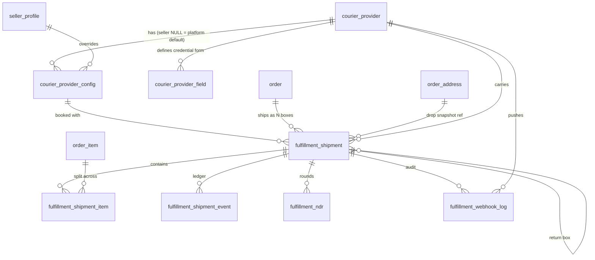
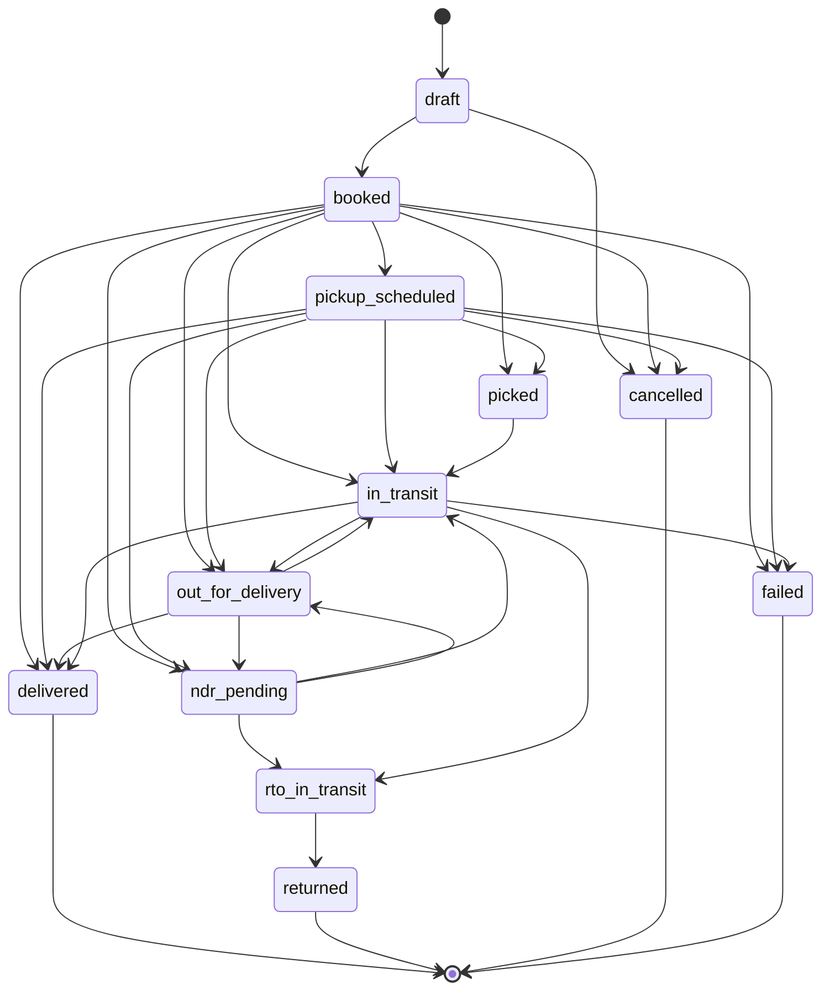
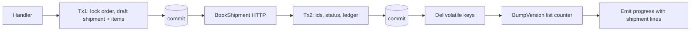
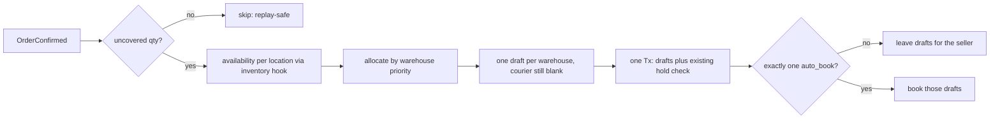
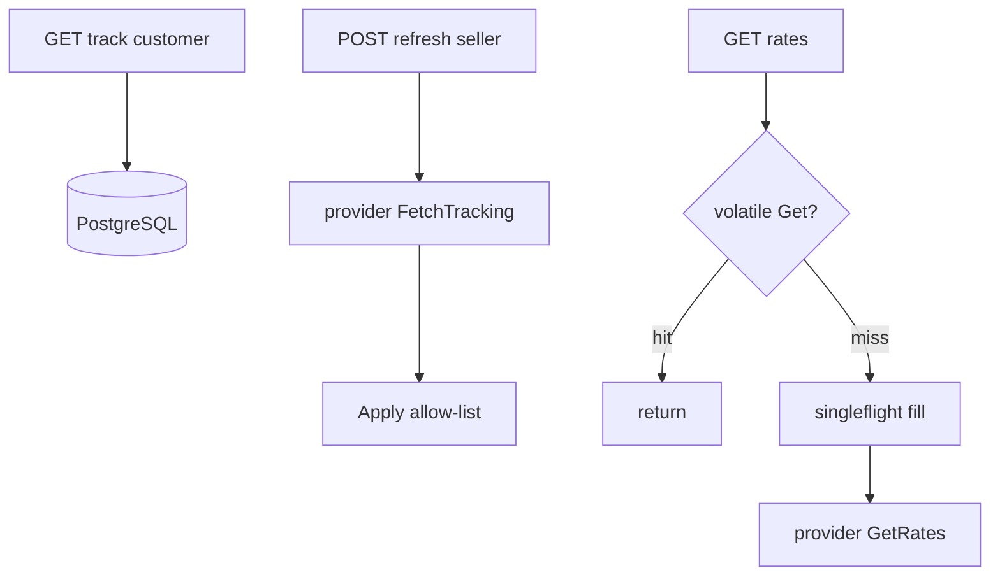
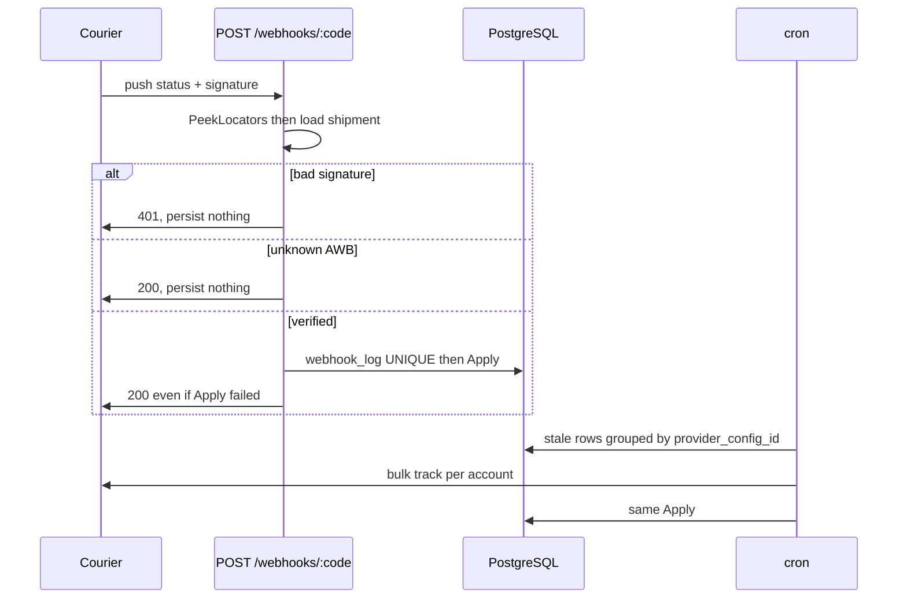

# 013 — Courier Fulfillment Platform · Data Model (Phase 1: DB design)

> Status: **revised — auto-plan + location build**. Tables plus location-based auto-shipment planning with a per-tenant auto-book flag. No backorder (arrives with PO): checkout guarantees full availability, so the planner assumes full coverage and treats missing stock as an exception.
> Conventions: singular table names (`SingularTable: true` + `TableName()`), `BaseEntity(id BIGSERIAL PK, created_at/updated_at TIMESTAMPTZ)` with **no `deleted_at`** (matches `payment_*` / `order`), money as `BIGINT *_cents`, JSONB `NOT NULL DEFAULT '{}'`, statuses as `VARCHAR` + one app enum (no DB CHECK except `quantity > 0`, `weight_grams > 0`, `cod_cents >= 0`, `attempt_no > 0`). All DDL uses `IF NOT EXISTS`. Migration file: `migrations/032_create_fulfillment_tables.sql`. Never edit old migrations.
>
> `fulfillment/entity/shipment.go` is a stub (`OrderShipment`: `carrier`, `tracking_no`, `pending`). No shipment table exists in migrations yet. `032` creates `fulfillment_shipment`. The stub entity is rewritten to match this model. It is not altered in place under the old column names.
>
> Cross-module rule: **no FK into another module's tables**. `pickup_location_id` (inventory) and `delivery_address_id` (order) are plain id columns — logical references resolved via service hooks. The owning module is always the single source of truth; the shipment stores ids, never copies of their rows. There are no pincode columns: pincodes are resolved from the ids at call time. DB CHECKs exist only for `quantity > 0`, `weight_grams > 0`, `default_weight_grams > 0`, `cod_cents >= 0`, `attempt_no > 0`.

## 1. Table relation map



```
courier_provider ──┬──< courier_provider_config >── seller_profile (NULL seller_id = platform default)
                   ├──< courier_provider_field
                   ├──< fulfillment_shipment >── "order" (RESTRICT)
                   └──< fulfillment_webhook_log

fulfillment_shipment ──< fulfillment_shipment_item >── order_item (RESTRICT)
                     ──< fulfillment_shipment_event (immutable ledger)
                     ──< fulfillment_ndr (one open round)
                     ──< fulfillment_shipment.return_of_shipment_id (return box)

fulfillment_shipment carries pickup_location_id + delivery_address_id (logical refs, no FK)
```

COD remittance is deferred (section 6). `cod_cents` on the shipment is only a snapshot of what the courier should collect. The courier pickup nickname is derived at runtime as `S{seller_id}L{location_id}` from the shipment's own ids — no alias column, no mapping table. Backorder arrives with PO and is not modeled here.

## 2. Data flows

### 2a. Shipment status (one vocabulary)

The same strings are the shipment `status`, the `ShipmentAction` (plus `ignore`), and the ledger `event_type`. There is no second or third list.

`draft`, `booked`, `pickup_scheduled`, `picked`, `in_transit`, `out_for_delivery`, `ndr_pending`, `delivered`, `failed`, `cancelled`, `rto_in_transit`, `returned`.

Terminal statuses never leave: `delivered`, `failed`, `cancelled`, `returned`.

Moving statuses are not a ladder. A box may go out for delivery, sit in NDR, then go out for delivery again. `Apply` uses the allow-list below. It does not rank statuses and reject a “lower” one.

| From | Allowed next |
|---|---|
| draft | booked, cancelled |
| booked | pickup_scheduled, picked, in_transit, out_for_delivery, ndr_pending, rto_in_transit, delivered, cancelled, failed |
| pickup_scheduled | picked, in_transit, out_for_delivery, ndr_pending, rto_in_transit, delivered, cancelled, failed |
| picked | in_transit, out_for_delivery, ndr_pending, rto_in_transit, delivered, failed |
| in_transit | out_for_delivery, ndr_pending, rto_in_transit, delivered, failed |
| out_for_delivery | in_transit, ndr_pending, rto_in_transit, delivered, failed |
| ndr_pending | in_transit, out_for_delivery, rto_in_transit, delivered, failed |
| rto_in_transit | returned, failed |
| delivered / failed / cancelled / returned | none |

Same status again is an idempotent no-op (no extra ledger row). A verified event whose pair is not in the table is stored as `ignore` and does not change status. `cancelled` is only legal before pickup (`draft`, `booked`, `pickup_scheduled`).

A courier often sends only the latest scan. `delivered` is legal from every status that has left `draft`, except the four terminal statuses. A failed delivery attempt is `ndr_pending`, not `failed`. `failed` means lost, damaged, or disposed, and it does not move again. The diagram below skips some of those jumps. This table is the rule.



### 2b. Write path (short DB transactions, courier call outside them)



Lists retire via durable version counters (`fulfill:list:ver:{seller}`). Prefix / `KEYS` deletes on the request path are forbidden (012 rule).

### 2b2. Auto-plan (location-based, event-driven)

`OrderConfirmed` triggers the planner. One draft shipment per warehouse — no human input:



Full coverage is guaranteed by checkout (orders without available quantity are not allowed), so there is no `unallocated` path and no backorder state. Missing stock at plan time is an exception (`FULFILLMENT_STOCK_MISMATCH`), not a flow — it means checkout and inventory disagree. Cancelled shipments leave their quantity uncovered, so a later plan can create new drafts. Pickup-in-store, transfer, and local delivery do not enter this flow.

### 2c. Read path

Customer tracking reads PostgreSQL only. It does not call the courier and does not change status. A seller refresh is a separate write. Rates use volatile cache; rate pincodes are resolved in memory from the location/address ids via hooks — the shipment stores ids only (single source of truth). COD plaintext and credentials are never cached.



### 2d. Webhook + reconciler (same Apply)

Unknown AWB replies **200** and stores nothing. A bad signature replies **401** and stores nothing. Couriers retry 4xx until the endpoint is disabled, so an unknown tracking number must not be a 4xx.



## 3. Tables

### T1 · `courier_provider` — catalog

One seed row per courier. Orchestrators do not gain a branch per courier.

| Column | Type | Constraints / notes |
|---|---|---|
| id | BIGSERIAL PK | |
| code | VARCHAR(50) | NOT NULL UNIQUE — `shiprocket`, `delhivery`; factory key |
| name | VARCHAR(100) | NOT NULL |
| kind | VARCHAR(20) | NOT NULL `aggregator` / `direct` |
| supports_pickup / supports_ndr / supports_return / supports_cod / webhook_supported | BOOLEAN | UI gates. Direct couriers often lack NDR |
| is_active | BOOLEAN | DEFAULT TRUE |
| created_at / updated_at | TIMESTAMPTZ | NOT NULL DEFAULT NOW() |

The API host lives in the adapter, not in this table.

Index: `UNIQUE(code)` is enough (no second index on `code`).
Seed: `('shiprocket','Shiprocket','aggregator', true…)`.

### T2 · `courier_provider_field` — credential form

| Column | Type | Constraints / notes |
|---|---|---|
| id | BIGSERIAL PK | |
| provider_code | VARCHAR(50) | NOT NULL FK → `courier_provider(code)` ON DELETE CASCADE |
| field_name | VARCHAR(100) | NOT NULL; UNIQUE(provider_code, field_name) |
| display_name | VARCHAR(200) | NOT NULL |
| field_type | VARCHAR(50) | `string` / `password` / `url` / `email` / `number` / `boolean` |
| is_required / is_sensitive | BOOLEAN | DEFAULT TRUE / FALSE |
| display_order | INT | DEFAULT 0 |
| validation_rules | JSONB | NULL |
| created_at / updated_at | TIMESTAMPTZ | NOT NULL DEFAULT NOW() |

Seed — shiprocket: `api_email`, `api_password` (sensitive), `webhook_secret` (sensitive). The unique pair is the lookup index.

### T3 · `courier_provider_config` — hybrid credentials

`seller_id NULL` is the platform default. A seller row overrides it at **book** time. The shipment stores `provider_config_id`, so later webhooks and tracking use that same row. They do not resolve “seller else platform” again.

| Column | Type | Constraints / notes |
|---|---|---|
| id | BIGSERIAL PK | |
| seller_id | BIGINT | NULL FK → `seller_profile(user_id)` ON DELETE CASCADE |
| provider_code | VARCHAR(50) | NOT NULL FK → `courier_provider(code)` ON DELETE CASCADE |
| environment | VARCHAR(20) | NOT NULL DEFAULT `'production'` |
| credentials | JSONB | NOT NULL — encrypted |
| auto_book | BOOLEAN | DEFAULT FALSE — tenant flag: plan-only drafts (FALSE) vs plan + book + pickup (TRUE) |
| rate_preference | VARCHAR(20) | NULL — `cheapest` / `fastest`; used only when `auto_book` is TRUE |
| default_weight_grams | INT | NULL CHECK (`default_weight_grams > 0`) — fallback box weight for auto-book when the draft has no PATCHed weight |
| is_active | BOOLEAN | DEFAULT TRUE |
| created_at / updated_at | TIMESTAMPTZ | NOT NULL DEFAULT NOW() |

`UNIQUE(seller_id, provider_code, environment)` plus partial `UNIQUE(provider_code, environment) WHERE seller_id IS NULL`.
Index: `(seller_id, provider_code, is_active)`.

### T4 · `fulfillment_shipment` — one row per box

`provider_code` has **no default** and stays NULL on a draft. The seller, or auto-book, chooses the courier at book time. `awb` stays NULL until booking returns one. Locations are plain ids (`pickup_location_id`, `delivery_address_id`) — no FK, resolved via hooks.

| Column | Type | Constraints / notes |
|---|---|---|
| id | BIGSERIAL PK | |
| order_id | BIGINT | NOT NULL FK → `"order"(id)` ON DELETE RESTRICT |
| seller_id | BIGINT | NOT NULL FK → `seller_profile(user_id)` |
| provider_code | VARCHAR(50) | NULL until book. Then FK → `courier_provider(code)`. No default |
| provider_config_id | BIGINT | NULL until book; then set. FK → `courier_provider_config(id)` |
| provider_order_id | TEXT | NULL in `draft`. Value sent to the courier is this shipment’s id, not the order id |
| provider_shipment_id | TEXT | NULL |
| awb | TEXT | NULL |
| idempotency_key | TEXT | NULL — client retry key. A repeat of the same key returns the existing row |
| book_requested_at | TIMESTAMPTZ | NULL until someone actually starts a book (seller click, auto-book, or return). A draft waiting for review stays NULL. The retry job reads this |
| book_attempts | INT | NOT NULL DEFAULT 0. Stops at 5 |
| courier_name | VARCHAR(100) | NULL — late-bound, e.g. `Delhivery Surface` |
| service_code | VARCHAR(50) | NULL |
| status | VARCHAR(32) | NOT NULL DEFAULT `'draft'` — section 2a only |
| pickup_location_id | BIGINT | NULL — seller-side warehouse/location. No FK: logical ref to inventory `location`, resolved via hook |
| delivery_address_id | BIGINT | NULL — customer location snapshot. No FK: logical ref to `order_address`, resolved via hook |
| delivery_address_revised_at | TIMESTAMPTZ | NULL — address revision stamp: set at plan from `order_address.updated_at`, re-stamped by confirm-address; book refuses when the live address is newer |
| delivery_address_revised_at | TIMESTAMPTZ | NULL — `updated_at` of that address at plan time. Not a copy of the address. Book compares it |
| weight_grams | INT | NULL CHECK (`weight_grams > 0`) |
| length_cm / breadth_cm / height_cm | NUMERIC(8,2) | NULL |
| cod_cents | BIGINT | NOT NULL DEFAULT 0 — collect-amount snapshot. 0 = prepaid. Not a remittance record. The full order amount is stamped on **one** box only (first draft by warehouse priority, then lowest id). Every other box is 0. If that box is cancelled before pickup, the amount moves to the next box that is still `draft` or `booked`. It is never copied onto two boxes |
| rate_cents | BIGINT | NULL — quoted freight |
| insured | BOOLEAN | DEFAULT FALSE |
| etd / shipped_at / delivered_at / cancelled_at / last_synced_at | TIMESTAMPTZ | NULL. `last_synced_at` is the last successful provider poll or applied webhook. It is not `updated_at` |
| book_requested_at | TIMESTAMPTZ | NULL — first book-attempt marker; `recover_drafts` sweeps drafts with it set and `provider_order_id` still NULL (plus never-attempted drafts older than 2 minutes) |
| book_attempts | INT | NOT NULL DEFAULT 0 — incremented per attempt; auto-retry caps at 5, then manual-only + alert |
| return_of_shipment_id | BIGINT | NULL FK → `fulfillment_shipment(id)`. Set on a return box. No separate return-status table |
| raw_ref | JSONB | NOT NULL DEFAULT `'{}'` — sanitized, no PII |
| created_at / updated_at | TIMESTAMPTZ | NOT NULL DEFAULT NOW() |

Labels are not stored. `GetLabel` streams bytes from the courier on request.

Constraints:
- `UNIQUE(provider_code, provider_order_id)`
- `UNIQUE(provider_code, awb)` (PostgreSQL allows many NULLs)
- `UNIQUE(idempotency_key)` (many NULLs allowed)
- `CHECK (return_of_shipment_id IS NULL OR return_of_shipment_id <> id)`

Indexes:
- `(seller_id, created_at DESC)` — seller list
- `(seller_id, status)`
- `(order_id)`
- `(pickup_location_id)` — warehouse filter
- `(status, last_synced_at)` — reconciler
- `(status, book_requested_at) WHERE status = 'draft'` — recover sweep (partial)
- partial `(book_requested_at) WHERE status = 'draft' AND provider_order_id IS NULL AND book_requested_at IS NOT NULL` — crash retry only

No standalone `(awb)` index and no standalone `(created_at)` index. The unique keys already cover AWB lookup.

Create (manual or planner) locks the **order** row, then checks Σ quantity on shipments whose status is not `cancelled` ≤ `order_item.quantity`, then inserts the draft. Cancelled rows do not count and do not block a new plan. Two concurrent creates cannot over-allocate. Full coverage is assumed (no backorder until PO); a shortfall raises instead of branching. The stock check and the draft insert commit or roll back together. Fulfillment does not create a second inventory reservation. Checkout already holds the units at variant level.

### T5 · `fulfillment_shipment_item`

| Column | Type | Constraints / notes |
|---|---|---|
| id | BIGSERIAL PK | |
| shipment_id | BIGINT | NOT NULL FK → `fulfillment_shipment(id)` ON DELETE CASCADE |
| order_item_id | BIGINT | NOT NULL FK → `order_item(id)` ON DELETE RESTRICT |
| quantity | INT | NOT NULL CHECK (`quantity > 0`) |
| created_at / updated_at | TIMESTAMPTZ | NOT NULL DEFAULT NOW() |

`UNIQUE(shipment_id, order_item_id)`.
Indexes: the unique pair covers `(shipment_id, order_item_id)`. Add `(order_item_id)` for the sum check.

### T6 · `fulfillment_shipment_event` — immutable ledger

`event_type` uses the same strings as status, or `ignore`. Raw courier text goes in `provider_event` only.

| Column | Type | Constraints / notes |
|---|---|---|
| id | BIGSERIAL PK | |
| shipment_id | BIGINT | NOT NULL FK → `fulfillment_shipment(id)` ON DELETE CASCADE |
| event_type | VARCHAR(50) | NOT NULL — status string or `ignore` |
| from_status | VARCHAR(32) | NULL |
| to_status | VARCHAR(32) | NOT NULL |
| provider_event | VARCHAR(100) | NULL — raw label, audit only |
| provider_request / provider_response | JSONB | NULL — sanitized |
| failure_code / failure_message | VARCHAR(100) / TEXT | NULL |
| source | VARCHAR(20) | NOT NULL — `api` / `webhook` / `system` / `admin` |
| actor_id / actor_type | BIGINT / VARCHAR(20) | NULL |
| created_at | TIMESTAMPTZ | NOT NULL DEFAULT NOW() |

Index: `(shipment_id, created_at DESC)`.

### T7 · `fulfillment_webhook_log`

Persist only after signature verification. Unknown AWB: nothing stored, HTTP 200. Bad signature: nothing stored, HTTP 401.

| Column | Type | Constraints / notes |
|---|---|---|
| id | BIGSERIAL PK | |
| provider_code | VARCHAR(50) | NULL in `draft`, set at book. FK → `courier_provider(code)` |
| event_id | TEXT | NOT NULL |
| awb | TEXT | NULL |
| action | VARCHAR(50) | NOT NULL — same vocabulary as status, or `ignore` |
| status | VARCHAR(30) | NOT NULL — `received` / `applied` / `failed` / `ignored` |
| error_message | TEXT | NULL |
| payload | JSONB | NOT NULL — phones and addresses stripped |
| headers | JSONB | NULL — secrets removed |
| shipment_id | BIGINT | NULL FK → `fulfillment_shipment(id)` |
| ip_address | VARCHAR(50) | NULL |
| processed_at | TIMESTAMPTZ | NULL |
| created_at | TIMESTAMPTZ | NOT NULL DEFAULT NOW() |

`UNIQUE(provider_code, event_id)`.
Index for the heal cron: `(status, created_at)`. No extra indexes on `provider_code` or `event_id` alone.

### T8 · `fulfillment_ndr` — one open round per shipment

A second “customer not home” is a new round after the previous one is actioned. It is not blocked by the reason text.

| Column | Type | Constraints / notes |
|---|---|---|
| id | BIGSERIAL PK | |
| shipment_id | BIGINT | NOT NULL FK → `fulfillment_shipment(id)` ON DELETE CASCADE |
| awb | TEXT | NOT NULL |
| attempt_no | INT | NOT NULL CHECK (`attempt_no > 0`) |
| ndr_status | VARCHAR(50) | NOT NULL — reason label, not a uniqueness key |
| reason | TEXT | NULL |
| action_taken | VARCHAR(30) | NULL — `reattempt` / `rto` |
| acted_at | TIMESTAMPTZ | NULL |
| created_at / updated_at | TIMESTAMPTZ | NOT NULL DEFAULT NOW() |

`UNIQUE(shipment_id, attempt_no)`.
Partial unique index: `UNIQUE(shipment_id) WHERE action_taken IS NULL` — one open round.
Index: `(shipment_id)`.

## 4. GORM mapping notes

Each entity implements `TableName()`. Nullable columns are pointers. Money is `int64`. JSON is `db.JSONMap`. Read shipments with `Preload("Items")`. Cross-module ids (`pickup_location_id`, `delivery_address_id`) are plain `*uint` with no GORM association — never `Preload`ed, resolved via hooks.

## 5. Seeds

`courier_provider` (shiprocket) + `courier_provider_field` rows + one NULL-seller `courier_provider_config` placeholder (empty encrypted creds, `auto_book` FALSE). Demo shipments only if matching `order` / `order_item` seeds exist.

## 6. Deferred (not in `032`)

1. **`environment` on T3.** Kept so test credentials have a row. Shiprocket has no real sandbox.
2. **COD remittance.** Couriers pay many AWBs under one UTR. A 1:1 remittance table is the wrong shape. Add it when a statement API is specified. Until then `cod_cents` is only the collect-amount snapshot.
3. **Label storage.** No `label_url` column. Reprint calls the courier.
4. **Backorder / PO.** No `unallocated` state, no restock re-planner. Missing stock at plan time is an exception. Backorder arrives as its own designed feature with PO (supplier ETA, partial-release rules).
