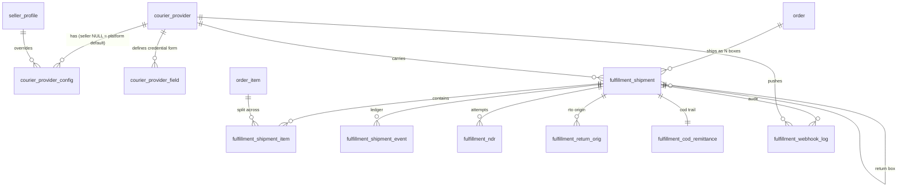
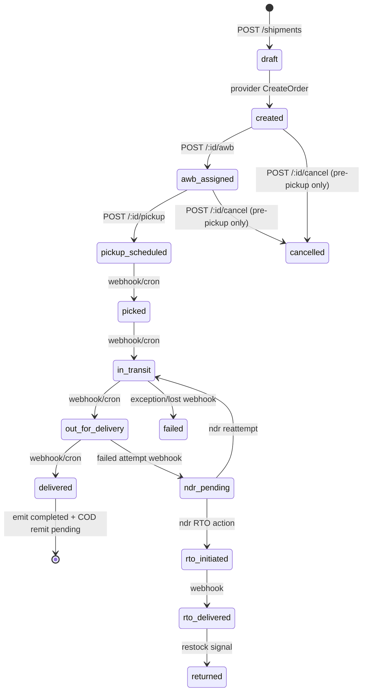
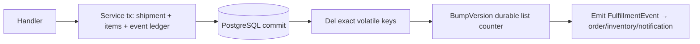
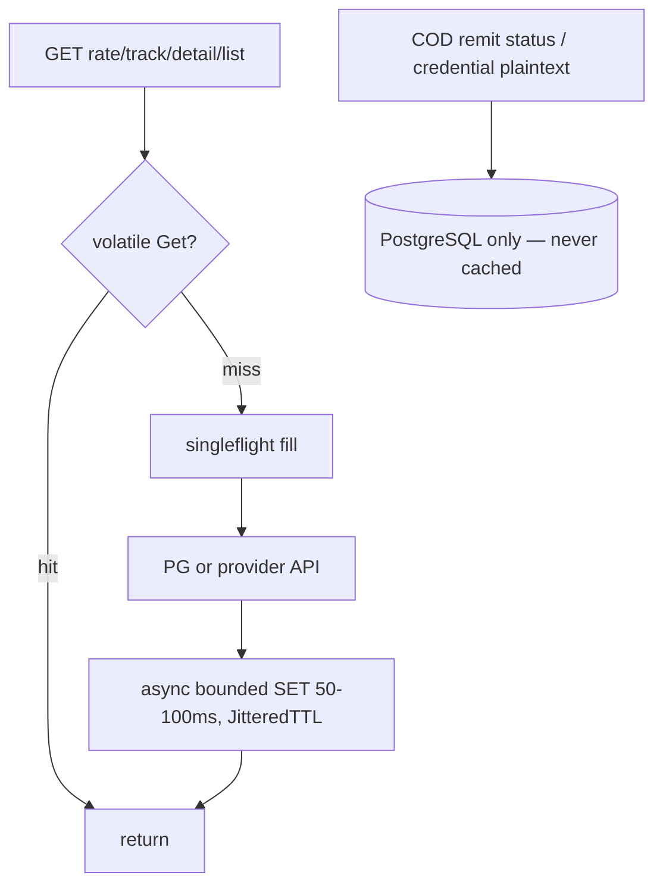
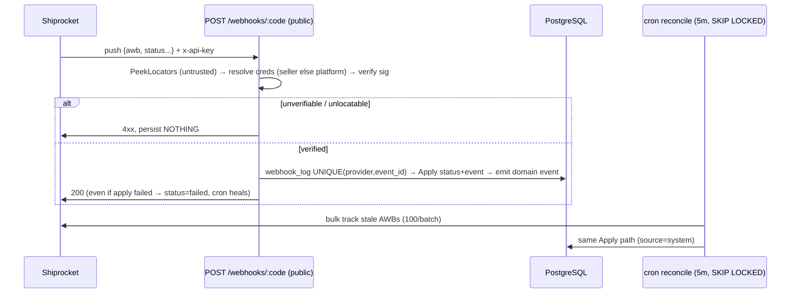

# 013 — Courier Fulfillment Platform · Data Model (Phase 1: DB design)

> Status: **draft for review**. Phase 1 covers tables only. Provider interface (`contracts/`) is Phase 2 and references — but changes — none of these tables.
> Conventions: singular table names (`SingularTable: true` + `TableName()`), `BaseEntity(id BIGSERIAL PK, created_at/updated_at TIMESTAMPTZ)` with **no `deleted_at`** (matches `payment_*` / `order` tables), money as `BIGINT *_cents`, JSONB `NOT NULL DEFAULT '{}'`, statuses as `VARCHAR` + app-level enum (no DB CHECK except `quantity > 0`, `weight_grams > 0`, `cod_cents >= 0`). All DDL uses `IF NOT EXISTS`. Migration file: `migrations/032_create_fulfillment_tables.sql`. Never edit old migrations.

## 1. Table relation map



ASCII fallback (renders anywhere):

```
courier_provider ──┬──< courier_provider_config >── seller_profile (NULL seller_id = platform default)
                   ├──< courier_provider_field (dynamic credential form)
                   ├──< fulfillment_shipment >── "order" (RESTRICT, never orphan history)
                   └──< fulfillment_webhook_log

fulfillment_shipment ──< fulfillment_shipment_item >── order_item (RESTRICT)
                     ──< fulfillment_shipment_event (immutable ledger)
                     ──< fulfillment_ndr ──1── fulfillment_return ──→ fulfillment_shipment (return box)
                     ──1── fulfillment_cod_remittance (1:1, UNIQUE)
```

## 2. Data flows (visual)

### 2a. Shipment lifecycle (state machine; terminal states never regress)



### 2b. Write path (PG first, cache second — never reverse)



Lists retire via durable version counters (`fulfill:list:ver:{seller}`); prefix/`KEYS` deletes on the request path are forbidden (012 rule).

### 2c. Read path (volatile cache, fail-open) vs authoritative reads



### 2d. Webhook + reconciler (webhook primary, cron safety net; same Apply)



## 3. Tables

### T1 · `courier_provider` — catalog (mirrors `payment_gateway`)

New courier (aggregator *or* direct) = 1 seed INSERT. No code/DB change in orchestrators.

| Column | Type | Constraints / notes |
|---|---|---|
| id | BIGSERIAL PK | |
| code | VARCHAR(50) | NOT NULL UNIQUE — `shiprocket`, `delhivery`, `bluedart`; factory registry key |
| name | VARCHAR(100) | NOT NULL, display |
| kind | VARCHAR(20) | NOT NULL `aggregator` / `direct` |
| supports_pickup / supports_ndr / supports_return / supports_cod / webhook_supported | BOOLEAN | Capability flags; UI gates buttons on these (direct couriers often lack NDR) |
| base_url | TEXT | NULL; adapter default, overridable per env |
| is_active | BOOLEAN | DEFAULT TRUE — kill-switch without delete |
| created_at / updated_at | TIMESTAMPTZ | NOT NULL DEFAULT NOW() |

Indexes: `idx_courier_provider_code (code)`.
Seed: `('shiprocket','Shiprocket','aggregator', true…)`.

### T2 · `courier_provider_field` — dynamic credential form (mirrors `payment_gateway_field`)

Lets the dashboard render per-provider credential forms and gives `Validate()` a data-driven source. New provider's form = seed rows, no migration.

| Column | Type | Constraints / notes |
|---|---|---|
| id | BIGSERIAL PK | |
| provider_code | VARCHAR(50) | NOT NULL FK → `courier_provider(code)` ON DELETE CASCADE |
| field_name | VARCHAR(100) | NOT NULL; UNIQUE(provider_code, field_name) |
| display_name | VARCHAR(200) | NOT NULL |
| field_type | VARCHAR(50) | `string` / `password` / `url` / `email` / `number` / `boolean` |
| is_required / is_sensitive | BOOLEAN | DEFAULT TRUE / FALSE |
| display_order | INT | DEFAULT 0 |
| validation_rules | JSONB | NULL |
| created_at / updated_at | TIMESTAMPTZ | NOT NULL DEFAULT NOW() |

Seed examples — shiprocket: `api_email` (required), `api_password` (required+sensitive), `webhook_secret` (optional+sensitive); delhivery: `api_token` (required+sensitive).
Index: `idx_courier_provider_field_provider (provider_code)`.

### T3 · `courier_provider_config` — hybrid credentials (mirrors `payment_gateway_config`)

`s seller_id NULL` = platform default; per-seller row overrides it. Resolver: seller row else platform row. Credentials encrypted at rest, masked in API/logs; `TestConnection` never persists.

| Column | Type | Constraints / notes |
|---|---|---|
| id | BIGSERIAL PK | |
| seller_id | BIGINT | NULL FK → `seller_profile(user_id)` ON DELETE CASCADE; NULL = platform default |
| provider_code | VARCHAR(50) | NOT NULL FK → `courier_provider(code)` ON DELETE CASCADE |
| environment | VARCHAR(20) | NOT NULL DEFAULT `'production'` (`sandbox`/`production`; sandbox holds test/mock creds — Shiprocket has no true sandbox) |
| credentials | JSONB | NOT NULL — encrypted; shape validated against T2 |
| pickup_alias | VARCHAR(100) | NULL — default pickup location nickname |
| is_active | BOOLEAN | DEFAULT TRUE — per-seller disable |
| created_at / updated_at | TIMESTAMPTZ | NOT NULL DEFAULT NOW() |

Constraints: `UNIQUE(seller_id, provider_code, environment)` **plus** partial `UNIQUE(provider_code, environment) WHERE seller_id IS NULL` (plain UNIQUE allows multiple NULLs in PG — without the partial index duplicate platform defaults are possible).
Indexes: `(seller_id)`, `(provider_code)`, `(seller_id, is_active)`.

### T4 · `fulfillment_shipment` — core (extends stub `OrderShipment`; one row per split box)

Fully provider-generic (no `sr_*` names). An order with 3 items shipped in 2 boxes = 2 rows. `awb` NULL until the AWB step.

| Column | Type | Constraints / notes |
|---|---|---|
| id | BIGSERIAL PK | |
| order_id | BIGINT | NOT NULL FK → `"order"(id)` ON DELETE RESTRICT (never orphan financial history) |
| seller_id | BIGINT | NOT NULL FK → `seller_profile(user_id)`; every seller query filters this |
| provider_code | VARCHAR(50) | NOT NULL DEFAULT `'shiprocket'` FK → `courier_provider(code)` |
| provider_order_id | TEXT | NULL — provider's order id; NULL in `draft` |
| provider_shipment_id | TEXT | NULL |
| awb | TEXT | NULL — webhook locator; UNIQUE (NULLs ignored by PG) |
| courier_name | VARCHAR(100) | NULL — late-bound by aggregator (e.g. `Delhivery Surface`) |
| service_code | VARCHAR(50) | NULL — chosen rate option |
| status | VARCHAR(32) | NOT NULL DEFAULT `'draft'`; set §3.1 |
| pickup_pincode / delivery_pincode | VARCHAR(20) | NULL — rate inputs snapshot |
| weight_grams | INT | NULL CHECK (`weight_grams > 0`) |
| length_cm / breadth_cm / height_cm | NUMERIC(8,2) | NULL — dims snapshot |
| cod_cents | BIGINT | NOT NULL DEFAULT 0 — 0 = prepaid |
| rate_cents | BIGINT | NULL — quoted freight at ship time (audit) |
| insured | BOOLEAN | DEFAULT FALSE |
| label_url | TEXT | NULL — File-module id or provider URL |
| etd / shipped_at / delivered_at / cancelled_at | TIMESTAMPTZ | NULL |
| raw_ref | JSONB | NOT NULL DEFAULT `'{}'` — sanitized provider snapshot, no PII |
| created_at / updated_at | TIMESTAMPTZ | NOT NULL DEFAULT NOW() |

#### §3.1 Status set (extends stub's 7)

`draft, created, awb_assigned, pickup_scheduled, picked, in_transit, out_for_delivery, delivered, failed, cancelled, ndr_pending, rto_initiated, rto_delivered, returned`. Transitions enforced in service (terminal `delivered/returned/cancelled/failed` never regress).

Constraints: `UNIQUE(provider_code, provider_order_id)` (provider idempotency — create-order retries don't dup), `UNIQUE(awb)`.
Indexes: `(seller_id, status)`, `(order_id)`, `(awb)`, `(status, updated_at)` (reconciler sweep), `(created_at DESC)`.

### T5 · `fulfillment_shipment_item` — split lines (keeps stub shape)

| Column | Type | Constraints / notes |
|---|---|---|
| id | BIGSERIAL PK | |
| shipment_id | BIGINT | NOT NULL FK → `fulfillment_shipment(id)` ON DELETE CASCADE |
| order_item_id | BIGINT | NOT NULL FK → `order_item(id)` ON DELETE RESTRICT |
| quantity | INT | NOT NULL CHECK (`quantity > 0`) |
| created_at / updated_at | TIMESTAMPTZ | NOT NULL DEFAULT NOW() |

`UNIQUE(shipment_id, order_item_id)`; service guard: Σ quantity across an order's shipments ≤ `order_item.quantity`.
Indexes: `(shipment_id)`, `(order_item_id)`.

### T6 · `fulfillment_shipment_event` — immutable ledger (mirrors `payment_transaction_event`)

Every transition + sanitized provider request/response. Powers seller timeline UI and dispute audit. Never updated/deleted.

| Column | Type | Constraints / notes |
|---|---|---|
| id | BIGSERIAL PK | |
| shipment_id | BIGINT | NOT NULL FK → `fulfillment_shipment(id)` ON DELETE CASCADE |
| event_type | VARCHAR(50) | NOT NULL — `created, awb_assigned, pickup_scheduled, picked, in_transit, out_for_delivery, delivered, failed, cancelled, ndr_raised, ndr_resolved, rto_initiated, rto_delivered, returned, label_generated` |
| from_status | VARCHAR(32) | NULL |
| to_status | VARCHAR(32) | NOT NULL |
| provider_event | VARCHAR(100) | NULL — raw provider label (audit only; logic uses `event_type`) |
| gateway_request / gateway_response | JSONB | NULL — sanitized |
| failure_code / failure_message | VARCHAR(100) / TEXT | NULL |
| source | VARCHAR(20) | NOT NULL — `api` / `webhook` / `system` / `admin` (like payment) |
| actor_id / actor_type | BIGINT / VARCHAR(20) | NULL — seller/customer/admin/system |
| created_at | TIMESTAMPTZ | NOT NULL DEFAULT NOW() (no `updated_at` — immutable) |

Indexes: `(shipment_id)`, `(created_at DESC)`, `(event_type)`.

### T7 · `fulfillment_webhook_log` — verified-only audit + idempotency (mirrors `payment_webhook_log`)

Persist **only after signature verification** — unverifiable bodies are dropped, never stored (payment rule). `event_id` adapter-generated, never empty (fallback `{providerEvent}:{awb}:{statusId}:{timestamp}`).

| Column | Type | Constraints / notes |
|---|---|---|
| id | BIGSERIAL PK | |
| provider_code | VARCHAR(50) | NOT NULL FK → `courier_provider(code)` |
| event_id | TEXT | NOT NULL — idempotency key |
| awb | TEXT | NULL (NULL only if verified but unparseable) |
| action | VARCHAR(50) | NOT NULL — normalized `ShipmentAction` |
| status | VARCHAR(30) | NOT NULL — `received` / `applied` / `failed` / `ignored` (`failed` = verified but apply error → cron heals) |
| error_message | TEXT | NULL |
| payload | JSONB | NOT NULL — sanitized (phones/addresses stripped) |
| headers | JSONB | NULL — secrets removed |
| shipment_id | BIGINT | NULL FK → `fulfillment_shipment(id)` — linked when locatable |
| ip_address | VARCHAR(50) | NULL |
| processed_at | TIMESTAMPTZ | NULL |
| created_at | TIMESTAMPTZ | NOT NULL DEFAULT NOW() |

`UNIQUE(provider_code, event_id)` unconditional (event_id NOT NULL — same as payment).
Indexes: `(provider_code)`, `(event_id)`, `(status)`, `(awb)`, `(created_at DESC)`.

### T8 · `fulfillment_ndr` — one row per NDR round

| Column | Type | Constraints / notes |
|---|---|---|
| id | BIGSERIAL PK | |
| shipment_id | BIGINT | NOT NULL FK → `fulfillment_shipment(id)` ON DELETE CASCADE |
| awb | TEXT | NOT NULL |
| ndr_status | VARCHAR(50) | NOT NULL — e.g. `consignee_not_available`, `address_issue`, `refused` |
| reason | TEXT | NULL |
| action_taken | VARCHAR(30) | NULL — `reattempt` / `rto` |
| acted_at | TIMESTAMPTZ | NULL |
| created_at / updated_at | TIMESTAMPTZ | NOT NULL DEFAULT NOW() |

`UNIQUE(awb, ndr_status)`. Indexes: `(shipment_id)`, `(awb)`.

### T9 · `fulfillment_return` — outbound box → return box link

The return/RTO box is itself a `fulfillment_shipment` row, so tracking/reconciler work uniformly; this table is the link.

| Column | Type | Constraints / notes |
|---|---|---|
| id | BIGSERIAL PK | |
| orig_shipment_id | BIGINT | NOT NULL FK → `fulfillment_shipment(id)` ON DELETE CASCADE |
| return_shipment_id | BIGINT | NULL FK → `fulfillment_shipment(id)` ON DELETE CASCADE (NULL until carrier creates it) |
| reason | VARCHAR(100) | NULL |
| status | VARCHAR(30) | NOT NULL DEFAULT `'requested'` — `requested` / `in_transit` / `delivered` |
| created_at / updated_at | TIMESTAMPTZ | NOT NULL DEFAULT NOW() |

`UNIQUE(orig_shipment_id, return_shipment_id)`. Index: `(orig_shipment_id)`.

### T10 · `fulfillment_cod_remittance` — COD money trail (1:1, never cached)

COD collected by courier ≠ revenue until remitted. Reconciled by hourly cron against provider statements.

| Column | Type | Constraints / notes |
|---|---|---|
| id | BIGSERIAL PK | |
| shipment_id | BIGINT | NOT NULL UNIQUE FK → `fulfillment_shipment(id)` ON DELETE RESTRICT |
| awb | TEXT | NOT NULL — statement join key |
| cod_cents | BIGINT | NOT NULL CHECK (`cod_cents >= 0`) — collect-amount snapshot |
| status | VARCHAR(30) | NOT NULL DEFAULT `'pending'` — `pending` / `remitted` / `disputed` |
| remitted_at | TIMESTAMPTZ | NULL |
| utr | TEXT | NULL — bank remittance ref |
| raw | JSONB | NOT NULL DEFAULT `'{}'` — statement line snapshot |
| created_at / updated_at | TIMESTAMPTZ | NOT NULL DEFAULT NOW() |

Index: `(status)`.

## 4. GORM mapping notes

Each entity gets `func (X) TableName() string` returning the singular name above. `courier_provider_config.seller_id`, `fulfillment_shipment.awb/provider_order_id/courier_name…` are `*string`/`*uint` (NULL-able); money `int64`; JSON `db.JSONMap`; `Items []FulfillmentShipmentItem gorm:"foreignKey:ShipmentID"` with `Preload` on reads (no N+1). Existing stub `OrderShipment`/`OrderShipmentItem` in `fulfillment/entity/shipment.go` is extended in place (status set grows, `provider_*`/`seller_id`/`cod_cents` added) — not replaced.

## 5. Seeds (`seeds/00X_seed_fulfillment_data.sql`)

`courier_provider` (shiprocket) + `courier_provider_field` rows (email/password/webhook_secret) + one NULL-seller `courier_provider_config` placeholder row (empty encrypted creds). Demo shipment rows only if matching `order`/`order_item` seeds exist (referential-integrity rule — CODING_STANDARDS).

## 6. Open decisions (confirm before writing `032`)

1. **Pickup addresses**: `pickup_alias` string on T3 (MVP, specified above) vs dedicated `courier_pickup_location` table (multi-warehouse). Recommendation: string now, table later.
2. **`environment` on T3**: keep for payment-parity/test creds vs drop (Shiprocket has no true sandbox). Recommendation: keep.
